# Design Document 

Authors: Bianchi Giulia, Colella Edoardo, Colotti Manuel Enrique, Di Benedetto Giovanna

| Version number | Change                                                 |
| -------------- | :----------------------------------------------------- |
| 1.0            | First drafts of Design Document                        |
| 2.0            | Final version of Design Document (Before Coding)       |
| 3.0            | Final version of Design Doument (After implementation) |

# Contents

- [Design Document](#design-document)
- [Contents](#contents)
- [Instructions](#instructions)
- [High level design](#high-level-design)
- [Low level design](#low-level-design)
  - [Class Diagram](#class-diagram)
- [Verification traceability matrix](#verification-traceability-matrix)
- [Verification sequence diagrams](#verification-sequence-diagrams)
  - [Sequence Diagram 1.1](#sequence-diagram-11)
  - [Sequence Diagram 3.1](#sequence-diagram-31)
  - [Sequence Diagram 4.1](#sequence-diagram-41)
  - [Sequence Diagram 5.1.1](#sequence-diagram-511)
  - [Sequence Diagram 5.2.1](#sequence-diagram-521)
  - [Sequence Diagram 6.1](#sequence-diagram-61)
  - [Sequence Diagram 9.1](#sequence-diagram-91)
  - [Sequence Diagram 12.1](#sequence-diagram-121)

# Instructions

The design must satisfy the Official Requirements document, notably functional and non functional requirements, and be consistent with the APIs

# High level design 

The architectural pattern adopted for the design of EasyWarehouse is the Client-Server pattern.

This is the reason why the team has decided to show in the package diagram both frontend and backend macro-packages even though the frontend one wasn't required from the specifics.

The backend package is divided in a data package that provides all the data structures required by the application and a logic package that provides the operations to manage the data.

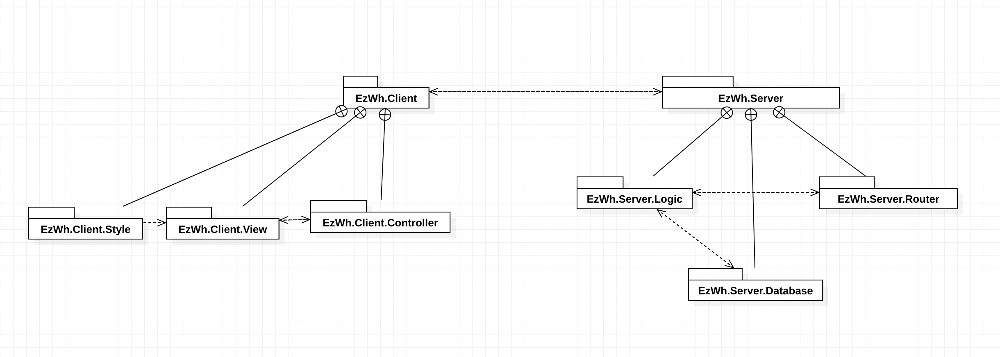

# Low level design

## Class Diagram
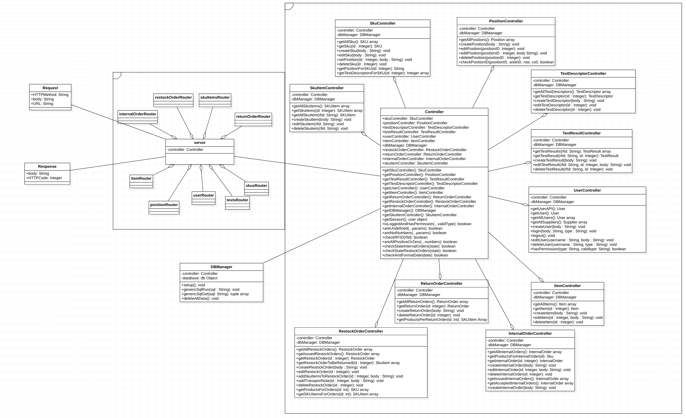

# Verification traceability matrix

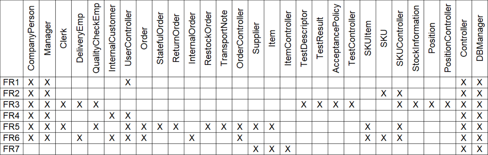

# Verification sequence diagrams 

## Sequence Diagram 1.1

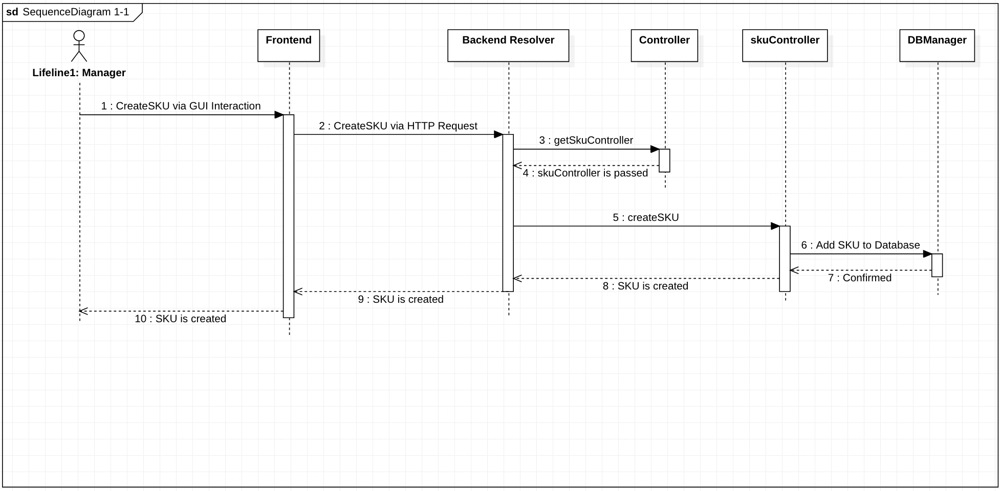

## Sequence Diagram 3.1

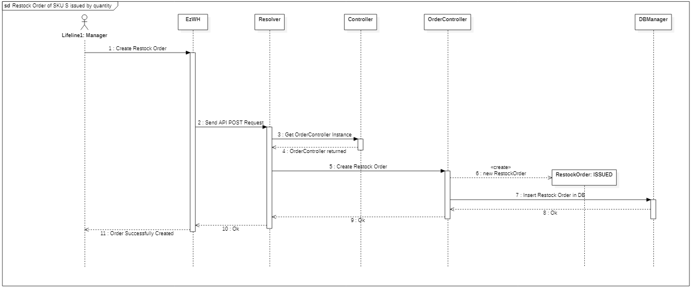

## Sequence Diagram 4.1

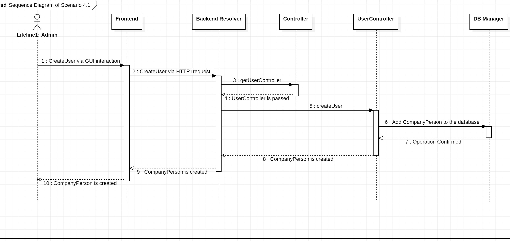

## Sequence Diagram 5.1.1
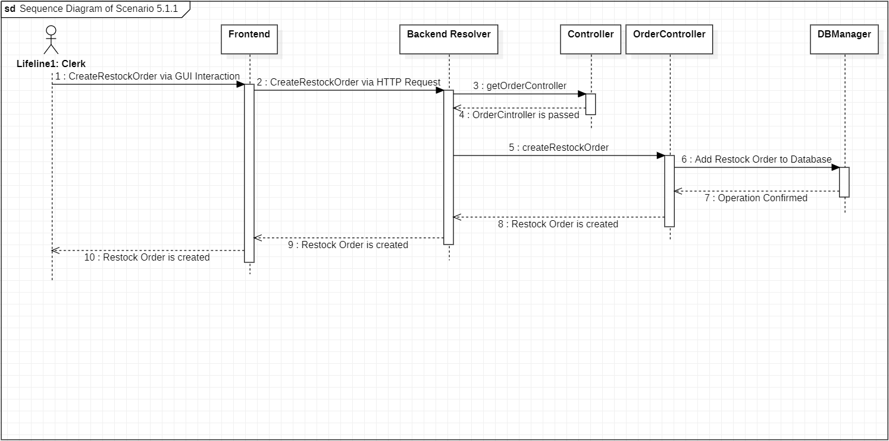

## Sequence Diagram 5.2.1

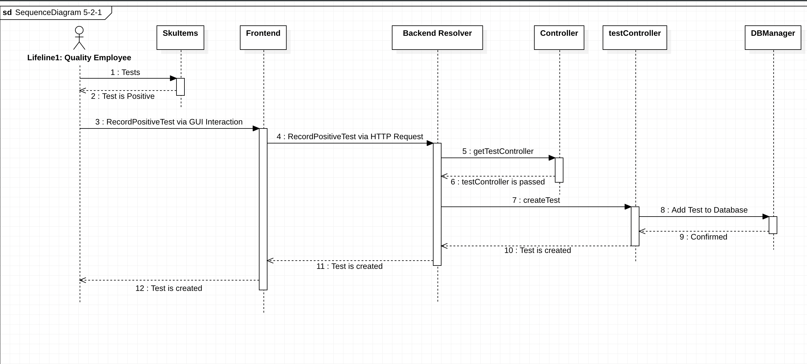

## Sequence Diagram 6.1

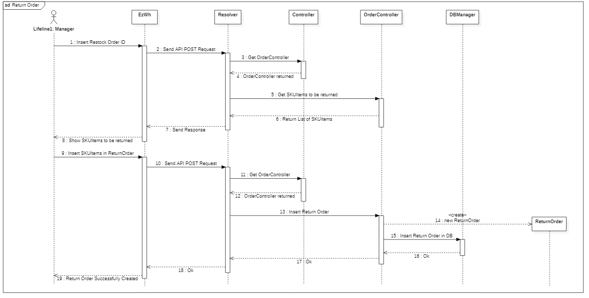

## Sequence Diagram 9.1

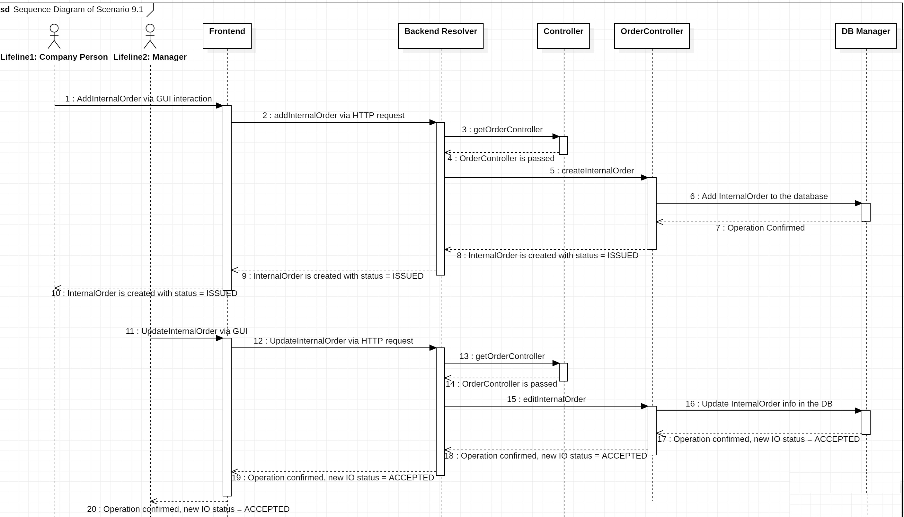

## Sequence Diagram 12.1

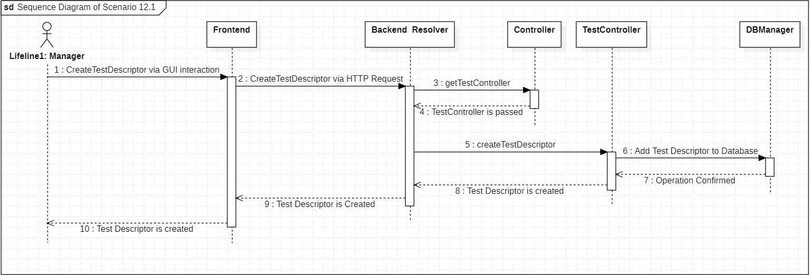

