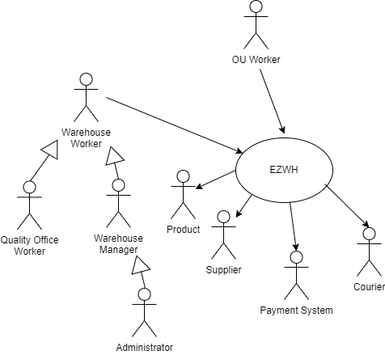
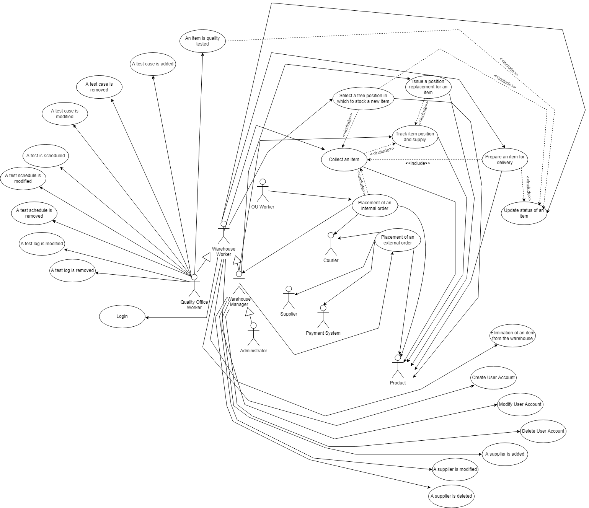
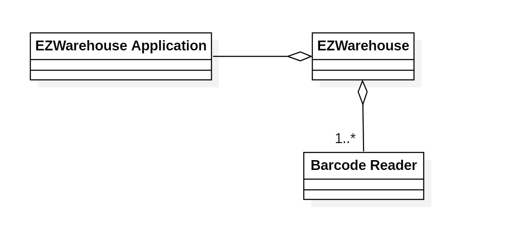
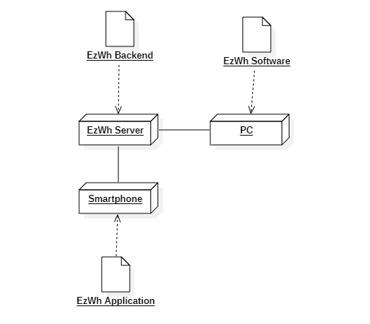

 # Requirements Document 

 Authors: Bianchi Giulia, Colella Edoardo, Colotti Manuel Enrique, Di Benedetto Giovanna

 
| Version number | Change                                                                                                         |
| -------------- | :------------------------------------------------------------------------------------------------------------- |
| 1.0            | Definition of Stakeholders, functional requirements and non-functional requirements                            |
| 2.0            | Definition of Use cases and scenarios                                                                          |
| 3.0            | Revision of Use cases and scenarios, Added draft of GUI, Context Diagram, System Design and Deployment Diagram |
| 4.0            | Added use cases diagram and revised the whole document                                                         |

# Contents

- [Requirements Document](#requirements-document)
- [Contents](#contents)
- [Informal description](#informal-description)
- [Stakeholders](#stakeholders)
- [Context Diagram and interfaces](#context-diagram-and-interfaces)
	- [Context Diagram](#context-diagram)
	- [Interfaces](#interfaces)
- [Stories and personas](#stories-and-personas)
- [Functional and non functional requirements](#functional-and-non-functional-requirements)
	- [Functional Requirements](#functional-requirements)
	- [Non Functional Requirements](#non-functional-requirements)
- [Use case diagram and use cases](#use-case-diagram-and-use-cases)
	- [Use case diagram](#use-case-diagram)
	- [Use case 1, UC1 - Placement of an internal order](#use-case-1-uc1---placement-of-an-internal-order)
		- [Scenario 1.1](#scenario-11)
		- [Scenario 1.2](#scenario-12)
	- [Use case 2, UC2 - Placement of an external order](#use-case-2-uc2---placement-of-an-external-order)
		- [Scenario 2.1](#scenario-21)
		- [Scenario 2.2](#scenario-22)
		- [Scenario 2.3](#scenario-23)
	- [Use case 3, UC3 Track an item position and supply](#use-case-3-uc3-track-an-item-position-and-supply)
		- [Scenario 3.1](#scenario-31)
		- [Scenario 3.2](#scenario-32)
	- [Use case 4, UC4 Collect an item](#use-case-4-uc4-collect-an-item)
		- [Scenario 4.1](#scenario-41)
		- [Scenario 4.2](#scenario-42)
		- [Scenario 4.3](#scenario-43)
	- [Use case 5, UC5 Select a free position in which to stock a new item](#use-case-5-uc5-select-a-free-position-in-which-to-stock-a-new-item)
		- [Scenario 5.1](#scenario-51)
		- [Scenario 5.2](#scenario-52)
		- [Scenario 5.3](#scenario-53)
	- [Use case 6, UC6 Issue a position replacement for an item](#use-case-6-uc6-issue-a-position-replacement-for-an-item)
		- [Scenario 6.1](#scenario-61)
		- [Scenario 6.2](#scenario-62)
		- [Scenario 6.3](#scenario-63)
	- [Use case 7, UC7 Prepare an item for delivery](#use-case-7-uc7-prepare-an-item-for-delivery)
		- [Scenario 7.1](#scenario-71)
		- [Scenario 7.2](#scenario-72)
	- [Use case 8, UC8 Elimination of an item from the warehouse](#use-case-8-uc8-elimination-of-an-item-from-the-warehouse)
	- [Use case 9, UC9 - Create User Account](#use-case-9-uc9---create-user-account)
	- [Use case 10, UC10 - Modify user account](#use-case-10-uc10---modify-user-account)
	- [Use case 11, UC11 - Delete user account](#use-case-11-uc11---delete-user-account)
	- [Use case 12, UC12 - An item is quality tested](#use-case-12-uc12---an-item-is-quality-tested)
		- [Scenario 12.1](#scenario-121)
		- [Scenario 12.2](#scenario-122)
	- [Use case 13, UC13 - A test case is added](#use-case-13-uc13---a-test-case-is-added)
	- [Use case 14, UC14 - A test case is modified](#use-case-14-uc14---a-test-case-is-modified)
	- [Use case 15, UC15 - A test case is removed](#use-case-15-uc15---a-test-case-is-removed)
	- [Use case 16, UC16 - A test is scheduled](#use-case-16-uc16---a-test-is-scheduled)
	- [Use case 17, UC17 - A test schedule is modified](#use-case-17-uc17---a-test-schedule-is-modified)
	- [Use case 18, UC18 - A test schedule is removed](#use-case-18-uc18---a-test-schedule-is-removed)
	- [Use case 19, UC19 - A test log is modified](#use-case-19-uc19---a-test-log-is-modified)
	- [Use case 20, UC20 - A test log is removed](#use-case-20-uc20---a-test-log-is-removed)
	- [Use case 21, UC21 - A  supplier is added](#use-case-21-uc21---a--supplier-is-added)
	- [Use case 22, UC22 - A supplier is updated](#use-case-22-uc22---a-supplier-is-updated)
	- [Use case 23, UC23 - A supplier is deleted](#use-case-23-uc23---a-supplier-is-deleted)
	- [Use case 24, UC24 Update status of an item](#use-case-24-uc24-update-status-of-an-item)
		- [Scenario 24.1](#scenario-241)
		- [Scenario 24.2](#scenario-242)
		- [Scenario 24.3](#scenario-243)
		- [Scenario 24.4](#scenario-244)
	- [Use case 25, UC25 User Login](#use-case-25-uc25-user-login)
- [Glossary](#glossary)
- [System Design](#system-design)
- [Deployment Diagram](#deployment-diagram)

# Informal description
Medium companies and retailers need a simple application to manage the relationship with suppliers and the inventory of physical items stocked in a physical warehouse. 
The warehouse is supervised by a manager, who supervises the availability of items. When a certain item is in short supply, the manager issues an order to a supplier. In general the same item can be purchased by many suppliers. The warehouse keeps a list of possible suppliers per item. 

After some time the items ordered to a supplier are received. The items must be quality checked and stored in specific positions in the warehouse. The quality check is performed by specific roles (quality office), who apply specific tests for item (different items are tested differently). Possibly the tests are not made at all, or made randomly on some of the items received. If an item does not pass a quality test it may be rejected and sent back to the supplier. 

Storage of items in the warehouse must take into account the availability of physical space in the warehouse. Further the position of items must be traced to guide later recollection of them.

The warehouse is part of a company. Other organizational units (OU) of the company may ask for items in the warehouse. This is implemented via internal orders, received by the warehouse. Upon reception of an internal order the warehouse must collect the requested item(s), prepare them and deliver them to a pick up area. When the item is collected by the other OU the internal order is completed. 

EZWH (EaSy WareHouse) is a software application to support the management of a warehouse.

# Stakeholders

| Stakeholder name                   |                                        Description                                        |
| ---------------------------------- | :---------------------------------------------------------------------------------------: |
| Medium Companies / Retailers       |                                                                                           |
| System Administrator               |                                                                                           |
| User Management System             |                                                                                           |
| Suppliers                          |   companies that supply items to the warehouse, hence to the warehouse's owner company    |
| Physical Warehouse                 |                                  items stocking facility                                  |
| Warehouse Items                    |                               items stocked in a warehouse                                |
| Warehouse Manager                  |                        person in charge of managing the warehouse                         |
| Items Ordering system              |                            system that manages incoming orders                            |
| Items Availability Checking System |                         system that checks availability of items                          |
| Items Collection System            |                        system that collects items to be delivered                         |
| Items Delivery System              |                 system that manages the delivery of items within an order                 |
| Warehouse worker                   |                                                                                           |
| Courier                            |                                                                                           |
| Quality Office                     |                            office that performs tests on items                            |
| Quality Checking System            |                    system that schedules tests and logs their outcomes                    |
| Quality Tests                      |                          tests for the different items)     !!!                           |
| Items Stocking System              |              system that manages the stocking in the warehouse of new items               |
| Items Returning System             | system that manages the returning of items that haven't passed one or more quality checks |
| Warehouse Space Management System  |             system that optimizes the space occupied by items in a warehouse              |
| Items Location Tracking System     |                    system that tracks items that have to be dispatched                    |
| Company Organizational Units       |                    sub-parts of the same company owning the warehouse                     |
| Internal Ordering System           |                   system that manages company-internal incoming orders                    |
| Payment System                     |                       system that handles the payment for an order                        |

# Context Diagram and interfaces

## Context Diagram

## Interfaces

| Actor             |                                    Logical Interface                                    |                     Physical Interface                      |
| ----------------- | :-------------------------------------------------------------------------------------: | :---------------------------------------------------------: |
| Payment System    |                            API (https://stripe.com/docs/api)                            |                        Internet link                        |
| Supplier          |                                  Sends/receives email                                   |                        Internet link                        |
| Courirer          |                                     Receives email                                      |                        Internet link                        |
| Product           | API for reading barcodes (https://developers.google.com/ml-kit/vision/barcode-scanning) |                     Mobile Phone Camera                     |
| Warehouse Worker  |                                           GUI                                           | Screen, keyboard and mouse on PC, touchscreen on smartphone |
| Warehouse Manager |                                           GUI                                           | Screen, keyboard and mouse on PC, touchscreen on smartphone |
| QO Worker         |                                           GUI                                           | Screen, keyboard and mouse on PC, touchscreen on smartphone |
| OU Worker         |                                           GUI                                           | Screen, keyboard and mouse on PC, touchscreen on smartphone |
| Administrator     |                                           GUI                                           |              Screen, keyboard and mouse on PC               |

# Stories and personas

Mark is a middle-aged man, he is the Warehouse Manager and has an inclination for order and discipline. When a product of a certain type is close to sold out, Mark reorders it. Mark is also very busy because of his position and work, he always gets home very late to fulfill his duties and he never has time to spend with his family. So Mark needs a fast and easy way to track the availability of a product, but he also needs an easy way to contact a supplier and perform the orders of the warehouse. Since he spends a lot of time in his office, he would like to have the opportuinity to perform all these kind of actions from the office PC.

Gina is a young woman, she is a normal part-time employee of the warehouse, and she has a really bad memory. When storing or removing a product, she would like to have a way to update the product's information without waiting to reach the office PC, since maybe she's going to forget it, so she would like to manage this kind of operations with her business phone as soon as possible.  

Albert is an old man, but he still works in the warehouse since he is part of a poor family. He wants to do his best in this work, so he'd like to have a tool that helps him in tracking in the most efficient way the warehouse products. Since he's old, he doesn't have great tech skills, so he would only be able to use an application with a basic user interface.

# Functional and non functional requirements

## Functional Requirements

| ID  |        |         |           |                             Description                              |
| --- | ------ | ------- | --------- | :------------------------------------------------------------------: |
| FR1 |        |         |           |                        Placement of an Order                         |
|     | FR1.1  |         |           |                    Placement of an internal order                    |
|     |        | FR1.1.1 |           |                      Choice of the wanted item                       |
|     |        | FR1.1.2 |           |      Choice of the attributes for an item (quantity, color...)       |
|     |        | FR1.1.3 |           |                       Issue Order to warehouse                       |
|     |        | FR1.1.4 |           |                      Complete an internal order                      |
|     |        |         | FR1.1.4.1 |                           Log placed order                           |
|     | FR1.2  |         |           |                 Placement of an order to a supplier                  |
|     |        | FR1.2.1 |           |    Record info of a supplier (in case not already in the system)     |
|     |        | FR1.2.2 |           |        Choice of the supplier (in case already in the system)        |
|     |        | FR1.2.3 |           |                Fill information needed for the order                 |
|     |        | FR1.2.4 |           |               Check Availability of the requested item               |
|     |        | FR1.2.5 |           |        Handle payment of the items (external payment system)         |
|     |        | FR1.2.6 |           |                              Send order                              |
|     |        | FR1.2.7 |           |                      Complete an internal order                      |
|     |        |         | FR1.2.7.1 |                           Log placed order                           |
| FR2 |        |         |           |                 Management of the physical warehouse                 |
|     | FR2.1  |         |           |                    Check availability of an item                     |
|     | FR2.2  |         |           |                   Collect an item to be delivered                    |
|     | FR2.3  |         |           |         Select a free position in which to stock a new item          |
|     | FR2.4  |         |           |               Issue a position replacement for an item               |
|     | FR2.5  |         |           |                   Track an item by it's properties                   |
|     | FR2.6  |         |           |                     Prepare an item for delivery                     |
|     | FR2.7  |         |           |              Check space availability in the warehouse               |
|     | FR2.8  |         |           |                    Collect an item to be stocked                     |
|     | FR2.9  |         |           |              Elimination of an item from the warehouse               |
|     | FR2.10 |         |           |               Placement of an item in the pick-up area               |
| FR3 |        |         |           |                       Quality Tests Management                       |
|     | FR3.1  |         |           |                 Schedule a quality test for an item                  |
|     | FR3.2  |         |           |               Insert in the system a new quality test                |
|     | FR3.3  |         |           |            Insert outcome of a quality test in the system            |
|     | FR3.4  |         |           |                        Show outcome of a test                        |
|     | FR3.5  |         |           |        Modify parameters of a quality test (pass/reject rate)        |
|     | FR3.6  |         |           | Schedule return of an item in case of unfullfilled test requirements |
| FR4 |        |         |           |                         Inventory Management                         |
|     | FR4.1  |         |           |                   Add a new item to the inventory                    |
|     | FR4.2  |         |           |                  Remove an item from the inventory                   |
|     | FR4.3  |         |           |                         Edit info of an item                         |
|     | FR4.4  |         |           |                       Add supplier for an item                       |
|     | FR4.5  |         |           |                     Remove supplier for an item                      |
|     | FR4.6  |         |           |                      Edit supplier for an item                       |
|     | FR4.7  |         |           |             Track items to be placed in the pick-up area             |
| FR5 |        |         |           |                           Users Management                           |
|     | FR5.1  |         |           |                              Add a user                              |
|     | FR5.2  |         |           |                            Remove a user                             |
|     | FR5.3  |         |           |                     Manage permissions of a user                     |
|     | FR5.4  |         |           |                 Edit personal information of a user                  |
|     | FR5.5  |         |           |                      Show information of users                       |

## Non Functional Requirements

| ID    |             Type              |                                                                  Description                                                                   | Refers to |
| ----- | :---------------------------: | :--------------------------------------------------------------------------------------------------------------------------------------------: | --------: |
| NFR1  |           Usability           |                 The software must be easy to use also for employees which have a limited amount of knowledge in the IT domain                  |    All FR |
| NFR2  |          Portability          |           In a company there might be different computers with different OS's, the software should be able to work in each of them.            |    All FR |
| NFR3  |          Efficiency           | The software must be efficient in managing the operations of space optimization, collection, shipment and stocking of a large number of items. |    All FR |
| NFR4  |          Robustness           |   The software must behave in a reasonable way also in case of unexpected scenarios (wrong inputs, bugs) in order to avoid economic damages    |    All FR |
| NFR5  |    Multi-language support     |                                 Nationality of companies that will use the software (multi-language platform)                                  |    All FR |
| NFR6  | International metrics support |  Use of different measurement metrics in case the software will be used in different continents (i.e. currencies, distance, space, speed...)   |    All FR |
| NFR7  |          Consistency          |                                                   Consistency of data within the application                                                   |    All FR |
| NFR8  |            Privacy            |                                                          Privacy and Security of data                                                          |       FR5 |
| NFR9  |         Need-to-know          |                                        Every user has only the necessary information to perform his job                                        |       FR5 |
| NFR10 |        Least privilege        |                                 Every user has the necessary amount of privileges necessary to perform his job                                 |       FR5 |

# Use case diagram and use cases

## Use case diagram

 
 
 

## Use case 1, UC1 - Placement of an internal order
| Actors Involved  |                                                   Manager, OU, Product, Courier                                                    |
| ---------------- | :--------------------------------------------------------------------------------------------------------------------------------: |
| Precondition     |                                                     An item has to be ordered                                                      |
| Post condition   |                                                    The desired item is ordered                                                     |
| Nominal Scenario | The OU issues an order for the item (by selecting it and its attributes), the manager receives the order and the item is delivered |
| Variants         |                                                                                                                                    |
| Exceptions       |                        The item is not available; the item doesn't pass most of the tests that it has to do                        |

### Scenario 1.1

| Scenario 1.1   | Placement of internal order (item available)  |
| -------------- | :-------------------------------------------: |
| Precondition   |  The OU requests an item from the warehouse   |
| Post condition |           The OU receives the item            |
| Step#          |                  Description                  |
| 1              |    OU selects the item and its properties     |
| 2              |   The warehouse manager receives the order    |
| 3              |  The manager checks if the item is available  |
| 4              | The manager prepares the item to be delivered |
| 5              |             The item is delivered             |
| 6              |           The OU receives the item            |

### Scenario 1.2
| Scenario 1.2   |  Placement of internal order (item unavailable)  |
| -------------- | :----------------------------------------------: |
| Precondition   |    The OU requests an item from the warehouse    |
| Post condition |         The OU doesn't receive the item          |
| Step#          |                   Description                    |
| 1              |      OU selects the item and its properties      |
| 2              |     The warehouse manager receives the order     |
| 3              |   The manager checks if the item is available    |
| 4              | The item is not available, the order is declined |

## Use case 2, UC2 - Placement of an external order
| Actors Involved  |                                            Manager, Supplier, Product, Payment System, Courier                                            |
| ---------------- | :---------------------------------------------------------------------------------------------------------------------------------------: |
| Precondition     |                                                         An item has to be ordered                                                         |
| Post condition   |                                                        The desired item is ordered                                                        |
| Nominal Scenario | The manager issues an order for the item (by selecting it and its attributes), the suppliers receives the order and the item is delivered |
| Variants         |                                                                                                                                           |
| Exceptions       |         The item is not available; the supplier doesn't have the item; the item doesn't pass most of the tests that it has to do          |

### Scenario 2.1

| Scenario 2.1   |                  Placement of external order (item available, supplier already exists)                   |
| -------------- | :------------------------------------------------------------------------------------------------------: |
| Precondition   |                               The manager requests an item from a supplier                               |
| Post condition |                                      The manager receives the item                                       |
| Step#          |                                               Description                                                |
| 1              |                             the manager selects the item and its properties                              |
| 2              | The manager selects the supplier from which the item has to be received (from an already known supplier) |
| 3              |                                     The supplier receives the order                                      |
| 4              |                               The supplier checks if the item is available                               |
| 5              |                              The supplier prepares the item to be delivered                              |
| 6              |                                          The item is delivered                                           |
| 7              |                                      The manager receives the item                                       |

### Scenario 2.2

| Scenario 2.2   |                Placement of external order (item not available, supplier already exists)                 |
| -------------- | :------------------------------------------------------------------------------------------------------: |
| Precondition   |                               The manager requests an item from a supplier                               |
| Post condition |                                  The manager does not receive the item                                   |
| Step#          |                                               Description                                                |
| 1              |                             the manager selects the item and its properties                              |
| 2              | The manager selects the supplier from which the item has to be received (from an already known supplier) |
| 3              |                                     The supplier receives the order                                      |
| 4              |                               The supplier checks if the item is available                               |
| 5              |                             The item is not available, the order is declined                             |

### Scenario 2.3

| Scenario 2.3   |               Placement of external order (new supplier)                |
| -------------- | :---------------------------------------------------------------------: |
| Precondition   |              The manager requests an item from a supplier               |
| Post condition |                      The manager receives the item                      |
| Step#          |                               Description                               |
| 1              |             the manager selects the item and its properties             |
| 2              | The manager selects the supplier from which the item has to be received |
| 3              |                     The supplier receives the order                     |
| 4              |              The supplier checks if the item is available               |
| 5              |  None of the supplier on the list has the item, select a new supplier   |
| 6              |             The supplier prepares the item to be delivered              |
| 7              |                          The item is delivered                          |
| 8              |                      The manager receives the item                      |

 ## Use case 3, UC3 Track an item position and supply
| Actors Involved  |                             Manager, Product                             |
| ---------------- | :----------------------------------------------------------------------: |
| Precondition     |        User is logged, item's information (id, name...) are known        |
| Post condition   |                 Supply and position of the item is known                 |
| Nominal Scenario | User types the information of the item he wants to find in the warehouse |
| Variants         |                                                                          |
| Exceptions       |           An item with the given information couldn't be found           |

### Scenario 3.1
| Scenario 3.1   |                                    Item informations are retreived correctly                                     |
| -------------- | :--------------------------------------------------------------------------------------------------------------: |
| Precondition   |                              The manager doesn't know some informations of an item                               |
| Post condition |                        The manager gets to know all the desired informations of the item                         |
| Step#          |                                                   Description                                                    |
| 1              |                                     The manager searches the item by its ID                                      |
| 2              |                                       The item is found into the warehouse                                       |
| 3              | The manager receives all the informations that was looking for (availability and position of the item) correctly |

### Scenario 3.2
| Scenario 3.2   |                      The item doesn't exist into the warehouse                      |
| -------------- | :---------------------------------------------------------------------------------: |
| Precondition   |                The manager doesn't know some informations of an item                |
| Post condition |                   The informations are not retreived successfully                   |
| Step#          |                                     Description                                     |
| 1              |                       The manager searches the item by its ID                       |
| 2              |            The ID doesn't match with any of the items into the warehouse            |
| 3              | The item doesn't exist into the warehouse, the system gives an alert to the manager |

## Use case 4, UC4 Collect an item  
| Actors Involved  |           Manager, Warehouse Worker, Product            |
| ---------------- | :-----------------------------------------------------: |
| Precondition     |        User is logged, item's position is known         |
| Post condition   |       The item is collected and ready to be moved       |
| Nominal Scenario | User types the position of the item he wants to collect |
| Variants         |                                                         |
| Exceptions       |                An item couldn't be found                |

### Scenario 4.1
| Scenario 4.1   |                    The item is moved into the pick up area                     |
| -------------- | :----------------------------------------------------------------------------: |
| Precondition   |                      The stored item has to be delivered                       |
| Post condition |                       The item is into the pick up area                        |
| Step#          |                                  Description                                   |
| 1              |              The manager receives an internal order for the item               |
| 2              |          The manager checks if the item is stored into the warehouse           |
| 3              |     The manager checks if the requested quantity of the item is available      |
| 4              | The item can be delivered; the manager changes its status on "to be delivered" |
| 5              |            The warehouse worker moves the item to the pick up area             |

### Scenario 4.2
| Scenario 4.2   |                    The item doesn't exist into the warehouse                    |
| -------------- | :-----------------------------------------------------------------------------: |
| Precondition   |                       The stored item has to be delivered                       |
| Post condition |                        The delivery request is declined                         |
| Step#          |                                   Description                                   |
| 1              |               The manager receives an internal order for the item               |
| 2              |           The manager checks if the item is stored into the warehouse           |
| 3              | The request doesn't give any results: the item doesn't exist into the warehouse |
| 4              |                        The delivery request is declined                         |

### Scenario 4.3
| Scenario 4.3   |            The item exists, but the quantity is not enough            |
| -------------- | :-------------------------------------------------------------------: |
| Precondition   |                  The stored item has to be delivered                  |
| Post condition |                   The delivery request is declined                    |
| Step#          |                              Description                              |
| 1              |          The manager receives an internal order for the item          |
| 2              |      The manager checks if the item is stored into the warehouse      |
| 3              | The manager checks if the requested quantity of the item is available |
| 4              |           The quantity is not enough to satisfy the request           |
| 5              |                   The delivery request is declined                    |

## Use case 5, UC5 Select a free position in which to stock a new item  
| Actors Involved  |                Warehouse Worker, Manager, Product                 |
| ---------------- | :---------------------------------------------------------------: |
| Precondition     |         User is logged, item's has already been collected         |
| Post condition   |                     A free position is found                      |
| Nominal Scenario |        User specifies the type of item and it's dimensions        |
| Variants         | Search for free positions without inserting any items information |
| Exceptions       |           No available free spaces inside the warehouse           |

### Scenario 5.1
| Scenario 5.1   |                                           Storing an item into a desired position                                           |
| -------------- | :-------------------------------------------------------------------------------------------------------------------------: |
| Precondition   |                                     The item has to be stored into a specific position                                      |
| Post condition |                                        The item is stored into the desired position                                         |
| Step#          |                                                         Description                                                         |
| 1              |                                           The manager receives the item to store                                            |
| 2              |                                              The manager checks its dimensions                                              |
| 3              |                    The manager checks if there is enough free space into the warehouse to store the item                    |
| 4              |                                         The manager checks the category of the item                                         |
| 5              | The manager checks if there is enough free space into the section of the warehouse that contains items of the same category |
| 6              |                                      The item can be stored into the desired position                                       |
| 7              |                                    The item is stored, its status is changed on "stored"                                    |
| 8              |                                      The position of the item is saved into the system                                      |

### Scenario 5.2
| Scenario 5.2   |                                           Storing an item into a random position                                            |
| -------------- | :-------------------------------------------------------------------------------------------------------------------------: |
| Precondition   |                                    The item has to be stored into an available position                                     |
| Post condition |                              The item is put into a position that is big enough to contain it                               |
| Step#          |                                                         Description                                                         |
| 1              |                                           The manager receives the item to store                                            |
| 2              |                                              The manager checks its dimensions                                              |
| 3              |                    The manager checks if there is enough free space into the warehouse to store the item                    |
| 4              |                                         The manager checks the category of the item                                         |
| 5              | The manager checks if there is enough free space into the section of the warehouse that contains items of the same category |
| 6              |                              There is no space into the section of items of the same category                               |
| 7              |                                 The item can be stored in another position of the warehouse                                 |
| 8              |                                    The item is stored, its status is changed on "stored"                                    |
| 9              |                                      The position of the item is saved into the system                                      |

### Scenario 5.3
| Scenario 5.3   |                       There is no more space into the warehouse                       |
| -------------- | :-----------------------------------------------------------------------------------: |
| Precondition   |                 The item has to be stored into an available position                  |
| Post condition |                                The item is not stored                                 |
| Step#          |                                      Description                                      |
| 1              |                        The manager receives the item to store                         |
| 2              |                           The manager checks its dimensions                           |
| 3              | The manager checks if there is enough free space into the warehouse to store the item |
| 4              |                       There is no free space into the warehouse                       |
| 5              |                         The item is sent back to the supplier                         |

## Use case 6, UC6 Issue a position replacement for an item
| Actors Involved  |                                   Manager, Product                                    |
| ---------------- | :-----------------------------------------------------------------------------------: |
| Precondition     |           User is logged, item's ID is known, destination position is known           |
| Post condition   |                     The item has been moved to it's new position                      |
| Nominal Scenario |   The two items which position has to be switched are selected, items are exchanged   |
| Variants         | Destination position is empty, No available position in which to move the second item |
| Exceptions       |                                                                                       |

### Scenario 6.1
| Scenario 6.1   |                        Position replacement for an item in a busy position                        |
| -------------- | :-----------------------------------------------------------------------------------------------: |
| Precondition   | User is logged, item's ID is known, destination position in which the item will be moved is known |
| Post condition |                           The item has been moved to it's new position                            |
| Step#          |                                            Description                                            |
| 1              |                  Position of first item in the warehouse is obtained by it's ID                   |
| 2              |                   The system checks if destination position is available or not                   |
| 3              |                                 Destination position is not empty                                 |
| 4              |                                      First item is collected                                      |
| 5              |           The system checks for an available position in which to stock the second item           |
| 6              |                               New position for second item is found                               |
| 7              |                          Second item is collected by a Warehouse worker                           |
| 8              |        First item is moved and stocked by a warehouse worker in it's destination position         |
| 9              |        Second item is moved and stocked by a warehouse worker in it's destination position        |

### Scenario 6.2
| Scenario 6.2   |                       Position replacement for an item in an empty position                       |
| -------------- | :-----------------------------------------------------------------------------------------------: |
| Precondition   | User is logged, item's ID is known, destination position in which the item will be moved is known |
| Post condition |                           The item has been moved to it's new position                            |
| Step#          |                                            Description                                            |
| 1              |                  Position of first item in the warehouse is obtained by it's ID                   |
| 2              |                   The system checks if destination position is available or not                   |
| 3              |                                   Destination position is empty                                   |
| 4              |                                      First item is collected                                      |
| 5              |        First item is moved and stocked by a warehouse worker in it's destination position         |

### Scenario 6.3
| Scenario 6.3   |                             No available new position for second item                             |
| -------------- | :-----------------------------------------------------------------------------------------------: |
| Precondition   | User is logged, item's ID is known, destination position in which the item will be moved is known |
| Post condition |                      The item will be stocked back in it's original position                      |
| Step#          |                                            Description                                            |
| 1              |                  Position of first item in the warehouse is obtained by it's ID                   |
| 2              |                   The system checks if destination position is available or not                   |
| 3              |                                 Destination position is not empty                                 |
| 4              |                                      First item is collected                                      |
| 5              |           The system checks for an available position in which to stock the second item           |
| 6              |                            No position for second item could be found                             |
| 7              |                       First item is stocked back in it's original position                        |

											

                           

## Use case 7, UC7 Prepare an item for delivery
| Actors Involved  |                         Manager, Warehouse worker, Product                         |
| ---------------- | :--------------------------------------------------------------------------------: |
| Precondition     |                      User is logged, item has been collected                       |
| Post condition   |               The item is ready to be delivered to the pick-up area                |
| Nominal Scenario | Needed operations are done on the item that needs to be delivered (i.e. packaging) |
| Variants         |                                                                                    |
| Exceptions       |                The item can't be prepared due to logistic problems                 |

### Scenario 7.1
| Scenario 7.1   |                       Delivery of an item                        |
| -------------- | :--------------------------------------------------------------: |
| Precondition   | User is logged, item's ID is known, pickup area has been defined |
| Post condition |            The item will be placed in the pickup area            |
| Step#          |                           Description                            |
| 1              |    Item located in the warehouse thourgh its ID and position     |
| 2              |               A warehouse worker collects the item               |
| 3              |       The warehouse worker prepares the item for delivery        |
| 4              |               The item is moved to the pickup area               |
| 5              |         The item status is updated in "to be delivered"          |

### Scenario 7.2
| Scenario 7.2   |                              Unable to delivery                              |
| -------------- | :--------------------------------------------------------------------------: |
| Precondition   |       User is logged, item's ID is known, pickup area has been defined       |
| Post condition |                The item will be placed back in it's position                 |
| Step#          |                                 Description                                  |
| 1              |  Position of the item in the warehouse is obtained by it's ID and position   |
| 2              |                     A warehouse worker collects the item                     |
| 3              |             The warehouse worker prepares the item for delivery              |
| 4              | The item couldn't be prepared and it's placed back in it's original position |

## Use case 8, UC8 Elimination of an item from the warehouse
| Actors Involved  |              Manager, Warehouse worker              |
| ---------------- | :-------------------------------------------------: |
| Precondition     |                   User is logged                    |
| Post condition   |   The item will no longer be inside the warehouse   |
| Nominal Scenario | The item is trashed hence it's position is freed up |
| Variants         |          Only the manager can delete items          |
| Exceptions       |                                                     |

| Scenario 8.1   |     Elimination of an item from the warehouse (normal user)     |
| -------------- | :-------------------------------------------------------------: |
| Precondition   |              User is logged, he's not the manager               |
| Post condition |                     The item is not deleted                     |
| Step#          |                           Description                           |
| 1              |                    The user selects the item                    |
| 2              | The user tries to delete the item by clicking on the "x" button |
| 3              |               The user receives an error message                |
| 4              |                     The item is not deleted                     |

| Scenario 8.2   |       Elimination of an item from the warehouse (manager)       |
| -------------- | :-------------------------------------------------------------: |
| Precondition   |                User is logged, he's the manager                 |
| Post condition |                       The item is deleted                       |
| Step#          |                           Description                           |
| 1              |                  The manager selects the item                   |
| 2              | The manager tries to delete the item clicking on the "x" button |
| 3              |       The manager confirms the desire to delete the item        |
| 4              |                       The item is deleted                       |

| Scenario 8.3   | Elimination of an item from the warehouse, item not deleted (manager) |
| -------------- | :-------------------------------------------------------------------: |
| Precondition   |                   User is logged, he's the manager                    |
| Post condition |                        The item is not deleted                        |
| Step#          |                              Description                              |
| 1              |                     The manager selects the item                      |
| 2              |    The manager tries to delete the item clicking on the "x" button    |
| 3              |                     The manager aborts the action                     |
| 4              |                        The item is not deleted                        |

## Use case 9, UC9 - Create User Account
| Actors Involved  |                             Manager, System Administrator, Warehouse Worker                              |
| ---------------- | :------------------------------------------------------------------------------------------------------: |
| Precondition     |                                         Account U does not exist                                         |
| Post condition   |                                      Account U added in the system                                       |
| Nominal Scenario |                    Admin or manager creates a new account U and populates its fields.                    |
| Variants         | Only the manager creates one account, this is checked through the email (one email, one account at most) |
| Exceptions       |                                                                                                          |

| Scenario 9.1   |           Creation of the account by a common user            |
| -------------- | :-----------------------------------------------------------: |
| Precondition   |          The user is a common user, subcribed or not          |
| Post condition |              The new user account is not created              |
| Step#          |                          Description                          |
| 1              | The user tries to have access to the user administration area |
| 2              |                      The user is blocked                      |

| Scenario 9.2   |   Creation of an already existing account by the admin   |
| -------------- | :------------------------------------------------------: |
| Precondition   |                  The user is subscribed                  |
| Post condition |           The new user account is not created            |
| Step#          |                       Description                        |
| 1              |     The admin enters in the user administration area     |
| 2              | The admin compiles the user form adding its informations |
| 3              |     The admin confirms and submits his informations      |
| 4              |   The system checks if the user is aldready subscribed   |
| 5              |  The user is subscribed, so the account is not created   |

| Scenario 9.3   |          Creation of a new account by the admin          |
| -------------- | :------------------------------------------------------: |
| Precondition   |                The user is not subscribed                |
| Post condition |             The new user account is created              |
| Step#          |                       Description                        |
| 1              |     The admin enters in the user administration area     |
| 2              | The admin compiles the user form adding its informations |
| 3              |     The admin confirms and submits his informations      |
| 4              |   The system checks if the user is aldready subscribed   |
| 5              |  The user is not subscribed, so the account is created   |

## Use case 10, UC10 - Modify user account
| Actors Involved  |  Manager, System Administrator, Warehouse Worker   |
| ---------------- | :------------------------------------------------: |
| Precondition     |                  Account U exists                  |
| Post condition   |                                                    |
| Nominal Scenario | The admin modifies one or more fields of account U |
| Variants         |        Administrator can modify any account        |
| Exceptions       |                                                    |

| Scenario 10.1  |                Modification of an account by the admin                |
| -------------- | :-------------------------------------------------------------------: |
| Precondition   |           The user is an admin, the account already exists            |
| Post condition |                     The informations are updated                      |
| Step#          |                              Description                              |
| 1              |           The admin enters in the user administration area            |
| 2              | The admin selects the user account in the account list to be modified |
| 3              |                  The admin modifies the informations                  |
| 4              |               The admin is taken back to the user list                |

| Scenario 10.2  |         Modification of an account by a common user          |
| -------------- | :----------------------------------------------------------: |
| Precondition   |    The user is a common user, the account already exists     |
| Post condition |                 The informations are updated                 |
| Step#          |                         Description                          |
| 1              |       The user enters in the user administration area        |
| 2              | The user is automatically redirected to its own informations |
| 3              |              The user modifies the informations              |
| 4              |                  The informations are saved                  |

## Use case 11, UC11 - Delete user account
| Actors Involved  |        Manager, System Administrator        |
| ---------------- | :-----------------------------------------: |
| Precondition     |              Account U exists               |
| Post condition   |      Account U deleted from the system      |
| Nominal Scenario |  User selects an user account U to delete   |
| Variants         | Only an administrator can delete an account |

| Scenario 11.1  |                   Elimination of an existing user                    |
| -------------- | :------------------------------------------------------------------: |
| Precondition   |   User is logged, he's the admin, the account to be deleted exists   |
| Post condition |                        An account is deleted                         |
| Step#          |                             Description                              |
| 1              |           The admin enters in the user administration area           |
| 2              | The admin selects the user account in the account list to be deleted |
| 3              |           The admin confirms the desire to delete the user           |
| 4              |                         The user is deleted                          |
| 5              |               The admin is taken back to the user list               |

| Scenario 11.2  |          Elimination of an existing user, user not deleted           |
| -------------- | :------------------------------------------------------------------: |
| Precondition   |   User is logged, he's the admin, the account to be deleted exists   |
| Post condition |                       The user is not deleted                        |
| Step#          |                             Description                              |
| 1              |           The admin enters in the user administration area           |
| 2              | The admin selects the user account in the account list to be deleted |
| 3              |                     The admin aborts the action                      |
| 4              |                       The user is not deleted                        |
| 5              |               The admin is taken back to the user list               |

| Scenario 11.3  |                   Elimination of a non-existing user                    |
| -------------- | :---------------------------------------------------------------------: |
| Precondition   | User is logged, he's the admin, the account to be deleted doesn't exist |
| Post condition |                          An account is deleted                          |
| Step#          |                               Description                               |
| 1              |            The admin enters in the user administration area             |
| 2              |  The admin searchs the user account in the account list to be deleted   |
| 3              |            The account doesn't exist, account is not deleted            |

## Use case 12, UC12 - An item is quality tested
| Actors Involved  |              Quality Office Worker              |
| ---------------- | :---------------------------------------------: |
| Precondition     |  Item is not tested, a test has been scheduled  |
| Post condition   |                 Item is tested                  |
| Nominal Scenario | A quality officier tests the quality of an item |
| Variants         |        Only quality officier makes tests        |
| Exceptions       |                                                 |

### Scenario 12.1
| Scenario 12.1  |                         The item passes the quality test                         |
| -------------- | :------------------------------------------------------------------------------: |
| Precondition   | A quality test has been scheduled for the item, the item passes the quality test |
| Post condition |                 A new positive test is recorded in test history                  |
| Step#          |                                   Description                                    |
| 1              |              A quality test officer enters the test history section              |
| 2              |                       The quality test officer adds a test                       |
| 3              |                    The test is selected from scheduled tests                     |
| 4              |                         The test informations are filled                         |
| 5              |                The test result is updated with a positive result                 |

### Scenario 12.2
| Scenario 12.2  |                      The item doesn't pass the quality test                      |
| -------------- | :------------------------------------------------------------------------------: |
| Precondition   | A quality test has been scheduled for the item, the item passes the quality test |
| Post condition |                 A new negative test is recorded in test history                  |
| Step#          |                                   Description                                    |
| 1              |              A quality test officer enters the test history section              |
| 2              |                       The quality test officer adds a test                       |
| 3              |                    The test is selected from scheduled tests                     |
| 4              |                         The test informations are filled                         |
| 5              |                 The test result is updated with negative result                  |

## Use case 13, UC13 - A test case is added

| Actors Involved  |                    Quality Office Worker                    |
| ---------------- | :---------------------------------------------------------: |
| Precondition     |               The test case T does not exist                |
| Post condition   |                   The test case T exists                    |
| Nominal Scenario | The quality officer inserts the new test case in the system |
| Variants         |    Only quality officier insert test cases in the system    |
| Exceptions       |                                                             |

| Scenario 13.1  |        New non-existing test case added by a quality officer        |
| -------------- | :-----------------------------------------------------------------: |
| Precondition   | User is logged, he's a quality officer, the test case doesn't exist |
| Post condition |                     A new test case is created                      |
| Step#          |                             Description                             |
| 1              |                  The user enters in the test area                   |
| 2              |           The user enters the test cases management area            |
| 3              |                 The user creates the new test case                  |
| 4              |         The test case informations are filled and confirmed         |
| 5              |          The system checks if the test case already exists          |
| 6              |                      The test case is created                       |
| 7              | The quality officer is redirected to the test cases managment area  |

| Scenario 13.2  |         New existing test case added by a quality officer          |
| -------------- | :----------------------------------------------------------------: |
| Precondition   |    User is logged, he's a quality officer, the test case exists    |
| Post condition |                   A new test case is not created                   |
| Step#          |                            Description                             |
| 1              |                  The user enters in the test area                  |
| 2              |           The user enters the test cases management area           |
| 3              |                 The user creates the new test case                 |
| 4              |        The test case informations are filled and confirmed         |
| 5              |         The system checks if the test case already exists          |
| 6              |                    The test case is not created                    |
| 7              | The quality officer is redirected to the test cases managment area |

## Use case 14, UC14 - A test case is modified
| Actors Involved  |                          Quality Office Worker                           |
| ---------------- | :----------------------------------------------------------------------: |
| Precondition     |                          The test case T exists                          |
| Post condition   |                       The test case T is modified                        |
| Nominal Scenario | The quality officer modifies the parameters of a test case in the system |
| Variants         |                                                                          |
| Exceptions       |                                                                          |

| Scenario 14.1  |     Modification of an existing test case by a quality officer     |
| -------------- | :----------------------------------------------------------------: |
| Precondition   |    User is logged, he's a quality officer, the test case exists    |
| Post condition |               The test case informations are updated               |
| Step#          |                            Description                             |
| 1              |                  The user enters in the test area                  |
| 2              |           The user enters the test cases management area           |
| 3              |                   The user selects the test case                   |
| 4              |         The test case informations are filled and updated          |
| 5              | The quality officer is redirected to the test cases managment area |

## Use case 15, UC15 - A test case is removed
| Actors Involved  |                  Quality Office Worker                   |
| ---------------- | :------------------------------------------------------: |
| Precondition     |                  The test case T exists                  |
| Post condition   |              The test case T doesn't exist               |
| Nominal Scenario | The quality officer delete the test case T in the system |
| Variants         |  Only quality officer deletes test cases in the system   |
| Exceptions       |                                                          |

| Scenario 15.1  |  Elimination of an existing test case by a quality officer   |
| -------------- | :----------------------------------------------------------: |
| Precondition   | User is logged, he's a quality officer, the test case exists |
| Post condition |                   The test case is removed                   |
| Step#          |                         Description                          |
| 1              |               The user enters in the test area               |
| 2              |        The user enters the test cases management area        |
| 3              |                The user selects the test case                |
| 4              |     The user comfirms the desire to delete the test case     |
| 5              |                   The test case is deleted                   |

| Scenario 15.2  | Elimination of an existing test case by a quality officer, test case not deleted |
| -------------- | :------------------------------------------------------------------------------: |
| Precondition   |           User is logged, he's a quality officer, the test case exists           |
| Post condition |                           The test case is not removed                           |
| Step#          |                                   Description                                    |
| 1              |                         The user enters in the test area                         |
| 2              |                  The user enters the test cases management area                  |
| 3              |                          The user selects the test case                          |
| 4              |                The user aborts the desire to delete the test case                |
| 5              |                           The test case is not deleted                           |

## Use case 16, UC16 - A test is scheduled
| Actors Involved  |                     Quality Office Worker                      |
| ---------------- | :------------------------------------------------------------: |
| Precondition     | The item has to be tested, the test has not been scheduled yet |
| Post condition   |            The test for a certain item is scheduled            |
| Nominal Scenario |      The quality officer schedules the test in the system      |
| Variants         |       Only quality officer schedules tests in the system       |
| Exceptions       |                                                                |

| Scenario 16.1  |          New non-existing test schedule added by a quality officer          |
| -------------- | :-------------------------------------------------------------------------: |
| Precondition   |     User is logged, he's a quality officer, the test case doesn't exist     |
| Post condition |                       A new test schedule is created                        |
| Step#          |                                 Description                                 |
| 1              |                      The user enters in the test area                       |
| 2              |                   The user enters the test schedule area                    |
| 3              |                   The user creates the new test schedule                    |
| 4              |               The test case schedule are filled and confirmed               |
| 5              |            The system checks if the test schedule already exists            |
| 6              |                        The test schedule is created                         |
| 7              | A relative test log entry is automatically created in the test history area |
| 8              |         The quality officer is redirected to the test schedule area         |

| Scenario 16.2  |      New existing test schedule added by a quality officer       |
| -------------- | :--------------------------------------------------------------: |
| Precondition   | User is logged, he's a quality officer, the test schedule exists |
| Post condition |                A new test schedule is not created                |
| Step#          |                           Description                            |
| 1              |                 The user enters in the test area                 |
| 2              |              The user enters the test schedule area              |
| 3              |              The user creates the new test schedule              |
| 4              |     The test schedule informations are filled and confirmed      |
| 5              |      The system checks if the test schedule already exists       |
| 6              |                 The test schedule is not created                 |
| 7              |   The quality officer is redirected to the test schedule area    |

## Use case 17, UC17 - A test schedule is modified
| Actors Involved  |                            Quality Office Worker                             |
| ---------------- | :--------------------------------------------------------------------------: |
| Precondition     |                          The test schedule T exists                          |
| Post condition   |                       The test schedule T is modified                        |
| Nominal Scenario | The quality officer modifies the parameters of a test schedule in the system |
| Variants         |                                                                              |
| Exceptions       |                                                                              |

| Scenario 17.1  |          Modification of an existing test schedule by a quality officer          |
| -------------- | :------------------------------------------------------------------------------: |
| Precondition   |         User is logged, he's a quality officer, the test schedule exists         |
| Post condition |                    The test schedule informations are updated                    |
| Step#          |                                   Description                                    |
| 1              |                         The user enters in the test area                         |
| 2              |                      The user enters the test schedule area                      |
| 3              |                        The user selects the test schedule                        |
| 4              |              The test schedule informations are filled and updated               |
| 5              | The test log informations related to the test schedule are automatically updated |
| 6              |           The quality officer is redirected to the test schedule area            |

| Scenario 17.2  | Modification of a test schedule by a quality officer, changes are not saved |
| -------------- | :-------------------------------------------------------------------------: |
| Precondition   |      User is logged, he's a quality officer, the test schedule exists       |
| Post condition |               The test schedule informations are not updated                |
| Step#          |                                 Description                                 |
| 1              |                      The user enters in the test area                       |
| 2              |                   The user enters the test schedule area                    |
| 3              |                     The user selects the test schedule                      |
| 4              | The test schedule informations are filled, then the user doesn'd save them  |
| 5              |   The test log informations related to the test schedule are not updated    |
| 6              |         The quality officer is redirected to the test schedule area         |

## Use case 18, UC18 - A test schedule is removed
| Actors Involved  |                    Quality Office Worker                     |
| ---------------- | :----------------------------------------------------------: |
| Precondition     |                  The test schedule T exists                  |
| Post condition   |              The test schedule T doesn't exist               |
| Nominal Scenario | The quality officer delete the test schedule T in the system |
| Variants         |  Only quality officer deletes test schedules in the system   |
| Exceptions       |                                                              |

| Scenario 18.1  |         Elimination of an existing test schedule by a quality officer         |
| -------------- | :---------------------------------------------------------------------------: |
| Precondition   |       User is logged, he's a quality officer, the test schedule exists        |
| Post condition |                         The test schedule is removed                          |
| Step#          |                                  Description                                  |
| 1              |                       The user enters in the test area                        |
| 2              |                    The user enters the test schedule area                     |
| 3              |                      The user selects the test schedule                       |
| 4              |           The user confirms the desire to delete the test schedule            |
| 5              | The test schedule and the relative test log entry in test history are deleted |

| Scenario 18.2  | Elimination of an existing test schedule by a quality officer, test schedule not deleted |
| -------------- | :--------------------------------------------------------------------------------------: |
| Precondition   |             User is logged, he's a quality officer, the test schedule exists             |
| Post condition |                             The test schedule is not removed                             |
| Step#          |                                       Description                                        |
| 1              |                             The user enters in the test area                             |
| 2              |                          The user enters the test schedule area                          |
| 3              |                            The user selects the test schedule                            |
| 4              |                  The user aborts the desire to delete the test schedule                  |
| 5              |                             The test schedule is not deleted                             |

## Use case 19, UC19 - A test log is modified
| Actors Involved  |                          Quality Office Worker                          |
| ---------------- | :---------------------------------------------------------------------: |
| Precondition     |                          The test log T exists                          |
| Post condition   |                       The test log T is modified                        |
| Nominal Scenario | The quality officer modifies the parameters of a test log in the system |
| Variants         |                                                                         |
| Exceptions       |                                                                         |

| Scenario 19.1  |            Modification of an existing test log by a quality officer             |
| -------------- | :------------------------------------------------------------------------------: |
| Precondition   |           User is logged, he's a quality officer, the test log exists            |
| Post condition |                      The test log informations are updated                       |
| Step#          |                                   Description                                    |
| 1              |                         The user enters in the test area                         |
| 2              |                      The user enters the test history area                       |
| 3              |                          The user selects the test log                           |
| 4              |                 The test log informations are filled and updated                 |
| 5              | The test schedule informations related to the test log are automatically updated |
| 6              |            The quality officer is redirected to the test history area            |

| Scenario 19.2  | Modification of a test log by a quality officer, changes are not saved |
| -------------- | :--------------------------------------------------------------------: |
| Precondition   |      User is logged, he's a quality officer, the test log exists       |
| Post condition |             The test schedule informations are not updated             |
| Step#          |                              Description                               |
| 1              |                    The user enters in the test area                    |
| 2              |                 The user enters the test history area                  |
| 3              |                     The user selects the test log                      |
| 4              | The test log informations are filled, then the user doesn't save them  |
| 5              | The test schedule informations related to the test log are not updated |
| 6              |       The quality officer is redirected to the test history area       |

## Use case 20, UC20 - A test log is removed
| Actors Involved  |                  Quality Office Worker                  |
| ---------------- | :-----------------------------------------------------: |
| Precondition     |                  The test log T exists                  |
| Post condition   |              The test log T doesn't exist               |
| Nominal Scenario | The quality officer delete the test log T in the system |
| Variants         |  Only quality officer deletes test logs in the system   |
| Exceptions       |                                                         |

| Scenario 20.1  |   Elimination of an existing test log by a quality officer    |
| -------------- | :-----------------------------------------------------------: |
| Precondition   |  User is logged, he's a quality officer, the test log exists  |
| Post condition |                    The test log is removed                    |
| Step#          |                          Description                          |
| 1              |               The user enters in the test area                |
| 2              |             The user enters the test history area             |
| 3              |                 The user selects the test log                 |
| 4              |      The user confirms the desire to delete the test log      |
| 5              | The test log and the relative test schedule entry are deleted |

| Scenario 20.2  | Elimination of an existing test log by a quality officer, test log not deleted |
| -------------- | :----------------------------------------------------------------------------: |
| Precondition   |          User is logged, he's a quality officer, the test log exists           |
| Post condition |                        The test schedule is not removed                        |
| Step#          |                                  Description                                   |
| 1              |                        The user enters in the test area                        |
| 2              |                       The user enters the test log area                        |
| 3              |                         The user selects the test log                          |
| 4              |               The user aborts the desire to delete the test log                |
| 5              |                          The test log is not deleted                           |

## Use case 21, UC21 - A  supplier is added 
| Actors Involved  |                  Manager, Administrator                   |
| ---------------- | :-------------------------------------------------------: |
| Precondition     |                The supplier is not present                |
| Post condition   |        The supplier becomes an available supplier         |
| Nominal Scenario | The manager records the new supplier and his informations |
| Variants         |          Only the manager can add new suppliers           |
| Exceptions       |                                                           |

| Scenario 21.1  |        New non-existing supplier added by the manager        |
| -------------- | :----------------------------------------------------------: |
| Precondition   | User is logged, he's the manager, the supplier doesn't exist |
| Post condition |                  A new supplier is created                   |
| Step#          |                         Description                          |
| 1              |              The user enters in the order area               |
| 2              |            The user enters the supplier list area            |
| 3              |              The user creates the new supplier               |
| 4              |      The supplier informations are filled and confirmed      |
| 5              |       The system checks if the supplier already exists       |
| 6              |                   The supplier is created                    |
| 7              |     The manager is redirected to the supplier list area      |

| Scenario 21.2  |      New existing supplier added by the manager       |
| -------------- | :---------------------------------------------------: |
| Precondition   | User is logged, he's the manager, the supplier exists |
| Post condition |             A new supplier is not created             |
| Step#          |                      Description                      |
| 1              |           The user enters in the order area           |
| 2              |        The user enters the supplier list area         |
| 3              |           The user creates the new supplier           |
| 4              |  The supplier informations are filled and confirmed   |
| 5              |   The system checks if the supplier already exists    |
| 6              |              The supplier is not created              |
| 7              |  The manager is redirected to the supplier list area  |

## Use case 22, UC22 - A supplier is updated 
| Actors Involved  |                 Manager, Administrator                  |
| ---------------- | :-----------------------------------------------------: |
| Precondition     | The supplier is in the supplier's list of the warehouse |
| Post condition   |          The supplier informations are updated          |
| Nominal Scenario |      The manager updates the supplier infromations      |
| Variants         |          Only the manager can modify suppliers          |
| Exceptions       |                                                         |

| Scenario 22.1  |  Modification of an existing supplier by the manager  |
| -------------- | :---------------------------------------------------: |
| Precondition   | User is logged, he's the manager, the supplier exists |
| Post condition |         The supplier informations are updated         |
| Step#          |                      Description                      |
| 1              |           The user enters in the order area           |
| 2              |        The user enters the supplier list area         |
| 3              |             The user selects the supplier             |
| 4              |   The supplier informations are filled and updated    |
| 5              |  The manager is redirected to the supplier list area  |

## Use case 23, UC23 - A supplier is deleted
| Actors Involved  |                      Manager, Administrator                       |
| ---------------- | :---------------------------------------------------------------: |
| Precondition     |      The supplier is in the supplier's list of the warehouse      |
| Post condition   | The supplier is no longer in the supplier's list of the warehouse |
| Nominal Scenario |                 The manager deletes the supplier                  |
| Variants         |               Only the manager can modify suppliers               |
| Exceptions       |                                                                   |

| Scenario 23.1  |  Elimination of an existing supplier by the manager   |
| -------------- | :---------------------------------------------------: |
| Precondition   | User is logged, he's the manager, the supplier exists |
| Post condition |                The supplier is removed                |
| Step#          |                      Description                      |
| 1              |           The user enters in the order area           |
| 2              |        The user enters the supplier list area         |
| 3              |             The user selects the supplier             |
| 4              |  The user confirms the desire to delete the supplier  |
| 5              |                The supplier is deleted                |
| 6              |   The user is redirected to the supplier list area    |

| Scenario 23.2  | Elimination of an existing supplier by the manager, supplier not deleted |
| -------------- | :----------------------------------------------------------------------: |
| Precondition   |          User is logged, he's the manager, the supplier exists           |
| Post condition |                     The test schedule is not removed                     |
| Step#          |                               Description                                |
| 1              |                    The user enters in the order area                     |
| 2              |                  The user enters the supplier list area                  |
| 3              |                      The user selects the supplier                       |
| 4              |            The user aborts the desire to delete the supplier             |
| 5              |                       The supplier is not deleted                        |

## Use case 24, UC24 Update status of an item
| Actors Involved  |                                     Manager, Worker                                      |
| ---------------- | :--------------------------------------------------------------------------------------: |
| Precondition     |                          Item exists, but its status is unknown                          |
| Post condition   |                               The item history is updated                                |
| Nominal Scenario | The item, based on its condition (if it is stored or not), gets its informations updated |
| Variants         |                                                                                          |
| Exceptions       |                        The item doesn't exist into the warehouse                         |

### Scenario 24.1
| Scenario 24.1  |                                 Update status (new item, status = to be stored)                                  |
| -------------- | :--------------------------------------------------------------------------------------------------------------: |
| Precondition   |                                    The item is new and its status is unknown                                     |
| Post condition |                                    The item's status is set on "to be stored"                                    |
| Step#          |                                                   Description                                                    |
| 1              |                                       A new item is sent to the warehouse                                        |
| 2              |                                       The item is not selected for a test                                        |
| 3              | The warehouse worker sets the item status on "to be stored" until it has a place to be stored into the warehouse |

### Scenario 24.2
| Scenario 24.2  |                           Update status (new item, status = to be tested)                            |
| -------------- | :--------------------------------------------------------------------------------------------------: |
| Precondition   |                              The item is new and its status is unknown                               |
| Post condition |                              The item's status is set on "to be tested"                              |
| Step#          |                                             Description                                              |
| 1              |                                 A new item is sent to the warehouse                                  |
| 2              |                                  The item is selected to be tested                                   |
| 3              | The warehouse worker sets the status on "to be tested" before giving the item to the quality officer |

### Scenario 24.3
| Scenario 24.3  |          Update status (tested item, status = to be stored)           |
| -------------- | :-------------------------------------------------------------------: |
| Precondition   |                       The item has to be tested                       |
| Post condition |        The item is tested and its status is on "to be stored"         |
| Step#          |                              Description                              |
| 1              |      The warehouse worker selects the item that has to be tested      |
| 2              |     The quality officer selects the test that the item has to do      |
| 3              |             The item passes the test and it can be stored             |
| 4              | The warehouse worker finds a place to put the item into the warehouse |
| 5              |   The warehouse worker changes the item's status on "to be stored"    |

### Scenario 24.4
| Scenario 24.4  |                              Update status (item status = to be delivered)                               |
| -------------- | :------------------------------------------------------------------------------------------------------: |
| Precondition   |                   The item has to be delivered and its status is currently on "stored"                   |
| Post condition |                              The item's status is set on "to be delivered"                               |
| Step#          |                                               Description                                                |
| 1              | The warehouse manager receives an internal order that includes an item that is stored into the warehouse |
| 2              |              The manager checks if the item can be delivered (conditions, test passed, etc)              |
| 3              |              The item can be delivered; the manager changes its status on "to be delivered"              |

## Use case 25, UC25 User Login
| Actors Involved  |                   All users                    |
| ---------------- | :--------------------------------------------: |
| Precondition     |       A user is not logged in the system       |
| Post condition   |         A user is logged in the system         |
| Nominal Scenario | User inserts his credentials in order to login |
| Variants         |          User forgets his credentials          |
| Exceptions       |             The user doesn't exist             |

# Glossary

 
 
 

# System Design

 
 
 

# Deployment Diagram 

