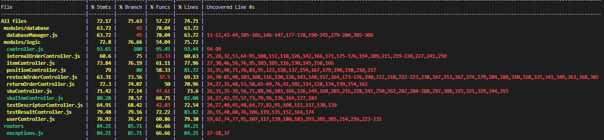

# Unit Testing Report

Date: 25/05/2022

Version: 1.0

# Black Box Unit Tests


## **Class *skuController* - method *getSKU***

The input value is the id.

**Criteria for method *getSKU*:**
	
 - Validity of *id*
 -*id* format


**Predicates for method *getSKU*:**

|     Criteria     |                        Predicate                        |
| :--------------: | :-----------------------------------------------------: |
| Validity of *id* | There is no SKU with the specified *id* in the database |
|                  | There is a SKU with the specified *id* in the database  |
|   *id* format    |              The format of id is incorrect              |
|                  |               The format of id is correct               |


**Boundaries**:

|     Criteria     |  Boundary values  |
| :--------------: | :---------------: |
| Validity of *id* | No boundary found |

| Criteria 1 | Criteria 2 | Valid / Invalid |                 Description of the test case                 |               Jest test case               |
| :--------: | :--------: | :-------------: | :----------------------------------------------------------: | :----------------------------------------: |
|  Present   |   Valid    |      Valid      |             There is a SKU with the chosen *id*              |      test('successful use of getSku')      |
|   Absent   |   Valid    |     Invalid     |             There is no SKU with the chosen *id*             | test('use of getSku with non-existant sku' |
|  Present   |  Invalid   |     Invalid     |  There is a SKU with the chosen *id*, the *id* is not valid  |   test('use of getSku with invalid id')    |
|   Absent   |  Invalid   |     Invalid     | There is no SKU with the chosen *id*,  the *id* is not valid |                                            |


## 1) Test Case: 'successful use of getAllSku'

```
let result, currId;
            const result = await skuController.getAllSku();
            console.log(result);
            assert.equal(result.length, 1);
```

## 2) Test Case: 'use of getSku with invalid id'

```
let errorValue;
            const result = await skuController.getSku("hello").catch(error => errorValue = error)
            assert.equal(errorValue.code, 422);
```
## 3) Test Case: 'use of getSku with non-existant sku'

```
let errorValue;
            let errorValue;
            await skuController.getSku(2).catch(error => errorValue = error)
            assert.equal(errorValue.code, 404);
```


 ## **Class *skuController* - method *createSKU***

The values used for criteria are not the input of the function, they are taken from the body of the HTTP POST Request.


**Criteria for method *createSKU*:**
	

 - Sign of *weight*
 - Sign of *volume*
 - Sign of *availableQuantity*
  - Sign of *price*
 - Absence of array of a value


**Predicates for method *createSKU*:**

|          Criteria           |                       Predicate                        |
| :-------------------------: | :----------------------------------------------------: |
|      Sign of *weight*       |                  *weight* is positive                  |
|                             |                  *weight* is negative                  |
|      Sign of *volume*       |                  *volume* is positive                  |
|                             |                  *volume* is negative                  |
| Sign of *availableQuantity* |            *availableQuantity* is positive             |
|                             |            *availableQuantity* is negative             |
|       Sign of *price*       |                  *price* is positive                   |
|                             |                  *price* is negative                   |
|     Absence of a value      | There is some missing value in the body of the request |
|                             |  There is no missing value in the body of the request  |


**Boundaries**:

|          Criteria           |  Boundary values  |
| :-------------------------: | :---------------: |
|      Sign of *weight*       |         0         |
|      Sign of *volume*       |         0         |
| Sign of *availableQuantity* |         0         |
|       Sign of *price*       |         0         |
|     Absence of a value      | No boundary found |


**Combination of predicates**:


| Criteria 1 | Criteria 2 | Criteria 3 | Criteria 4 | Criteria 5 | Valid / Invalid |                      Description of the test case                       |                 Jest test case                  |
| :--------: | :--------: | :--------: | :--------: | :--------: | :-------------: | :---------------------------------------------------------------------: | :---------------------------------------------: |
|  Positive  |  Positive  |  Positive  |  Positive  |  Present   |      Valid      |     The test case considers all the correct signs, no missing value     |  test("Successfully add new Sku to Database")   |
|  Positive  |  Positive  |  Positive  |  Positive  |   Absent   |     Invalid     | The test case considers all the correct signs, there is a missing value | test("Insertion of a sku with a missing value") |
|  Positive  |  Positive  |  Positive  |  Negative  |  Present   |     Invalid     |               The test case considers one incorrect sign                |                                                 |
|  Positive  |  Positive  |  Positive  |  Negative  |   Absent   |     Invalid     |               The test case considers one incorrect sign                |                                                 |
|  Positive  |  Positive  |  Negative  |  Positive  |  Present   |     Invalid     |               The test case considers one incorrect sign                |                                                 |
|  Positive  |  Positive  |  Negative  |  Positive  |   Absent   |     Invalid     |               The test case considers one incorrect sign                |                                                 |
|  Positive  |  Positive  |  Negative  |  Negative  |  Present   |     Invalid     |               The test case considers two incorrect signs               |                                                 |
|  Positive  |  Positive  |  Negative  |  Negative  |   Absent   |     Invalid     |               The test case considers two incorrect signs               |                                                 |
|  Positive  |  Negative  |  Positive  |  Positive  |  Present   |     Invalid     |               The test case considers one incorrect sign                | test("Insertion of a Sku with negative volume") |
|  Positive  |  Negative  |  Positive  |  Positive  |   Absent   |     Invalid     |               The test case considers one incorrect sign                |                                                 |
|  Positive  |  Negative  |  Positive  |  Negative  |  Present   |     Invalid     |               The test case considers two incorrect signs               |                                                 |
|  Positive  |  Negative  |  Positive  |  Negative  |   Absent   |     Invalid     |               The test case considers two incorrect signs               |                                                 |
|  Positive  |  Negative  |  Negative  |  Positive  |  Present   |     Invalid     |               The test case considers two incorrect signs               |                                                 |
|  Positive  |  Negative  |  Negative  |  Positive  |   Absent   |     Invalid     |               The test case considers two incorrect signs               |                                                 |
|  Positive  |  Negative  |  Negative  |  Negative  |  Present   |     Invalid     |              The test case considers three incorrect signs              |                                                 |
|  Positive  |  Negative  |  Negative  |  Negative  |   Absent   |     Invalid     |              The test case considers three incorrect signs              |                                                 |
|  Negative  |  Positive  |  Positive  |  Positive  |  Present   |     Invalid     |               The test case considers one incorrect sign                |                                                 |
|  Negative  |  Positive  |  Positive  |  Positive  |   Absent   |     Invalid     |               The test case considers one incorrect sign                |                                                 |
|  Negative  |  Positive  |  Positive  |  Negative  |  Present   |     Invalid     |               The test case considers two incorrect signs               |                                                 |
|  Negative  |  Positive  |  Positive  |  Negative  |   Absent   |     Invalid     |               The test case considers two incorrect signs               |                                                 |
|  Negative  |  Positive  |  Negative  |  Positive  |  Present   |     Invalid     |               The test case considers two incorrect signs               |                                                 |
|  Negative  |  Positive  |  Negative  |  Positive  |   Absent   |     Invalid     |               The test case considers two incorrect signs               |                                                 |
|  Negative  |  Positive  |  Negative  |  Negative  |  Present   |     Invalid     |              The test case considers three incorrect signs              |                                                 |
|  Negative  |  Positive  |  Negative  |  Negative  |   Absent   |     Invalid     |              The test case considers three incorrect signs              |                                                 |
|  Negative  |  Negative  |  Positive  |  Positive  |  Present   |     Invalid     |               The test case considers two incorrect signs               |                                                 |
|  Negative  |  Negative  |  Positive  |  Positive  |   Absent   |     Invalid     |               The test case considers two incorrect signs               |                                                 |
|  Negative  |  Negative  |  Positive  |  Negative  |  Present   |     Invalid     |              The test case considers three incorrect signs              |                                                 |
|  Negative  |  Negative  |  Positive  |  Negative  |   Absent   |     Invalid     |              The test case considers three incorrect signs              |                                                 |
|  Negative  |  Negative  |  Negative  |  Positive  |  Present   |     Invalid     |              The test case considers three incorrect signs              |                                                 |
|  Negative  |  Negative  |  Negative  |  Positive  |   Absent   |     Invalid     |              The test case considers three incorrect signs              |                                                 |
|  Negative  |  Negative  |  Negative  |  Negative  |  Present   |     Invalid     |              The test case considers four incorrect signs               |                                                 |
|  Negative  |  Negative  |  Negative  |  Negative  |   Absent   |     Invalid     |              The test case considers four incorrect signs               |                                                 |


## 1) Test Case: "Successfully add new Sku to Database"

```
let result;
            let oldCount;
            let newCount;
            const body = {
                "description": "a new sku",
                "weight": 100,
                "volume": 50,
                "notes": "second SKU",
                "price": 10.99,
                "availableQuantity": 50
            }

            result = await skuController.getAllSku();
            oldCount = result.length;

            await skuController.createSku(body);

            result = await skuController.getAllSku();
            newCount = result.length;


            expect(newCount).to.be.equal(oldCount + 1);
```

## 2) Test Case: "Insertion of a sku with a missing value"

```
let result;
            let oldCount;
            let newCount;
            const body = {
                "description": "a new sku",
                "weight": 100,
                "volume": 50,
                "notes": "second SKU",
                "price": 10.99
            }

            result = await skuController.getAllSku();
            oldCount = result.length;

            await skuController.createSku(body).catch(() => { });

            result = await skuController.getAllSku();
            newCount = result.length;


            expect(newCount).to.be.equal(oldCount);
```
## 3) Test Case: "Insertion of a Sku with negative volume"

```
            let result;
            let oldCount;
            let newCount;
            const body = {
                "description": "a new sku",
                "weight": 100,
                "volume": -50,
                "notes": "second SKU",
                "price": 10.99,
                "availableQuantity": 50
            }

            result = await skuController.getAllSku();
            oldCount = result.length;

            await skuController.createSku(body).catch(() => { });

            result = await skuController.getAllSku();
            newCount = result.length;


            expect(newCount).to.be.equal(oldCount);
```

## **Class *skuController* - method *editSKU***

The input values the id and they are also taken from the body of the HTTP PUT Request.

**Criteria for method *editSKU*:**
	

 - Sign and validity of *newWeight*
 - Sign and validity of *newVolume*
 - Sign of *newAvailableQuantity*
 - Sign of *newPrice*
 - Validity of *id*
 - Value of *occupiedWeight-maxWeight*
 - Value of *occupiedVolume-maxVolume*


**Predicates for method *editSKU*:**

|              Criteria              |                        Predicate                        |
| :--------------------------------: | :-----------------------------------------------------: |
|  Sign and validity of *newWeight*  |                 *newWeight* is positive                 |
|                                    |                 *newWeight* is negative                 |
|  Sign and validity of *newVolume*  |                 *newVolume* is positive                 |
|                                    |                 *newVolume* is negative                 |
|   Sign of *newAvailableQuantity*   |           *newAvailableQuantity* is positive            |
|                                    |           *newAvailableQuantity* is negative            |
|         Sign of *newPrice*         |                 *newPrice* is positive                  |
|                                    |                 *newPrice* is negative                  |
|          Validity of *id*          | There is no SKU with the specified *id* in the database |
|                                    | There is a SKU with the specified *id* in the database  |
| Sign of *occupiedWeight-maxWeight* |         *occupiedWeight-maxWeight* is negative          |
|                                    |         *occupiedWeight-maxWeight* is positive          |
| Sign of *occupiedVolume-maxVolume* |          *occupiedVolume-maxVolume*is negative          |
|                                    |         *occupiedVolume-maxVolume* is positive          |


**Boundaries**:

|              Criteria              |  Boundary values  |
| :--------------------------------: | :---------------: |
|  Sign and validity of *newWeight*  |         0         |
|  Sign and validity of *newVolume*  |         0         |
|   Sign of *newAvailableQuantity*   |         0         |
|         Sign of *newPrice*         |         0         |
|          Validity of *id*          | No boundary found |
| Sign of *occupiedVolume-maxVolume* |         0         |
| Sign of *occupiedWeight-maxWeight* |         0         |


**Combination of predicates**:


| Criteria 1 | Criteria 2 | Criteria 3 | Criteria 4 | Criteria 5 | Criteria 6 | Criteria 7 | Valid / Invalid |                                                                                                    Description of the test case                                                                                                    |                                                  Jest test case                                                   |
| :--------: | :--------: | :--------: | :--------: | :--------: | :--------: | :--------: | :-------------: | :--------------------------------------------------------------------------------------------------------------------------------------------------------------------------------------------------------------------------------: | :---------------------------------------------------------------------------------------------------------------: |
|  Positive  |  Positive  |  Positive  |  Positive  |  Present   |  Positive  |  Positive  |     Invalid     |                                                                    The new occupied weight exceeds the maxWeight, the new occupied volume exceeds the maxVolume                                                                    |                                                                                                                   |
|  Positive  |  Positive  |  Positive  |  Positive  |  Present   |  Positive  |  Negative  |     Invalid     |                                                                                           The new occupied weight exceeds the maxWeight                                                                                            | test('Edit a sku in such a way that newWeight*newAvailableQuantity>maxWeight of the position in which is stored') |
|  Positive  |  Positive  |  Positive  |  Positive  |  Present   |  Negative  |  Positive  |     Invalid     |                                                                                           The new occupied volume exceeds the maxVolume                                                                                            |                                                                                                                   |
|  Positive  |  Positive  |  Positive  |  Positive  |  Present   |  Negative  |  Negative  |      Valid      |                                The test case considers all the correct signs, there is a SKU with the chosen *id* in the database, the occupied volume and weight don't exceed their maximum value                                 |                                          test('Successfully edit a sku')                                          |
|  Positive  |  Positive  |  Positive  |  Positive  |   Absent   |  Positive  |  Positive  |     Invalid     |               The new occupied weight exceeds the maxWeight, the new occupied volume exceeds the maxVolume, the test case considers all the correct signs, but there is no SKU with the chosen *id* in the database                |                                                                                                                   |
|  Positive  |  Positive  |  Positive  |  Positive  |   Absent   |  Positive  |  Negative  |     Invalid     |                                       The new occupied weight exceeds the maxWeight, the test case considers all the correct signs, but there is no SKU with the chosen *id* in the database                                       |                                                                                                                   |
|  Positive  |  Positive  |  Positive  |  Positive  |   Absent   |  Negative  |  Positive  |     Invalid     |                                       The new occupied volume exceeds the maxVolume, he test case considers all the correct signs, but there is no SKU with the chosen *id* in the database                                        |                                                                                                                   |
|  Positive  |  Positive  |  Positive  |  Positive  |   Absent   |  Negative  |  Negative  |     Invalid     |                                                              The test case considers all the correct signs, but there is no SKU with the chosen *id* in the database                                                               |                                          test('Edit a non-existing Sku')                                          |
|  Positive  |  Positive  |  Positive  |  Negative  |  Present   |  Positive  |  Positive  |     Invalid     |                                                       The new occupied weight exceeds the maxWeight, the new occupied volume exceeds the maxVolume, there is one wrong sign                                                        |                                                                                                                   |
|  Positive  |  Positive  |  Positive  |  Negative  |  Present   |  Positive  |  Negative  |     Invalid     |                                                                               The new occupied weight exceeds the maxWeight, there is one wrong sign                                                                               |                                                                                                                   |
|  Positive  |  Positive  |  Positive  |  Negative  |  Present   |  Negative  |  Positive  |     Invalid     |                                                                               The new occupied volume exceeds the maxVolume, there is one wrong sign                                                                               |                                                                                                                   |
|  Positive  |  Positive  |  Positive  |  Negative  |  Present   |  Negative  |  Negative  |     Invalid     |                    The test case considers all the correct signs, there is a SKU with the chosen *id* in the database, the occupied volume and weight don't exceed their maximum value, there is one wrong sign                    |                                                                                                                   |
|  Positive  |  Positive  |  Positive  |  Negative  |   Absent   |  Positive  |  Positive  |     Invalid     |   The new occupied weight exceeds the maxWeight, the new occupied volume exceeds the maxVolume, the test case considers all the correct signs, but there is no SKU with the chosen *id* in the database, there is one wrong sign   |                                                                                                                   |
|  Positive  |  Positive  |  Positive  |  Negative  |   Absent   |  Positive  |  Negative  |     Invalid     |                          The new occupied weight exceeds the maxWeight, the test case considers all the correct signs, but there is no SKU with the chosen *id* in the database, there is one wrong sign                           |                                                                                                                   |
|  Positive  |  Positive  |  Positive  |  Negative  |   Absent   |  Negative  |  Positive  |     Invalid     |                           The new occupied volume exceeds the maxVolume, he test case considers all the correct signs, but there is no SKU with the chosen *id* in the database, there is one wrong sign                           |                                                                                                                   |
|  Positive  |  Positive  |  Positive  |  Negative  |   Absent   |  Negative  |  Negative  |     Invalid     |                                                  The test case considers all the correct signs, but there is no SKU with the chosen *id* in the database, there is one wrong sign                                                  |                                                                                                                   |
|  Positive  |  Positive  |  Negative  |  Positive  |  Present   |  Positive  |  Positive  |     Invalid     |                                                       The new occupied weight exceeds the maxWeight, the new occupied volume exceeds the maxVolume, there is one wrong sign                                                        |                                                                                                                   |
|  Positive  |  Positive  |  Negative  |  Positive  |  Present   |  Positive  |  Negative  |     Invalid     |                                                                               The new occupied weight exceeds the maxWeight, there is one wrong sign                                                                               |                                                                                                                   |
|  Positive  |  Positive  |  Negative  |  Positive  |  Present   |  Negative  |  Positive  |     Invalid     |                                                                               The new occupied volume exceeds the maxVolume, there is one wrong sign                                                                               |                                                                                                                   |
|  Positive  |  Positive  |  Negative  |  Positive  |  Present   |  Negative  |  Negative  |     Invalid     |                    The test case considers all the correct signs, there is a SKU with the chosen *id* in the database, the occupied volume and weight don't exceed their maximum value, there is one wrong sign                    |                                                                                                                   |
|  Positive  |  Positive  |  Negative  |  Positive  |   Absent   |  Positive  |  Positive  |     Invalid     |   The new occupied weight exceeds the maxWeight, the new occupied volume exceeds the maxVolume, the test case considers all the correct signs, but there is no SKU with the chosen *id* in the database, there is one wrong sign   |                                                                                                                   |
|  Positive  |  Positive  |  Negative  |  Positive  |   Absent   |  Positive  |  Negative  |     Invalid     |                          The new occupied weight exceeds the maxWeight, the test case considers all the correct signs, but there is no SKU with the chosen *id* in the database, there is one wrong sign                           |                                                                                                                   |
|  Positive  |  Positive  |  Negative  |  Positive  |   Absent   |  Negative  |  Positive  |     Invalid     |                           The new occupied volume exceeds the maxVolume, he test case considers all the correct signs, but there is no SKU with the chosen *id* in the database, there is one wrong sign                           |                                                                                                                   |
|  Positive  |  Positive  |  Negative  |  Positive  |   Absent   |  Negative  |  Negative  |     Invalid     |                                                  The test case considers all the correct signs, but there is no SKU with the chosen *id* in the database, there is one wrong sign                                                  |                                                                                                                   |
|  Positive  |  Positive  |  Negative  |  Negative  |  Present   |  Positive  |  Positive  |     Invalid     |                                                      The new occupied weight exceeds the maxWeight, the new occupied volume exceeds the maxVolume, there are two wrong signs                                                       |                                                                                                                   |
|  Positive  |  Positive  |  Negative  |  Negative  |  Present   |  Positive  |  Negative  |     Invalid     |                                                                              The new occupied weight exceeds the maxWeight, there are two wrong signs                                                                              |                                                                                                                   |
|  Positive  |  Positive  |  Negative  |  Negative  |  Present   |  Negative  |  Positive  |     Invalid     |                                                                              The new occupied volume exceeds the maxVolume, there are two wrong signs                                                                              |                                                                                                                   |
|  Positive  |  Positive  |  Negative  |  Negative  |  Present   |  Negative  |  Negative  |     Invalid     |                   The test case considers all the correct signs, there is a SKU with the chosen *id* in the database, the occupied volume and weight don't exceed their maximum value, there are two wrong signs                   |                                                                                                                   |
|  Positive  |  Positive  |  Negative  |  Negative  |   Absent   |  Positive  |  Positive  |     Invalid     |  The new occupied weight exceeds the maxWeight, the new occupied volume exceeds the maxVolume, the test case considers all the correct signs, but there is no SKU with the chosen *id* in the database, there are two wrong signs  |                                                                                                                   |
|  Positive  |  Positive  |  Negative  |  Negative  |   Absent   |  Positive  |  Negative  |     Invalid     |                         The new occupied weight exceeds the maxWeight, the test case considers all the correct signs, but there is no SKU with the chosen *id* in the database, there are two wrong signs                          |                                                                                                                   |
|  Positive  |  Positive  |  Negative  |  Negative  |   Absent   |  Negative  |  Positive  |     Invalid     |                          The new occupied volume exceeds the maxVolume, he test case considers all the correct signs, but there is no SKU with the chosen *id* in the database, there are two wrong signs                          |                                                                                                                   |
|  Positive  |  Positive  |  Negative  |  Negative  |   Absent   |  Negative  |  Negative  |     Invalid     |                                                 The test case considers all the correct signs, but there is no SKU with the chosen *id* in the database, there are two wrong signs                                                 |                                                                                                                   |
|  Positive  |  Negative  |  Positive  |  Positive  |  Present   |  Positive  |  Positive  |     Invalid     |                                                       The new occupied weight exceeds the maxWeight, the new occupied volume exceeds the maxVolume, there is one wrong sign                                                        |                                                                                                                   |
|  Positive  |  Negative  |  Positive  |  Positive  |  Present   |  Positive  |  Negative  |     Invalid     |                                                                               The new occupied weight exceeds the maxWeight, there is one wrong sign                                                                               |                                                                                                                   |
|  Positive  |  Negative  |  Positive  |  Positive  |  Present   |  Negative  |  Positive  |     Invalid     |                                                                               The new occupied volume exceeds the maxVolume, there is one wrong sign                                                                               |                                                                                                                   |
|  Positive  |  Negative  |  Positive  |  Positive  |  Present   |  Negative  |  Negative  |     Invalid     |                    The test case considers all the correct signs, there is a SKU with the chosen *id* in the database, the occupied volume and weight don't exceed their maximum value, there is one wrong sign                    |                                                                                                                   |
|  Positive  |  Negative  |  Positive  |  Positive  |   Absent   |  Positive  |  Positive  |     Invalid     |   The new occupied weight exceeds the maxWeight, the new occupied volume exceeds the maxVolume, the test case considers all the correct signs, but there is no SKU with the chosen *id* in the database, there is one wrong sign   |                                   test('Edit a sku with an invalid new volume')                                   |
|  Positive  |  Negative  |  Positive  |  Positive  |   Absent   |  Positive  |  Negative  |     Invalid     |                          The new occupied weight exceeds the maxWeight, the test case considers all the correct signs, but there is no SKU with the chosen *id* in the database, there is one wrong sign                           |                                                                                                                   |
|  Positive  |  Negative  |  Positive  |  Positive  |   Absent   |  Negative  |  Positive  |     Invalid     |                                       The new occupied volume exceeds the maxVolume, he test case considers all the correct signs, but there is no SKU with the chosen *id* in the database                                        |                                                                                                                   |
|  Positive  |  Negative  |  Positive  |  Positive  |   Absent   |  Negative  |  Negative  |     Invalid     |                                                  The test case considers all the correct signs, but there is no SKU with the chosen *id* in the database, there is one wrong sign                                                  |                                                                                                                   |
|  Positive  |  Negative  |  Positive  |  Negative  |  Present   |  Positive  |  Positive  |     Invalid     |                                                      The new occupied weight exceeds the maxWeight, the new occupied volume exceeds the maxVolume, there are two wrong signs                                                       |                                                                                                                   |
|  Positive  |  Negative  |  Positive  |  Negative  |  Present   |  Positive  |  Negative  |     Invalid     |                                                                              The new occupied weight exceeds the maxWeight, there are two wrong signs                                                                              |                                                                                                                   |
|  Positive  |  Negative  |  Positive  |  Negative  |  Present   |  Negative  |  Positive  |     Invalid     |                                                                              The new occupied volume exceeds the maxVolume, there are two wrong signs                                                                              |                                                                                                                   |
|  Positive  |  Negative  |  Positive  |  Negative  |  Present   |  Negative  |  Negative  |     Invalid     |                   The test case considers all the correct signs, there is a SKU with the chosen *id* in the database, the occupied volume and weight don't exceed their maximum value, there are two wrong signs                   |                                                                                                                   |
|  Positive  |  Negative  |  Positive  |  Negative  |   Absent   |  Positive  |  Positive  |     Invalid     |  The new occupied weight exceeds the maxWeight, the new occupied volume exceeds the maxVolume, the test case considers all the correct signs, but there is no SKU with the chosen *id* in the database, there are two wrong signs  |                                                                                                                   |
|  Positive  |  Negative  |  Positive  |  Negative  |   Absent   |  Positive  |  Negative  |     Invalid     |                         The new occupied weight exceeds the maxWeight, the test case considers all the correct signs, but there is no SKU with the chosen *id* in the database, there are two wrong signs                          |                                                                                                                   |
|  Positive  |  Negative  |  Positive  |  Negative  |   Absent   |  Negative  |  Positive  |     Invalid     |                          The new occupied volume exceeds the maxVolume, he test case considers all the correct signs, but there is no SKU with the chosen *id* in the database, there are two wrong signs                          |                                                                                                                   |
|  Positive  |  Negative  |  Positive  |  Negative  |   Absent   |  Negative  |  Negative  |     Invalid     |                                                 The test case considers all the correct signs, but there is no SKU with the chosen *id* in the database, there are two wrong signs                                                 |                                                                                                                   |
|  Positive  |  Negative  |  Negative  |  Positive  |  Present   |  Positive  |  Positive  |     Invalid     |                                                      The new occupied weight exceeds the maxWeight, the new occupied volume exceeds the maxVolume, there are two wrong signs                                                       |                                                                                                                   |
|  Positive  |  Negative  |  Negative  |  Positive  |  Present   |  Positive  |  Negative  |     Invalid     |                                                                              The new occupied weight exceeds the maxWeight, there are two wrong signs                                                                              |                                                                                                                   |
|  Positive  |  Negative  |  Negative  |  Positive  |  Present   |  Negative  |  Positive  |     Invalid     |                                                                              The new occupied volume exceeds the maxVolume, there are two wrong signs                                                                              |                                                                                                                   |
|  Positive  |  Negative  |  Negative  |  Positive  |  Present   |  Negative  |  Negative  |     Invalid     |                   The test case considers all the correct signs, there is a SKU with the chosen *id* in the database, the occupied volume and weight don't exceed their maximum value, there are two wrong signs                   |                                                                                                                   |
|  Positive  |  Negative  |  Negative  |  Positive  |   Absent   |  Positive  |  Positive  |     Invalid     |  The new occupied weight exceeds the maxWeight, the new occupied volume exceeds the maxVolume, the test case considers all the correct signs, but there is no SKU with the chosen *id* in the database, there are two wrong signs  |                                                                                                                   |
|  Positive  |  Negative  |  Negative  |  Positive  |   Absent   |  Positive  |  Negative  |     Invalid     |                         The new occupied weight exceeds the maxWeight, the test case considers all the correct signs, but there is no SKU with the chosen *id* in the database, there are two wrong signs                          |                                                                                                                   |
|  Positive  |  Negative  |  Negative  |  Positive  |   Absent   |  Negative  |  Positive  |     Invalid     |                          The new occupied volume exceeds the maxVolume, he test case considers all the correct signs, but there is no SKU with the chosen *id* in the database, there are two wrong signs                          |                                                                                                                   |
|  Positive  |  Negative  |  Negative  |  Positive  |   Absent   |  Negative  |  Negative  |     Invalid     |                                                 The test case considers all the correct signs, but there is no SKU with the chosen *id* in the database, there are two wrong signs                                                 |                                                                                                                   |
|  Positive  |  Negative  |  Negative  |  Negative  |  Present   |  Positive  |  Positive  |     Invalid     |                                                     The new occupied weight exceeds the maxWeight, the new occupied volume exceeds the maxVolume, there are three wrong signs                                                      |                                                                                                                   |
|  Positive  |  Negative  |  Negative  |  Negative  |  Present   |  Positive  |  Negative  |     Invalid     |                                                                             The new occupied weight exceeds the maxWeight, there are three wrong signs                                                                             |                                                                                                                   |
|  Positive  |  Negative  |  Negative  |  Negative  |  Present   |  Negative  |  Positive  |     Invalid     |                                                                             The new occupied volume exceeds the maxVolume, there are three wrong signs                                                                             |                                                                                                                   |
|  Positive  |  Negative  |  Negative  |  Negative  |  Present   |  Negative  |  Negative  |     Invalid     |                  The test case considers all the correct signs, there is a SKU with the chosen *id* in the database, the occupied volume and weight don't exceed their maximum value, there are three wrong signs                  |                                                                                                                   |
|  Positive  |  Negative  |  Negative  |  Negative  |   Absent   |  Positive  |  Positive  |     Invalid     | The new occupied weight exceeds the maxWeight, the new occupied volume exceeds the maxVolume, the test case considers all the correct signs, but there is no SKU with the chosen *id* in the database, there are three wrong signs |                                                                                                                   |
|  Positive  |  Negative  |  Negative  |  Negative  |   Absent   |  Positive  |  Negative  |     Invalid     |                        The new occupied weight exceeds the maxWeight, the test case considers all the correct signs, but there is no SKU with the chosen *id* in the database, there are three wrong signs                         |                                                                                                                   |
|  Positive  |  Negative  |  Negative  |  Negative  |   Absent   |  Negative  |  Positive  |     Invalid     |                         The new occupied volume exceeds the maxVolume, he test case considers all the correct signs, but there is no SKU with the chosen *id* in the database, there are three wrong signs                         |                                                                                                                   |
|  Positive  |  Negative  |  Negative  |  Negative  |   Absent   |  Negative  |  Negative  |     Invalid     |                                                                       but there is no SKU with the chosen *id* in the database, there are three wrong signs                                                                        |                                                                                                                   |
|  Invalid   |  Positive  |  Positive  |  Positive  |   Absent   |  Negative  |  Negative  |     Invalid     |                                                                The test case considers an invalid weight, but there is no SKU with the chosen *id* in the database                                                                 |                                    test('Edit a sku with an undefined value')                                     |
|  .......   |


## 1) Test Case: 'Successfully edit a sku'

```
let result;
            const body = {
                "newDescription": "a new sku",
                "newWeight": 10,
                "newVolume": 10,
                "newNotes": "first SKU",
                "newPrice": 10.99,
                "newAvailableQuantity": 3
            }


            await skuController.editSku(1, body).catch(() => { });;

            result = await skuController.getSku(1);

            expect(result['description']).to.be.equal("a new sku");
            expect(result['weight']).to.be.equal(10);
            expect(result['volume']).to.be.equal(10);
            expect(result['notes']).to.be.equal("first SKU");
            expect(result['price']).to.be.equal(10.99);
            expect(result['availableQuantity']).to.be.equal(3);
```

## 2) Test Case: 'Edit a sku with an invalid new volume'

```
let result;
            const body = {
                "newDescription": "a new sku",
                "newWeight": 10,
                "newVolume": -10,
                "newNotes": "first SKU",
                "newPrice": 10.99,
                "newAvailableQuantity": 3
            }
            let oldResult, newResult;

            oldResult = await skuController.getSku(1);

            await skuController.editSku(1, body).catch(() => { });

            newResult = await skuController.getSku(1);

            expect(oldResult['description']).to.be.equal(newResult['description']);
            expect(oldResult['weight']).to.be.equal(newResult['weight']);
            expect(oldResult['volume']).to.be.equal(newResult['volume']);
            expect(oldResult['notes']).to.be.equal(newResult['notes']);
            expect(oldResult['price']).to.be.equal(newResult['price']);
            expect(oldResult['availableQuantity']).to.be.equal(newResult['availableQuantity']);
```
## 3) Test Case: 'Edit a sku in such a way that newWeight*newAvailableQuantity>maxWeight of the position in which is stored'

```
            let result;
            const body = {
                "newDescription": "a new sku",
                "newWeight": 30,
                "newVolume": 30,
                "newNotes": "first SKU",
                "newPrice": 10.99,
                "newAvailableQuantity": 10
            }
            let oldResult, newResult;

            oldResult = await skuController.getSku(1);

            await skuController.editSku(1, body).catch(() => { });

            newResult = await skuController.getSku(1);

            expect(oldResult['description']).to.be.equal(newResult['description']);
            expect(oldResult['weight']).to.be.equal(newResult['weight']);
            expect(oldResult['volume']).to.be.equal(newResult['volume']);
            expect(oldResult['notes']).to.be.equal(newResult['notes']);
            expect(oldResult['price']).to.be.equal(newResult['price']);
            expect(oldResult['availableQuantity']).to.be.equal(newResult['availableQuantity']);
```

## 4) Test Case: 'Edit a non-existing Sku'

```
           let result;
            const body = {
                "newDescription": "a new sku",
                "newWeight": 10,
                "newVolume": 10,
                "newNotes": "first SKU",
                "newPrice": 10.99,
                "newAvailableQuantity": 3
            }


            result = await skuController.editSku(2, body).catch(() => { });
            expect(result).to.be.undefined;
```

## 5) Test Case: 'Edit a sku with an undefined value'

```
                       let errorValue;
            const body = {
                "newDescription": "a new sku",
                "newWeight": undefined,
                "newVolume": 10,
                "newNotes": "first SKU",
                "newPrice": 10.99,
                "newAvailableQuantity": 3
            }

            await skuController.editSku(1, body).catch(error => errorValue = error);
            assert.equal(errorValue.code, 422)

```


## **Class *skuController* - method *setPosition***

The input values the id and they are also taken from the body of the HTTP PUT Request.

**Criteria for method *setPosition*:**
	
 - Value of *occupiedWeight-maxWeight*
 - Value of *occupiedVolume-maxVolume*
 - Validity of *id*
 - Validity of *position*


**Predicates for method *setPosition*:**

|              Criteria              |                                          Predicate                                           |
| :--------------------------------: | :------------------------------------------------------------------------------------------: |
|          Validity of *id*          |                   There is no SKU with the specified *id* in the database                    |
|                                    |                    There is a SKU with the specified *id* in the database                    |
|       Validity of *position*       |    There is no SKU with the specified *position* in the database and the position exists     |
|                                    | There is a SKU with the specified *position* in the database or the *position* doesn't exist |
| Sign of *occupiedWeight-maxWeight* |                            *occupiedWeight-maxWeight* is negative                            |
|                                    |                            *occupiedWeight-maxWeight* is positive                            |
| Sign of *occupiedVolume-maxVolume* |                            *occupiedVolume-maxVolume*is negative                             |
|                                    |                            *occupiedVolume-maxVolume* is positive                            |


**Boundaries**:

|              Criteria              |  Boundary values  |
| :--------------------------------: | :---------------: |
| Sign of *occupiedVolume-maxVolume* |         0         |
| Sign of *occupiedWeight-maxWeight* |         0         |
|          Validity of *id*          | No boundary found |
|       Validity of *position*       | No boundary found |


**Combination of predicates**:


| Criteria 1 | Criteria 2 | Criteria 3 | Criteria 4 | Valid / Invalid |                                                                                                           Description of the test case                                                                                                           |                                                         Jest test case                                                         |
| :--------: | :--------: | :--------: | :--------: | :-------------: | :----------------------------------------------------------------------------------------------------------------------------------------------------------------------------------------------------------------------------------------------: | :----------------------------------------------------------------------------------------------------------------------------: |
|  Positive  |  Positive  |  Present   |   Valid    |     Invalid     |                                                                               The occupied weight exceeds the maxWeight, the occupied volume exceeds the maxVolume                                                                               | test('Edit a Sku with a position that is not capable to satisfy volume and weight constraints for available quantity of sku '= |
|  Positive  |  Positive  |  Present   |  Invalid   |     Invalid     |                         The occupied weight exceeds the maxWeight, the occupied volume exceeds the maxVolume, there is no position with such positionID in the database or the poitionID is already associated to a SKU                          |                                                                                                                                |
|  Positive  |  Positive  |   Absent   |   Valid    |     Invalid     |                                                      The occupied weight exceeds the maxWeight, the occupied volume exceeds the maxVolume, there is no SKU with such SKUID in the database                                                       |                                                                                                                                |
|  Positive  |  Positive  |   Absent   |  Invalid   |     Invalid     | The occupied weight exceeds the maxWeight, the occupied volume exceeds the maxVolume, there is no position with such positionID in the database, there is no SKU with such SKUID in the database or the poitionID is already associated to a SKU |                                                                                                                                |
|  Positive  |  Negative  |  Present   |   Valid    |     Invalid     |                                                                                                    The occupied weight exceeds the maxWeight                                                                                                     |                                                                                                                                |
|  Positive  |  Negative  |  Present   |  Invalid   |     Invalid     |                                               The occupied weight exceeds the maxWeight, there is no position with such positionID in the database or the poitionID is already associated to a SKU                                               |                                                                                                                                |
|  Positive  |  Negative  |   Absent   |   Valid    |     Invalid     |                                                                            The occupied weight exceeds the maxWeight, there is no SKU with such SKUID in the database                                                                            |                                                                                                                                |
|  Positive  |  Negative  |   Absent   |  Invalid   |     Invalid     |                      The occupied weight exceeds the maxWeight, there is no position with such positionID in the database or the poitionID is already associated to a SKU, there is no SKU with such SKUID in the database                       |                                                                                                                                |
|  Negative  |  Positive  |  Present   |   Valid    |     Invalid     |                                                                                                    The occupied volume exceeds the maxVolume                                                                                                     |                                                                                                                                |
|  Negative  |  Positive  |  Present   |  Invalid   |     Invalid     |                                               The occupied volume exceeds the maxVolume, there is no position with such positionID in the database or the poitionID is already associated to a SKU                                               |                                                                                                                                |
|  Negative  |  Positive  |   Absent   |   Valid    |     Invalid     |                                                                            The occupied volume exceeds the maxVolume, there is no SKU with such SKUID in the database                                                                            |                                                                                                                                |
|  Negative  |  Positive  |   Absent   |  Invalid   |     Invalid     |                      The occupied volume exceeds the maxVolume, there is no position with such positionID in the database or the poitionID is already associated to a SKU, there is no SKU with such SKUID in the database                       |                                                                                                                                |
|  Negative  |  Negative  |  Present   |   Valid    |      Valid      |                                                                                                         All the conditions are satisfied                                                                                                         |                                         test('Successfully edit a position of a sku')                                          |
|  Negative  |  Negative  |  Present   |  Invalid   |     Invalid     |                                                                    There is no position with such positionID in the database or the poitionID is already associated to a SKU                                                                     |                                        test('Edit a Sku with a non-existing position ')                                        |
|  Negative  |  Negative  |   Absent   |   Valid    |     Invalid     |                                                                                                 There is no SKU with such SKUID in the database                                                                                                  |                                                test('Edit a non-existing Sku')                                                 |
|  Negative  |  Negative  |   Absent   |  Invalid   |     Invalid     |                                            There is no position with such positionID in the database or the poitionID is already associated to a SKU, there is no SKU with such SKUID in the database                                            |                                                                                                                                |

## 1) Test Case: 'Successfully edit a position of a sku'

```
let result;
            const body = {
                "position": "000000000002"
            }


            await skuController.setPosition(1, body);

            result = await skuController.getPositionForSKU(1);

            expect(result).to.be.equal(String(Number("000000000002")));
        
```

## 2) Test Case: 'Edit a Sku with a position that is not capable to satisfy volume and weight constraints for available quantity of sku '

```
let result;
            const body = {
                "position": "000000000003"
            }

            let oldPosition, newPosition;
            oldPosition = await skuController.getPositionForSKU(1);

            result = await skuController.setPosition(1, body).catch(() => { });

            newPosition = await skuController.getPositionForSKU(1);

            expect(oldPosition).to.be.equal(newPosition);
```
## 3) Test Case: 'Edit a non-existing Sku'

```
            let result;
            const body = {
                "position": "000000000002"
            }


            result = await skuController.setPosition(2, body).catch(() => { });
            expect(result).to.be.undefined;
```

## 4) Test Case: 'Edit a Sku with a non-existing position '

```
           let result;
            const body = {
                "position": "000000000005"
            }

            let oldPosition, newPosition;
            oldPosition = await skuController.getPositionForSKU(1);

            result = await skuController.setPosition(1, body).catch(() => { });

            newPosition = await skuController.getPositionForSKU(1);

            expect(oldPosition).to.be.equal(newPosition);
```


## **Class *skuController* - method *deleteSKU***

The input value is the id.

**Criteria for method *deleteSKU*:**
	
 - Validity of *id*
 -Format of *id*


**Predicates for method *deleteSKU*:**

|     Criteria     |                        Predicate                        |
| :--------------: | :-----------------------------------------------------: |
| Validity of *id* | There is no SKU with the specified *id* in the database |
|                  | There is a SKU with the specified *id* in the database  |
|  Format of *id*  |                There format is not valid                |
|                  |                   The format is valid                   |


**Boundaries**:

|     Criteria     |  Boundary values  |
| :--------------: | :---------------: |
| Validity of *id* | No boundary found |
|  Format of *id*  | No boundary found |


**Combination of predicates**:


| Criteria 1 | Criteria 2 | Valid / Invalid |                 Description of the test case                 | Jest test case                                        |
| :--------: | :--------: | :-------------: | :----------------------------------------------------------: |
|  Present   |   Valid    |      Valid      |   There is a SKU with the chosen *id*, the format is valid   | test('Successfully delete a Sku')                     |
|   Absent   |   Valid    |     Invalid     |             There is no SKU with the chosen *id*             | test('Delete a non-existing Sku')                     |
|  Present   |  Invalid   |     Invalid     |  There is a SKU with the chosen *id*, the format is invalid  | test('attempt to delete a Sku with an invalid skuid') |
|   Absent   |  Invalid   |     Invalid     | There is no SKU with the chosen *id* , the format is invalid |                                                       |

## 1) Test Case: 'Successfully delete a Sku'

```
            let result;

            await skuController.deleteSku(1);

            result = await skuController.getSku(1).catch(() => { });
            expect(result).to.be.undefined;
        
```

## 2) Test Case: 'attempt to delete a Sku with an invalid skuid'

```
let result;
            let errorValue;

            await skuController.deleteSku("hello").catch(error => errorValue = error);
            assert.equal(errorValue.code, 422);
```
## 3) Test Case: 'Delete a non-existing Sku'

```
            let result, oldCount, newCount;

            oldCount = (await skuController.getAllSku()).length;

            await skuController.deleteSku(9).catch(() => { });

            newCount = (await skuController.getAllSku()).length;

            expect(oldCount).to.be.equal(newCount);
```

## **Class *skuItemController* - method *getSkuItems***

The input value is the Skuid.

**Criteria for method *getSkuItems*:**
	
 - Validity of *SKUid*


**Predicates for method *getSkuItems*:**

|      Criteria       |                                  Predicate                                  |
| :-----------------: | :-------------------------------------------------------------------------: |
| Validity of *SKUid* | There is no SKU with the specified *SKUid* in the database or it is Invalid |
|                     |          There is a SKU with the specified *SKUid* in the database          |


**Boundaries**:

|      Criteria       |  Boundary values  |
| :-----------------: | :---------------: |
| Validity of *SKUid* | No boundary found |


**Combination of predicates**:


| Criteria 1 | Valid / Invalid |               Description of the test case               |                                                     Jest test case                                                     |
| :--------: | :-------------: | :------------------------------------------------------: | :--------------------------------------------------------------------------------------------------------------------: |
|  Present   |      Valid      |          There is a SKU with the chosen *SKUid*          |                                         test('successful use of getSkuItems')                                          |
|   Absent   |     Invalid     | There is no SKU with the chosen *SKUid* or it is invalid | test('attempt to use getSkuItems with a non-existant skuid') / test('attempt to use getSkuItems with a invalid skuid') |


## 1) Test Case: successful use of getSkuItems
```
 test('successful use of getSkuItems', async () => {

            const sqlInstruction = `INSERT INTO SKU ( weight, volume, price, notes, description, availableQuantity)
        VALUES ( ?, ?, ?, ?, ?, ?);`;

            await dbManager.genericSqlRun(sqlInstruction, 100, 50, 10.99, "notes", "first sku", 50)
                .catch(() => { throw error });
            await dbManager.genericSqlRun(sqlInstruction, 100, 50, 10.99, "notes", "second sku", 50)
                .catch(() => { throw error });

            const rfid1 = '12345678901234567890123456789019'
            const rfid2 = '12345678901234567890123456789010'

            await skuItemController.createSkuItem(
                {
                    RFID: rfid1,
                    SKUId: 1,
                    DateOfStock: "2022/01/01",
                }
            ).catch(error => (console.log(error)))

            await skuItemController.createSkuItem(
                {
                    RFID: rfid2,
                    SKUId: 2,
                    DateOfStock: "2022/01/01",
                }
            ).catch(error => (console.log(error)))

            const items = await skuItemController.getSkuItems(1).catch(error => { throw error })
            assert.equal(items.length, 1)
            assert.equal(items[0].RFID, rfid1)
        })
```

## 2) Test case : attempt to use getSkuItems with a non-existant skuid
```
test('attempt to use getSkuItems with a non-existant skuid', async () => {
            let errorValue;
            const items = await skuItemController.getSkuItems(1).catch(error => { errorValue = error })
            assert.equal(errorValue.code, 404)
        })
```

## 3) Test case : attempt to use getSkuItems with an invalid skuId
```
test('attempt to use getSkuItems with an invalid skuid', async () => {
            let errorValue;
            const items = await skuItemController.getSkuItems("hello").catch(error => { errorValue = error })
            assert.equal(errorValue.code, 422)
        })
```

## **Class *skuItemController* - method *getSkuItem***

The input value is the SkuItemid.

**Criteria for method *getSkuItem*:**
	
 - Validity of *SKUItemid*


**Predicates for method *getSkuItem*:**

|        Criteria         |                                      Predicate                                       |
| :---------------------: | :----------------------------------------------------------------------------------: |
| Validity of *SKUItemid* | There is no SKU Item with the specified *SKUItemid* in the database or it is invalid |
|                         |          There is a SKU Item with the specified *SKUItemid* in the database          |


**Boundaries**:

|        Criteria         |  Boundary values  |
| :---------------------: | :---------------: |
| Validity of *SKUItemid* | No boundary found |


**Combination of predicates**:


| Criteria 1 | Valid / Invalid |                   Description of the test case                    |                                                   Jest test case                                                    |
| :--------: | :-------------: | :---------------------------------------------------------------: | :-----------------------------------------------------------------------------------------------------------------: |
|  Present   |      Valid      |          There is a SKU Item with the chosen *SKUItemid*          |                                        test('successfull use of getSkuItem')                                        |
|   Absent   |     Invalid     | There is no SKU Item with the chosen *SKUItemid* or it is invalid | test('attempt to use getSkuItem with an invalid rfid') / test('attempt to use getSkuItem with a non-existant rfid') |


## 1) Test Case : successfull use of getSkuItem
```
test('successfull use of getSkuItem', async () => {
            const sqlInstruction = `INSERT INTO SKU ( weight, volume, price, notes, description, availableQuantity)
            VALUES ( ?, ?, ?, ?, ?, ?);`;

            await dbManager.genericSqlRun(sqlInstruction, 100, 50, 10.99, "notes", "first sku", 50)
                .catch(() => { throw error });
            const rfid = '12345678901234567890123456789019';
            await skuItemController.createSkuItem(
                {
                    RFID: rfid,
                    SKUId: 1,
                    DateOfStock: "2022/01/01",
                }
            ).catch(error => (console.log(error)))
            const item = await skuItemController.getSkuItem(rfid);
            assert.equal(item.RFID, rfid);
        })
```

## 2) Test Case : attempt to use getSkuItem with a non-existant rfid
```
test('attempt to use getSkuItem with a non-existant rfid', async () => {
            let errorValue;
            const item = await skuItemController.getSkuItem('12345678901234567890123456789019')
                .catch(error => errorValue = error)
            assert.equal(errorValue.code, 404)
        })
```

## 3) Test Case : attempt to use getSkuItem with an invalid rfid
```
test('attempt to use getSkuItem with an invalid rfid', async () => {
            let errorValue;
            const item = await skuItemController.getSkuItem('hello')
                .catch(error => errorValue = error)
            assert.equal(errorValue.code, 422)
        })
```


## **Class *skuItemController* - method *createSkuItem***

The input value is the body of the HTTP POST Request.

**Criteria for method *createSkuItem*:**
 - Validity of *skuid*	
 - Format of  *dateOfStock*
 - Validity of *rfid*


**Predicates for method *createSkuItem*:**

|         Criteria         |                                Predicate                                 |
| :----------------------: | :----------------------------------------------------------------------: |
|   Validity of *skuid*    |        There is no SKU with the specified *skuid* in the database        |
|                          |        There is a SKU with the specified *skuid* in the database         |
|    Validity of *rfid*    |                         RFID has a valid format                          |
|                          |                       RFID has not a valid format                        |
| Format of  *dateOfStock* | The date format is a valid one (NULL, "YYYY/MM/DD" or"YYYY/MM/DD HH:MM") |
|                          |                    The date format is an invalid one                     |


**Boundaries**:

|         Criteria         |  Boundary values  |
| :----------------------: | :---------------: |
|   Validity of *skuid*    | No boundary found |
|    Validity of *rfid*    | No boundary found |
| Format of  *dateOfStock* | No boundary found |


**Combination of predicates**:


| Criteria 1 | Criteria 2 | Criteria 3 | Valid / Invalid |                                                    Description of the test case                                                    |                      Jest test case                       |
| :--------: | :--------: | :--------: | :-------------: | :--------------------------------------------------------------------------------------------------------------------------------: | :-------------------------------------------------------: |
|  Present   |   Valid    |  Invalid   |     Invalid     |                                                        The rfid is invalid                                                         |    test('attempt to create SkuItem with invalid rfid')    |
|  Present   |   Valid    |   Valid    |      Valid      |                  The rfid is not Valid, the date format is valid and the sku id is associated to an existing sku                   |   test('successful use of createSku and createSKUitem')   |
|  Present   |  Invalid   |  Invalid   |     Invalid     |                                         The rfid is invalid, the date format is not valid                                          |                                                           |
|  Present   |  Invalid   |   Valid    |     Invalid     |                                                    The date format is not valid                                                    |    test('attempt to create SkuItem with invalid date')    |
|   Absent   |   Valid    |  Invalid   |     Invalid     |                                     The rfid is invalid, there is no SKU with the specified id                                     | test('attempt to create SkuItem with non-existent SKUId') |
|   Absent   |   Valid    |   Valid    |     Invalid     | The rfid is valid, the date format is valid and the sku id is associated to an existing sku, there is no SKU with the specified id |                                                           |
|   Absent   |  Invalid   |  Invalid   |     Invalid     |                      The rfid is invalid, the date format is not valid, there is no SKU with the specified id                      |                                                           |
|   Absent   |  Invalid   |   Valid    |     Invalid     |                                The date format is not valid, there is no SKU with the specified id                                 |                                                           |

## 1) Test case: successful use of createSku and createSKUitem'
```
test('successful use of createSku and createSKUitem', async () => {
                await skuController.createSku(
                {
                    "description": "a new sku",
                    "weight": 100,
                    "volume": 50,
                    "notes": "second SKU",
                    "price": 10.99,
                    "availableQuantity": 50
                }
            ).catch(error => (console.log(error)))
            const rfid = '12345678901234567890123456789019';
            await skuItemController.createSkuItem(
                {
                    RFID: rfid,
                    SKUId: 1,
                    DateOfStock: "2022/01/01",
                }
            ).catch(error => (console.log(error)))
            const value = await skuItemController.getSkuItem(rfid)
                .catch(error => (console.log(error)))
            assert.equal(value.RFID, rfid)
        })
```

## 2) Test case: attempt to create SkuItem with invalid rfid
```
 test('attempt to create SkuItem with invalid rfid', async () => {
                 let errorValue;
            const rfid = 'hello';

            await skuItemController.createSkuItem(
                {
                    RFID: rfid,
                    SKUId: 1,
                    DateOfStock: "2022/01/01",
                }
            ).catch(error => (errorValue = error));

            assert.equal(errorValue.code, 422);

        })
```

## 3) Test case: attempt to create SkuItem with invalid date
```
test('attempt to create SkuItem with invalid date', async () => {
            let errorValue;
            const rfid = '12345678901234567890123456789019';

            await skuItemController.createSkuItem(
                {
                    RFID: rfid,
                    SKUId: 1,
                    DateOfStock: "2022/1001/01",
                }
            ).catch(error => (errorValue = error));

            assert.equal(errorValue.code, 422);

        })
```

## 4) Test case: attempt to create SkuItem with non-existent SKUId
```
test('attempt to create SkuItem with non-existent SKUId', async () => {
            let errorValue;
            const rfid = '12345678901234567890123456789019';

            await skuItemController.createSkuItem(
                {
                    RFID: rfid,
                    SKUId: 1,
                    DateOfStock: "2022/01/01",
                }
            ).catch(error => (errorValue = error));

            assert.equal(errorValue.code, 404);

        })
```


## **Class *skuItemController* - method *editSkuItem***

The input value is the body of the HTTP PUT Request, but also the old rfid.

**Criteria for method *editSkuItem*:**
 - Validity of *oldrfid*	
 - Validity of *rfid*	
 - Sign of *newAvailable*
 - Format of  *dateOfStock*
 


**Predicates for method *editSkuItem*:**

|         Criteria         |                                Predicate                                 |
| :----------------------: | :----------------------------------------------------------------------: |
|  Validity of *oldrfid*   |    There is no SKU item with the specified *oldrfid* in the database     |
|                          |       There is a SKU with the specified *oldrfid* in the database        |
|    Validity of *rfid*    |                         RFID has a valid format                          |
|                          |                       RFID has not a valid format                        |
|  Sign of *newAvailable*  |                             Sign is positive                             |
|                          |                             Sign is negative                             |
| Format of  *dateOfStock* | The date format is a valid one (NULL, "YYYY/MM/DD" or"YYYY/MM/DD HH:MM") |
|                          |                    The date format is an invalid one                     |


**Boundaries**:

|         Criteria         |  Boundary values  |
| :----------------------: | :---------------: |
|  Validity of *oldrfid*   | No boundary found |
|    Validity of *rfid*    | No boundary found |
|  Sign of *newAvailable*  |         0         |
| Format of  *dateOfStock* | No boundary found |


**Combination of predicates**:


| Criteria 1 | Criteria 2 | Criteria 3 | Criteria 4 | Valid / Invalid |                                                 Description of the test case                                                  |                          Jest test case                           |
| :--------: | :--------: | :--------: | :--------: | :-------------: | :---------------------------------------------------------------------------------------------------------------------------: | :---------------------------------------------------------------: |
|  Present   |  Invalid   |  Positive  |   Valid    |     Invalid     |                                                     The rfid is not valid                                                     |      test('attempt to edit a SkuItem with an invalid rfid')       |
|  Present   |  Invalid   |  Positive  |  Invalid   |     Invalid     |                                      The rfid is not valid, the date format is not valid                                      |                                                                   |
|  Present   |  Invalid   |  Negative  |   Valid    |     Invalid     |                                      The rfid is not valid, the availability is negative                                      |                                                                   |
|  Present   |  Invalid   |  Negative  |  Invalid   |     Invalid     |                       The rfid is not valid, the date format is not valid, the availability is negative                       |                                                                   |
|  Present   |   Valid    |  Positive  |   Valid    |      Valid      |                                         The rfid is valid, it is a valid modification                                         |      test('successful use of createSkuItem and editSkuItem')      |
|  Present   |   Valid    |  Positive  |  Invalid   |     Invalid     |                                                 The date format is not valid                                                  |      test('attempt to edit a SkuItem with an invalid date')       |
|  Present   |   Valid    |  Negative  |   Valid    |     Invalid     |                                                 The availability is negative                                                  | test('attempt to edit a SkuItem with an invalid available value') |
|  Present   |   Valid    |  Negative  |  Invalid   |     Invalid     |                                  The date format is not valid, the availability is negative                                   |                                                                   |
|   Absent   |  Invalid   |  Positive  |   Valid    |     Invalid     |                                The rfid is not valid, there is no SKUItem with rfid=*oldrfid*                                 |                                                                   |
|   Absent   |  Invalid   |  Positive  |  Invalid   |     Invalid     |                 The rfid is not valid, the date format is not valid, there is no SKUItem with rfid=*oldrfid*                  |                                                                   |
|   Absent   |  Invalid   |  Negative  |   Valid    |     Invalid     |                 The rfid is not valid, the availability is negative, there is no SKUItem with rfid=*oldrfid*                  |                                                                   |
|   Absent   |  Invalid   |  Negative  |  Invalid   |     Invalid     | The rfid is is not valid, the date format is not valid, the availability is negative, there is no SKUItem with rfid=*oldrfid* |                                                                   |
|   Absent   |   Valid    |  Positive  |   Valid    |     Invalid     |                    The rfid is valid, it is a valid modification, there is no SKUItem with rfid=*oldrfid*                     |          test('attempt to edit a non-existant SkuItem')           |
|   Absent   |   Valid    |  Positive  |  Invalid   |     Invalid     |                             The date format is not valid, there is no SKUItem with rfid=*oldrfid*                             |                                                                   |
|   Absent   |   Valid    |  Negative  |   Valid    |     Invalid     |                             The availability is negative, there is no SKUItem with rfid=*oldrfid*                             |                                                                   |
|   Absent   |   Valid    |  Negative  |  Invalid   |     Invalid     |              The date format is not valid, the availability is negative, there is no SKUItem with rfid=*oldrfid*              |                                                                   |


## 1) Test Case: successful use of createSkuItem and editSkuItem
```
test('successful use of createSkuItem and editSkuItem', async () => {
            await skuController.createSku(
                {
                    "description": "a new sku",
                    "weight": 100,
                    "volume": 50,
                    "notes": "second SKU",
                    "price": 10.99,
                    "availableQuantity": 50
                }
            ).catch(error => (console.log(error)))

            const rfid = '12345678901234567890123456789019';
            await skuItemController.createSkuItem(
                {
                    RFID: rfid,
                    SKUId: 1,
                    DateOfStock: "2022/01/01",
                }
            ).catch(error => (console.log(error)))

            await skuItemController.editSkuItem(rfid,
                {
                    newRFID: "12345678901234567890123456789018",
                    newAvailable: 1,
                    newDateOfStock: "2020/01/01",
                }
            ).catch(error => (console.log(error)))

            const value = await skuItemController.getSkuItem("12345678901234567890123456789018")
                .catch(error => (console.log("get:", error)))
            assert.equal(value.RFID, "12345678901234567890123456789018")
        })
```

## 2) Test Case: attempt to edit a non-existant SkuItem
```
 test('attempt to edit a non-existant SkuItem', async () => {
            let errorValue;
            const rfid = '12345678901234567890123456789019';
            await skuItemController.editSkuItem(rfid,
                {
                    newRFID: "12345678901234567890123456789018",
                    newAvailable: 1,
                    newDateOfStock: "2020/01/01",
                }
            ).catch(error => errorValue = error);

            assert.equal(errorValue.code, 404);

        })
```

## 3) Test Case: attempt to edit a SkuItem with an invalid rfid
```
test('attempt to edit a SkuItem with an invalid rfid', async () => {
            let errorValue;
            const rfid = '12345678901234567890123456789019';
            await skuItemController.editSkuItem(rfid,
                {
                    newRFID: "hello",
                    newAvailable: 1,
                    newDateOfStock: "2020/01/01",
                }
            ).catch(error => errorValue = error);

            assert.equal(errorValue.code, 422);

        })
```

## 4) Test Case: attempt to edit a SkuItem with an invalid available value
``` 
test('attempt to edit a SkuItem with an invalid available value', async () => {
            let errorValue;
            const rfid = '12345678901234567890123456789019';
            await skuItemController.editSkuItem(rfid,
                {
                    newRFID: "12345678901234567890123456789018",
                    newAvailable: "hello",
                    newDateOfStock: "2020/01/01",
                }
            ).catch(error => errorValue = error);

            assert.equal(errorValue.code, 422);

        })
```

## 5) Test Case: attempt to edit a SkuItem with an invalid date
```
test('attempt to edit a SkuItem with an invalid date', async () => {
            const rfid = '12345678901234567890123456789019';
            let errorValue;
            await skuItemController.editSkuItem(rfid,
                {
                    newRFID: "12345678901234567890123456789018",
                    newAvailable: 1,
                    newDateOfStock: "2020/2001/01",
                }
            ).catch(error => errorValue = error);

            assert.equal(errorValue.code, 422);
        })
```


## **Class *skuItemController* - method *deleteSkuItem***

The input value is the SkuItemid.

**Criteria for method *deleteSkuItem*:**
	
 - Validity of *SKUItemid*


**Predicates for method *deleteSkuItem*:**

|        Criteria         |      Predicate      |
| :---------------------: | :-----------------: |
| Validity of *SKUItemid* |  The RFID is Valid  |
|                         | The RFID is Invalid |


**Boundaries**:

|        Criteria         |  Boundary values  |
| :---------------------: | :---------------: |
| Validity of *SKUItemid* | No boundary found |


**Combination of predicates**:


| Criteria 1 | Valid / Invalid | Description of the test case |                      Jest test case                       |
| :--------: | :-------------: | :--------------------------: | :-------------------------------------------------------: |
|  Present   |      Valid      |      The RFID is Valid       | test('successful use of createSkuItem and deleteSkuItem') |
|   Absent   |     Invalid     |     The RFID is Invalid      | test('attempt to delete a SkuItem with an invalid rfid')  |

## 1) Test Case: successful use of createSkuItem and deleteSkuItem
```
test('successful use of createSkuItem and deleteSkuItem', async () => {
            await skuController.createSku(
                {
                    "description": "a new sku",
                    "weight": 100,
                    "volume": 50,
                    "notes": "second SKU",
                    "price": 10.99,
                    "availableQuantity": 50
                }
            ).catch(error => (console.log(error)))

            const rfid = '12345678901234567890123456789019';
            await skuItemController.createSkuItem(
                {
                    RFID: rfid,
                    SKUId: 1,
                    DateOfStock: "2022/01/01",
                }
            ).catch(error => (console.log(error)))


            await skuItemController.deleteSkuItem(rfid);

            const value = await skuItemController.getAllSkuItems()
                .catch(error => (console.log("get:", error)))
            assert.equal(value.length, 0)
        });
```

## 2) Test Case: attempt to delete a SkuItem with an invalid rfid
```
        test('attempt to delete a SkuItem with an invalid rfid', async () => {
            const rfid = 'hello';
            let errorValue;
            await skuItemController.deleteSkuItem(rfid)
                .catch(error => errorValue = error);
                        
            assert.equal(422, errorValue.code);
        })
```


## **Class *positionController* - method *createPosition***

The input value is the body of the HTTP POST Request.
**Criteria for method *createPosition*:**
	
 - Usage of *positionid*
 - Sign of *maxWeight*
 - Sign of *maxVolume*
 - Format and compatibility of position codes
 - Validity of parameters

|                  Criteria                  |                 Predicate                 |
| :----------------------------------------: | :---------------------------------------: |
|           Usage of *positionid*            |    The positionID is valid and unused     |
|                                            | The positionId is invalid or already used |
|            Sign of *maxWeight*             |           maxWeight is positive           |
|                                            |           maxWeight is negative           |
|            Sign of *maxVolume*             |           maxVolume is positive           |
|                                            |           maxVolume is negative           |
| Format and compatibility of position codes |         position codes are valid          |
|                                            |        position codes are invalid         |
|           Validity of parameters           |         The parameters are valid          |
|                                            |  the parameters are invalid or undefined  |


**Boundaries**:

|                  Criteria                  |  Boundary values  |
| :----------------------------------------: | :---------------: |
|           Usage of *positionid*            | No boundary found |
|            Sign of *maxWeight*             |         0         |
|            Sign of *maxVolume*             |         0         |
| Format and compatibility of position codes | No boundary found |
|           Validity of parameters           | No boundary found |


**Combination of predicates**:


| Criteria 1 | Criteria 2 | Criteria 3 | Criteria 4 | Criteria 5 | Valid / Invalid |  Description of the test case   |                           Jest test case                           |
| :--------: | :--------: | :--------: | :--------: | :--------: | :-------------: | :-----------------------------: | :----------------------------------------------------------------: |
|   Valid    |   Valid    |   Valid    |   Valid    |   Valid    |      Valid      |    All parameters are valid     |              test('successful use of createPosition')              |
|  Invalid   |   Valid    |   Valid    |   Valid    |   Valid    |     Invalid     |      PositionID is invalid      |     test('attempt of createPosition with invalid PositionID')      |
|   Valid    |   Valid    |   Valid    |  Invalid   |   Valid    |     Invalid     | position codes are incompatible | test('attempt of createPosition with incompatible position codes') |
|   Valid    |   Valid    |   Valid    |   Valid    |  Invalid   |     Invalid     | there is an undefined parameter |   test('attempt of createPosition with an undefined parameter')    |
|   Valid    |  Invalid   |   Valid    |   Valid    |   Valid    |     Invalid     |      maxWeight is negative      |       test('attempt of createPosition with negative weight'        |
|   Valid    |   Valid    |  Invalid   |   Valid    |   Valid    |     Invalid     |      maxVolume is negative      |       test('attempt of createPosition with negative volume')       |


## 1) Test case : successful use of createPosition
```
test('successful use of createPosition', async () => {
            await positionController.createPosition({
                positionID: "123456789012",
                aisleID: "1234",
                row: "5678",
                col: "9012",
                maxWeight: 100,
                maxVolume: 100,
            })
            const results = await positionController.getAllPositions();
            assert.equal(results.length, 1);

        })
```

## 2) Test case : attempt of createPosition with invalid PositionID
```
test('attempt of createPosition with invalid PositionID', async () => {
            let errorValue
            await positionController.createPosition({
                positionID: "hello",
                aisleID: "1234",
                row: "5678",
                col: "9012",
                maxWeight: 100,
                maxVolume: 100,
            }).catch(err => errorValue = err);
            assert.equal(errorValue.code, 422);

        })
```

## 3) Test case : attempt of createPosition with incompatible position codes
```
test('attempt of createPosition with incompatible position codes', async () => {
            let errorValue
            await positionController.createPosition({
                positionID: "123456789012",
                aisleID: "0000",
                row: "0000",
                col: "0000",
                maxWeight: 100,
                maxVolume: 100,
            }).catch(err => errorValue = err);
            assert.equal(errorValue.code, 422);

        })
```

## 4) Test case : attempt of createPosition with an undefined parameter
```
test('attempt of createPosition with an undefined parameter', async () => {
            let errorValue
            await positionController.createPosition({
                positionID: "123456789012",
                aisleID: "1234",
                row: "5678",
                col: "9012",
                maxWeight: undefined,
                maxVolume: 100,
            }).catch(err => errorValue = err);
            assert.equal(errorValue.code, 422);

        })
```

## 5) Test case : attempt of createPosition with negative weight
```
test('attempt of createPosition with negative weight', async () => {
            let errorValue
            await positionController.createPosition({
                positionID: "123456789012",
                aisleID: "1234",
                row: "5678",
                col: "9012",
                maxWeight: -100,
                maxVolume: 100,
            }).catch(err => errorValue = err);
            assert.equal(errorValue.code, 422);

        })
```

## 6) Test case : attempt of createPosition with negative volume
```
test('attempt of createPosition with negative volume', async () => {
            let errorValue
            await positionController.createPosition({
                positionID: "123456789012",
                aisleID: "1234",
                row: "5678",
                col: "9012",
                maxWeight: 100,
                maxVolume: -100,
            }).catch(err => errorValue = err);
            assert.equal(errorValue.code, 422);

        })
```


## **Class *positionController* - method *editPositionVer1***

The input value is the body of the HTTP PUT Request and the positionid.	


**Predicates for method *editPositionVer1*:**

|           Criteria           |            Predicate            |
| :--------------------------: | :-----------------------------: |
|     positionID validity      |       positionId is valid       |
|                              |      positionId is invalid      |
|      position existance      |         position exists         |
|                              |     position doesn't exist      |
| position codes compatibility |  position codes are compatible  |
|                              | position codes are incompatible |
|        maxWeight sign        |      maxWeight is positive      |
|                              |      maxWeight is negative      |
|        maxVolume sign        |      maxVolume is positive      |
|                              |      maxVolume is negative      |
|     occupiedWeight sign      |   occupiedWeight is positive    |
|                              |   occupiedWeight is negative    |
|     occupiedWVolume sign     |   occupiedVolume is positive    |
|                              |   occupiedVolume is negative    |


**Boundaries**:

|           Criteria           |  Boundary values  |
| :--------------------------: | :---------------: |
|     positionID validity      | No boundary found |
|      position existance      | No boundary found |
| position codes compatibility | No boundary found |
|        maxWeight sign        |         0         |
|        maxVolume sign        |         0         |
|     occupiedWeight sign      |         0         |
|     occupiedWVolume sign     |         0         |


**Combination of predicates**:


| Criteria 1 | Criteria 2 | Criteria 3 | Criteria 4 | Criteria 5 | Criteria 6 | Criteria 7 | Valid / Invalid |    Description of the test case     |                          Jest test case                          |
| :--------: | :--------: | :--------: | :--------: | :--------: | :--------: | :--------: | :-------------: | :---------------------------------: | :--------------------------------------------------------------: |
|   Valid    |   Valid    |   Valid    |   Valid    |   Valid    |   Valid    |   Valid    |      Valid      |       All parameters are fine       |            test('successful use of editPositionVer1')            |
|  Invalid   |   Valid    |   Valid    |   Valid    |   Valid    |   Valid    |   Valid    |     Invalid     |        positionID is invalid        |  test('attempt of editPositionVer1 with an invalid positionID')  |
|   Valid    |  Invalid   |   Valid    |   Valid    |   Valid    |   Valid    |   Valid    |     Invalid     |     the position doesn't exist      |  test('attempt of editPositionVer1 with non-existant position')  |
|   Valid    |   Valid    |  Invalid   |   Valid    |   Valid    |   Valid    |   Valid    |     Invalid     | the position codes are incompatible | test('attempt of editPositionVer1 with invalid position codes')  |
|   Valid    |   Valid    |   Valid    |  Invalid   |   Valid    |   Valid    |   Valid    |     Invalid     |        maxWeight is negative        |     test('attempt of editPositionVer1 with negative weight')     |
|   Valid    |   Valid    |   Valid    |   Valid    |  Invalid   |   Valid    |   Valid    |     Invalid     |        maxVolume is negative        |     test('attempt of editPositionVer1 with negative volume')     |
|   Valid    |   Valid    |   Valid    |   Valid    |   Valid    |  Invalid   |   Valid    |     Invalid     |     occupiedWeight is negative      | test('attempt of editPositionVer1 with negative occupiedWeight') |
|   Valid    |   Valid    |   Valid    |   Valid    |   Valid    |   Valid    |  Invalid   |     Invalid     |     occupiedVolume is negative      | test('attempt of editPositionVer1 with negative occupiedVolume') |


**Predicates for method *editPositionVer1*:**

## 1) Test case : successful use of editPositionVer1
```
test('successful use of editPositionVer1', async () => {
            await positionController.createPosition({
                positionID: "123456789012",
                aisleID: "1234",
                row: "5678",
                col: "9012",
                maxWeight: 100,
                maxVolume: 100,
            })

            await positionController.editPositionVer1("123456789012",
                {
                    newAisleID: "9999",
                    newRow: "5678",
                    newCol: "9012",
                    newMaxWeight: 100,
                    newMaxVolume: 100,
                    newOccupiedWeight: 100,
                    newOccupiedVolume: 100,
                })
            const results = await positionController.getAllPositions();
            assert.equal(results.length, 1);
            assert.equal(results[0].positionID, "999956789012")
        })
```

## 2) Test case : attempt of editPositionVer1 with an invalid positionID
```
test('attempt of editPositionVer1 with an invalid positionID', async () => {
            let errorValue;
            await positionController.editPositionVer1("hello",
                {
                    newAisleID: "9999",
                    newRow: "5678",
                    newCol: "9012",
                    newMaxWeight: 100,
                    newMaxVolume: 100,
                    newOccupiedWeight: 100,
                    newOccupiedVolume: 100,
                }).catch(err => errorValue = err)
            assert.equal(errorValue.code, 422);
        })
```

## 3) Test case : attempt of editPositionVer1 with non-existant position
```
test('attempt of editPositionVer1 with non-existant position', async () => {

            let errorValue;
            await positionController.editPositionVer1("123456789012",
                {
                    newAisleID: "9999",
                    newRow: "5678",
                    newCol: "9012",
                    newMaxWeight: 100,
                    newMaxVolume: 100,
                    newOccupiedWeight: 100,
                    newOccupiedVolume: 100,
                }).catch(err => errorValue = err)
            assert.equal(errorValue.code, 404);
        })
```


## 4) Test case : attempt of editPositionVer1 with invalid position codes
```
test('attempt of editPositionVer1 with invalid position codes', async () => {
            let errorValue;
            await positionController.editPositionVer1("123456789012",
                {
                    newAisleID: "hello",
                    newRow: "5678",
                    newCol: "9012",
                    newMaxWeight: 100,
                    newMaxVolume: 100,
                    newOccupiedWeight: 100,
                    newOccupiedVolume: 100,
                }).catch(err => errorValue = err)
            assert.equal(errorValue.code, 422);
        })
```

## 5) Test case : attempt of editPositionVer1 with negative weight
```
test('attempt of editPositionVer1 with negative weight', async () => {
            let errorValue;
            await positionController.editPositionVer1("123456789012",
                {
                    newAisleID: "hello",
                    newRow: "5678",
                    newCol: "9012",
                    newMaxWeight: -100,
                    newMaxVolume: 100,
                    newOccupiedWeight: 100,
                    newOccupiedVolume: 100,
                }).catch(err => errorValue = err)
            assert.equal(errorValue.code, 422);
        })
```

## 6) Test case : attempt of editPositionVer1 with negative volume
```
test('attempt of editPositionVer1 with negative volume', async () => {
            let errorValue;
            await positionController.editPositionVer1("123456789012",
                {
                    newAisleID: "hello",
                    newRow: "5678",
                    newCol: "9012",
                    newMaxWeight: 100,
                    newMaxVolume: -100,
                    newOccupiedWeight: 100,
                    newOccupiedVolume: 100,
                }).catch(err => errorValue = err)
            assert.equal(errorValue.code, 422);
        })
```

## 7) Test case : attempt of editPositionVer1 with negative occupiedWeight
```
 test('attempt of editPositionVer1 with negative occupiedWeight', async () => {
            let errorValue;
            await positionController.editPositionVer1("123456789012",
                {
                    newAisleID: "hello",
                    newRow: "5678",
                    newCol: "9012",
                    newMaxWeight: 100,
                    newMaxVolume: -100,
                    newOccupiedWeight: -100,
                    newOccupiedVolume: 100,
                }).catch(err => errorValue = err)
            assert.equal(errorValue.code, 422);
        })
```

## 8) Test case : attempt of editPositionVer1 with negative occupiedVolume
```
test('attempt of editPositionVer1 with negative occupiedVolume', async () => {
            let errorValue;
            await positionController.editPositionVer1("123456789012",
                {
                    newAisleID: "hello",
                    newRow: "5678",
                    newCol: "9012",
                    newMaxWeight: 100,
                    newMaxVolume: 100,
                    newOccupiedWeight: 100,
                    newOccupiedVolume: -100,
                }).catch(err => errorValue = err)
            assert.equal(errorValue.code, 422);
        })
```

## **Class *positionController* - method *editPositionVer2***

The input value is the body of the HTTP PUT Request and the positionid.


**Criteria for method *editPositionVer2*:**
	
 - Validity of *oldPositionID*
 - Validity of *newPositionID*
 - existance of the position


**Predicates for method *editPositionVer2*:**

|          Criteria           |         Predicate          |
| :-------------------------: | :------------------------: |
| Validity of *oldPositionID* |   oldPositionID is valid   |
|                             |  oldPositionID is invalid  |
| Validity of *newPositionID* |   newPositionId is valid   |
|                             |  newPositionID is invalid  |
|  existance of the position  |    the position exists     |
|                             | the position doesn't exist |


**Boundaries**:

|          Criteria           |  Boundary values  |
| :-------------------------: | :---------------: |
| Validity of *oldPositionID* | No boundary found |
| Validity of *newPositionID* | No boundary found |
|  existance of the position  | No boundary found |


**Combination of predicates**:


| Criteria 1 | Criteria 2 | Criterie 3 | Valid / Invalid |         Description of the test case         |                          Jest test case                          |
| :--------: | :--------: | :--------: | :-------------: | :------------------------------------------: | :--------------------------------------------------------------: |
|   Valid    |   Valid    |   Valid    |      Valid      | All params are valid and the position exists |            test('successful use of editPositionVer2')            |
|   Valid    |   Valid    |  Invalid   |     Invalid     |          The position doesn't exist          | test('attempt of editPositionVer2 with a non-existant position') |
|  Invalid   |   Valid    |   Valid    |     Invalid     |           oldPositionID is invalid           | test('attempt of editPositionVer2 with an invalid oldPositionID' |
|   Valid    |  Invalid   |   Valid    |     Invalid     |           newPositionId is invalid           | test('attempt of editPositionVer2 with an invalid newPositionID' |
## 1) Test case : successful use of editPositionVer2
```
test('successful use of editPositionVer2', async () => {
            await positionController.createPosition({
                positionID: "123456789012",
                aisleID: "1234",
                row: "5678",
                col: "9012",
                maxWeight: 100,
                maxVolume: 100,
            })
            await positionController.editPositionVer2("123456789012",
                { newPositionID: "123456789013" })
            const results = await positionController.getAllPositions();
            assert.equal(results.length, 1);
            assert.equal(results[0].positionID, "123456789013")
        })
```

## 2) Test case : attempt of editPositionVer2 with a non-existant position
```
 test('attempt of editPositionVer2 with a non-existant position', async () => {
            let errorValue;
            await positionController.editPositionVer2("123456789012",
                { newPositionID: "123456789013" })
                .catch(err => errorValue = err)
            assert.equal(errorValue.code, 404)
        })
```

## 3) Test case : attempt of editPositionVer2 with an invalid oldPositionID
```
 test('attempt of editPositionVer2 with an invalid oldPositionID', async () => {
            let errorValue;
            await positionController.editPositionVer2("hello",
                { newPositionID: "123456789013" })
                .catch(err => errorValue = err)
            assert.equal(errorValue.code, 422)
        })
```

## 4) Test case : attempt of editPositionVer2 with an invalid newPositionID
```
 test('attempt of editPositionVer2 with an invalid newPositionID', async () => {
            let errorValue;
            await positionController.editPositionVer2("123456789012",
                { newPositionID: "hello" })
                .catch(err => errorValue = err)
            assert.equal(errorValue.code, 422)
        })

```


## **Class *positionController* - method *deletePosition***

The input value is the positionid.

**Criteria for method *deletePosition*:**
	
 - Validity of *positionid*


**Predicates for method *deletePosition*:**

|         Criteria         |         Predicate         |
| :----------------------: | :-----------------------: |
| Validity of *positionid* |  The positionID is valid  |
|                          | The positionID is invalid |


**Boundaries**:

|         Criteria         |  Boundary values  |
| :----------------------: | :---------------: |
| Validity of *positionid* | No boundary found |


**Combination of predicates**:


| Criteria 1 | Valid / Invalid | Description of the test case |                      Jest test case                       |
| :--------: | :-------------: | :--------------------------: | :-------------------------------------------------------: |
|  Invalid   |     Invalid     |   The positionID is valid    | test('attempt of deletePosition with invalid positionId') |
|   Valid    |      Valid      |  The positionID is invalid   |         test('successful use of deletePosition')          |


## 1) Test case : successful use of deletePosition
```
test('successful use of deletePosition', async () => {
            let results;
            await positionController.createPosition({
                positionID: "123456789012",
                aisleID: "1234",
                row: "5678",
                col: "9012",
                maxWeight: 100,
                maxVolume: 100,
            })
            results = await positionController.getAllPositions();
            assert.equal(results.length, 1);
            await positionController.deletePosition("123456789012")
            results = await positionController.getAllPositions();
            assert.equal(results.length, 0);

        })
```

## 2) Test case : attempt of deletePosition with invalid positionId
```
test('attempt of deletePosition with invalid positionId', async () => {
            let errorValue;
            await positionController.deletePosition("hello")
                .catch(err => errorValue = err);
            assert.equal(errorValue.code, 422);

        })
```

## **Class *PositionController* - method *checkPositionID***


**Criteria for method *checkPositionID*:**
	
- position validity
- aisleID validity           
- col validity
- row validity          
- position codes compatibility          


**Predicates for method *checkPositionID*:**

|           Criteria           |             Predicate             |
| :--------------------------: | :-------------------------------: |
|     positionID validity      |        positionID is valid        |
|                              |       positionId is invalid       |
|       aisleID validity       |         aisleID is valid          |
|                              |        asiledID is invalid        |
|         row validity         |           row is valid            |
|                              |          row is invalid           |
|         col validity         |           col is valid            |
|                              |          col is invalid           |
| position codes compatibility |   position codes are compatible   |
|                              | position codes are not compatible |


**Boundaries**:

|           Criteria           |  Boundary values  |
| :--------------------------: | :---------------: |
|      position validity       | No boundary found |
|       aisleID validity       | No boundary found |
|         col validity         | No boundary found |
|         row validity         | No boundary found |
| position codes compatibility | No boundary found |


**Combination of predicates**:


| Criteria 1 | Criteria 2 | Criteria 3 | Criteria 4 | Criteria 5 | Valid / Invalid |  Description of the test case   |                       Jest test case                       |
| :--------: | :--------: | :--------: | :--------: | :--------: | :-------------: | :-----------------------------: | :--------------------------------------------------------: |
|   Valid    |   Valid    |   Valid    |   Valid    |   Valid    |      Valid      |    All parameters are valid     |         test('successful use of checkPositionID')          |
|  Invalid   |   Valid    |   Valid    |   Valid    |   Valid    |     Invalid     |      PositionId is invalid      | test('attempt of checkPositionID with invalid PositionID') |
|   Valid    |  Invalid   |   Valid    |   Valid    |   Valid    |     Invalid     |       AisleId is invalid        |  test('attempt of checkPositionID with invalid aisleID')   |
|   Valid    |   Valid    |  Invalid   |   Valid    |   Valid    |     Invalid     |         Row is invalid          |    test('attempt of checkPositionID with invalid row')     |
|   Valid    |   Valid    |   Valid    |  Invalid   |   Valid    |     Invalid     |         Col is invalid          |    test('attempt of checkPositionID with invalid col')     |
|   Valid    |   Valid    |   Valid    |   Valid    |  Invalid   |     Invalid     | position codes are incompatible | test('attempt of checkPositionID with incompatible codes') |


## 1) Test case : successful use of checkPositionID
```
test('successful use of checkPositionID', async () => {
            const result = positionController.checkPositionID("123456789012",
                "1234", "5678", "9012")

            assert.equal(result, true);

        })
```

## 2) Test case : attempt of checkPositionID with invalid PositionID
```
test('attempt of checkPositionID with invalid PositionID', async () => {
            const result = positionController.checkPositionID("hello",
                "1234", "5678", "9012")

            assert.equal(result, false);
        })
```

## 3) Test case : attempt of checkPositionID with invalid aisleID
```
    test('attempt of checkPositionID with invalid aisleID', async () => {
            const result = positionController.checkPositionID("123456789012",
                "hello", "5678", "9012")

            assert.equal(result, false);
        })
```

## 4) Test case : attempt of checkPositionID with invalid row
```
test('attempt of checkPositionID with invalid row', async () => {
            const result = positionController.checkPositionID("123456789012",
                "1234", "hello", "9012")

            assert.equal(result, false);
        })
```

## 5) Test case : attempt of checkPositionID with invalid col
```
test('attempt of checkPositionID with invalid col', async () => {
            const result = positionController.checkPositionID("123456789012",
                "1234", "5678", "hello")

            assert.equal(result, false);
        })
```

## 6) Test case : attempt of checkPositionID with incompatible codes
```
test('attempt of checkPositionID with incompatible codes', async () => {
            const result = positionController.checkPositionID("123456789012",
                "0000", "0000", "0000")

            assert.equal(result, false);
        })
```

## **Class *TestDescriptorController* - method *getTestDescriptor***

The input value is the test id.

**Criteria for method *getTestDescriptor*:**
	
 - Validity of *id*


**Predicates for method *getTestDescriptor*:**

|     Criteria     |                              Predicate                              |
| :--------------: | :-----------------------------------------------------------------: |
| Validity of *id* | There is no test descriptor with the specified *id* in the database |
|                  | There is a test descriptor with the specified *id* in the database  |


**Boundaries**:

|     Criteria     |  Boundary values  |
| :--------------: | :---------------: |
| Validity of *id* | No boundary found |


**Combination of predicates**:


| Criteria 1 | Valid / Invalid |     Description of the test case      | Jest test case |
| :--------: | :-------------: | :-----------------------------------: | :------------: |
|  Invalid   |     Invalid     | There is no test descriptor with *id* |                |
|   Valid    |      Valid      | There is a test descriptor with *id*  |                |

## **Class *TestDescriptorController* - method *createTestDescriptor***

The input value is the body of the HTTP POST request.

**Criteria for method *createTestDescriptor*:**
	
 - Validity of *idSKU*


**Predicates for method *createTestDescriptor*:**

|       Criteria       |                           Predicate                            |
| :------------------: | :------------------------------------------------------------: |
| Validity of *idSKU*  | There is not an SKU with the specified *idSKU* in the database |
|                      |   There is an SKU with the specified *idSKU* in the database   |
| Validity of the body |                 The body is correctly written                  |
|                      |                      The body is invalid                       |


**Boundaries**:

|       Criteria       |  Boundary values  |
| :------------------: | :---------------: |
| Validity of *idSKU*  | No boundary found |
| Validity if the body | No boundary found |


**Combination of predicates**:


| Criteria 1 | Criteria 2 | Valid / Invalid |                  Description of the test case                  |                         Jest test case                         |
| :--------: | :--------: | :-------------: | :------------------------------------------------------------: | :------------------------------------------------------------: |
|   Valid    |   Valid    |      Valid      | There is an SKU with *idSKU* and the body is correctly written |         test("Successfully create a Test Descriptor")          |
|  Invalid   |   Valid    |     Invalid     |                There is not an SKU with *idSKU*                | test("Insertion of a test descriptor with a non-existing SKU") |
|   Valid    |  Invalid   |     Invalid     |                      The body is invalid                       |    test("Insertion of a test descriptor with invalid body")    |

## 1) Test Case: "Successfully create a Test Descriptor"
```
    let result;
    let currId;
    const body = {
        name: "a_test_descriptor",
        procedureDescription: "procedureDescription99",
        idSKU: 1
    };
    currId = ((await testDescriptorController.getAllTestDescriptors()).length) + 1;

    await testDescriptorController.createTestDescriptor(body);

    result = await testDescriptorController.getTestDescriptor(currId).catch(() => { });

    expect(result).not.to.be.undefined;  
```

## 2) Test Case: "Insertion of a test descriptor with a non-existing SKU"
```
    let result;
    let currId;
    const body = {
        name: "new_test_descriptor",
        procedureDescription: "procedureDescription13",
        idSKU: -13000
    };
    currId = ((await testDescriptorController.getAllTestDescriptors()).length) + 1;

    await testDescriptorController.createTestDescriptor(body).catch(() => { });

    result = await testDescriptorController.getTestDescriptor(currId).catch(() => { });

    expect(result).to.be.undefined; 
```

## 3) Test Case: "Insertion of a test descriptor with invalid body"
```
    let result;
    let currId;
    const body = {
        name: "another_test_descriptor",
        procedureDescription: "procedureDescription44",
        idSKU: "anSKU"
    };
    currId = ((await testDescriptorController.getAllTestDescriptors()).length) + 1;

    await testDescriptorController.createTestDescriptor(body).catch(() => { });

    result = await testDescriptorController.getTestDescriptor(currId).catch(() => { });

    expect(result).to.be.undefined; 
```

## **Class *TestDescriptorController* - method *editTestDescriptor***

The input value is the body of the HTTP PUT request and the test id.

**Criteria for method *editTestDescriptor*:**
	
 - Validity of *newidSKU*
- Validity of *id*


**Predicates for method *editTestDescriptor*:**

|        Criteria        |                              Predicate                              |
| :--------------------: | :-----------------------------------------------------------------: |
| Validity of *newidSKU* |    There is a SKU with the specified *newidSKU* in the database     |
|                        |    There is no SKU with the specified *newidSKU* in the database    |
|    Validity of *id*    | There is no test descriptor with the specified *id* in the database |
|                        | There is a test descriptor with the specified *id* in the database  |


**Boundaries**:

|      Criteria       |  Boundary values  |
| :-----------------: | :---------------: |
| Validity of *idSKU* | No boundary found |
|  Validity of *id*   | No boundary found |


**Combination of predicates**:


| Criteria 1 | Criteria 2 | Valid / Invalid |                Description of the test case                 |                     Jest test case                     |
| :--------: | :--------: | :-------------: | :---------------------------------------------------------: | :----------------------------------------------------: |
|   Valid    |   Valid    |      Valid      |      There is a SKU with *idSKU*, the test id is valid      |      test("Successfully edit a Test Descriptor")       |
|  Invalid   |   Valid    |     Invalid     |                There is no test with such id                |     test("Edit a Test Descriptor with invalid id")     |
|   Valid    |  Invalid   |     Invalid     |                There is no SKU with *idSKU*                 | test("Edit a Test Descriptor with a non-existent SKU") |
|  Invalid   |  Invalid   |     Invalid     | There is no SKU with *idSKU*, there is no test with such id |                                                        |

## 1) Test Case: "Successfully edit a Test Descriptor"
```
    let result;
    let currId;
    const body = {
        newName: "newName",
        newProcedureDescription: "newProcedureDescription",
        newIdSKU: 2
    };
    let thisId;

    currId = ((await testDescriptorController.getAllTestDescriptors()).length);

    await testDescriptorController.editTestDescriptor(currId, body);
    result = await testDescriptorController.getTestDescriptor(currId);
    thisId = result['id'];

    expect(thisId).to.be.equal(currId);  
```

## 2) Test Case: "Edit a Test Descriptor with invalid id"
```
    let result;
    const body = {
        newName: "newName",
        newProcedureDescription: "newProcedureDescription",
        newIdSKU: 2
    };

    result = await testDescriptorController.editTestDescriptor(-1, body).catch(() => { });
    expect(result).to.be.undefined;   
```

## 3) Test Case: "Edit a Test Descriptor with a non-existent SKU"
```
    let result;
    const body = {
        newName: "newName",
        newProcedureDescription: "newProcedureDescription",
        newIdSKU: -20000
    };

    result = await testDescriptorController.editTestDescriptor(1, body).catch(() => { });

    expect(result).to.be.undefined;  
```

## **Class *TestDescriptorController* - method *deleteTestDescriptor***

The input value is the id.

**Criteria for method *deleteTestDescriptor*:**
	
 - Validity of *id*


**Predicates for method *deleteTestDescriptor*:**

|     Criteria     |                              Predicate                              |
| :--------------: | :-----------------------------------------------------------------: |
| Validity of *id* | There is no test descriptor with the specified *id* in the database |
|                  | There is a test descriptor with the specified *id* in the database  |


**Boundaries**:

|     Criteria     |  Boundary values  |
| :--------------: | :---------------: |
| Validity of *id* | No boundary found |

**Combination of predicates**:

| Criteria 1 | Valid / Invalid |     Description of the test case     |                Jest test case                 |
| :--------: | :-------------: | :----------------------------------: | :-------------------------------------------: |
|   Valid    |      Valid      | There is a test descriptor with *id* | test("Successfully delete a Test Descriptor") |
|  Invalid   |     Invalid     | There is no test descriptor with *id | test("Delete a non-existing Test Descriptor") |

## 1) Test Case: "Successfully delete a Test Descriptor"
```
    let result;
    await testDescriptorController.deleteTestDescriptor(1);

    result = await testDescriptorController.getTestDescriptor(1).catch(() => { });
    expect(result).to.be.undefined; 
```

## 2) Test Case: "Delete a non-existing Test Descriptor"
```
    let oldCount, newCount;

    oldCount = (await testDescriptorController.getAllTestDescriptors()).length;

    await testDescriptorController.deleteTestDescriptor(-1).catch(() => { });

    newCount = (await testDescriptorController.getAllTestDescriptors()).length;

    expect(oldCount).to.be.equal(newCount); 
```

## **Class *TestResultController* - method *getTestResults***

The input value is the rfid.

**Criteria for method *getTestResults*:**
	
 - existance of TestResults
 - validity of parameters


**Predicates for method *getTestResults*:**

|        Criteria        |                           Predicate                            |
| :--------------------: | :------------------------------------------------------------: |
| Existance of SKU Item  | There is no SKU item with the specified *rfid* in the database |
|                        | There is a SKU item with the specified *rfid* in the database  |
| validity of parameters |                    The parameters are valid                    |
|                        |                   The parameters are invalid                   |


**Boundaries**:

|        Criteria        |   Boundary values   |
| :--------------------: | :-----------------: |
| Existance of Sku Item  |  No boundary found  |
| validity of parameters | No boundary foundFD |

**Combination of predicates**:

| Criteria 1 | Criteria 2 | Valid / Invalid |     Description of the test case      |                                                       Jest test case                                                        |
| :--------: | :--------: | :-------------: | :-----------------------------------: | :-------------------------------------------------------------------------------------------------------------------------: |
|  Invalid   |   Valid    |     Invalid     |   There is no SKU item with *rfid*    |                                 test("attempt of getTestResults with a non-existant rfid")                                  |
|   Valid    |  Invalid   |      Valid      |    There is a SKU item with *rfid*    |                                           test("successful use of getTestResults)                                           |
|   Valid    |  Invalid   |     Invalid     | The parameter is invalid or undefined | test("attempt of getTestResults with an undefined parameter") / test("attempt of getTestResults with an invalid parameter") |


## 1) Test Case: "successful use of getTestResults"
```
test("successful use of getTestResults", async () => {

            await dbManager.genericSqlRun(`INSERT INTO SKU ( weight, volume, price, notes, description, availableQuantity)
            VALUES ( 10, 20, 10.99, "noteTest", "description1" , 5 );`)
                .catch(() => { throw error });

            await dbManager.genericSqlRun(`INSERT INTO SKUItem (RFID, SKUId, Available, DateOfStock) 
            VALUES ("12345678901234567890123456789015", 1, 1, "2021/11/20 12:30");`)
                .catch((error) => { throw error });

            await dbManager.genericSqlRun(`INSERT INTO TestDescriptor ( name, procedureDescription, idSKU) 
            VALUES ("test1", "procedureDescriptionTest", 1);`)
                .catch((error) => { throw error })


            await testResultController.createTestResult({
                rfid: "12345678901234567890123456789015",
                idTestDescriptor: 1,
                Date: "2020/01/01",
                Result: true,
            }).catch(error => console.log(error))

            await testResultController.createTestResult({
                rfid: "12345678901234567890123456789015",
                idTestDescriptor: 1,
                Date: "2020/01/01",
                Result: false,
            }).catch(error => console.log(error))

            response = await testResultController.getTestResults("12345678901234567890123456789015")

            assert.equal(response.length, 2)

        });
```
## 2) Test Case: "attempt of getTestResults with an undefined parameter"
```
 test("attempt of getTestResults with an undefined parameter", async () => {
            await dbManager.genericSqlRun(`INSERT INTO SKU ( weight, volume, price, notes, description, availableQuantity)
            VALUES ( 10, 20, 10.99, "noteTest", "description1" , 5 );`)
                .catch(() => { throw error });

            await dbManager.genericSqlRun(`INSERT INTO SKUItem (RFID, SKUId, Available, DateOfStock) 
            VALUES ("12345678901234567890123456789015", 1, 1, "2021/11/20 12:30");`)
                .catch((error) => { throw error });

            await dbManager.genericSqlRun(`INSERT INTO TestDescriptor ( name, procedureDescription, idSKU) 
            VALUES ("test1", "procedureDescriptionTest", 1);`)
                .catch((error) => { throw error })


            await testResultController.createTestResult({
                rfid: "12345678901234567890123456789015",
                idTestDescriptor: 1,
                Date: "2020/01/01",
                Result: true,
            }).catch(error => console.log(error))

            await testResultController.createTestResult({
                rfid: "12345678901234567890123456789015",
                idTestDescriptor: 1,
                Date: "2020/01/01",
                Result: false,
            }).catch(error => console.log(error))

            response = await testResultController.getTestResults(undefined)
                .catch(err => errorValue = err);

            assert.equal(errorValue.code, 422)
        });

```
## 3) Test Case: "attempt of getTestResults with an invalid parameter"
```
 test("attempt of getTestResults with an invalid parameter", async () => {
            await dbManager.genericSqlRun(`INSERT INTO SKU ( weight, volume, price, notes, description, availableQuantity)
            VALUES ( 10, 20, 10.99, "noteTest", "description1" , 5 );`)
                .catch(() => { throw error });

            await dbManager.genericSqlRun(`INSERT INTO SKUItem (RFID, SKUId, Available, DateOfStock) 
            VALUES ("12345678901234567890123456789015", 1, 1, "2021/11/20 12:30");`)
                .catch((error) => { throw error });

            await dbManager.genericSqlRun(`INSERT INTO TestDescriptor ( name, procedureDescription, idSKU) 
            VALUES ("test1", "procedureDescriptionTest", 1);`)
                .catch((error) => { throw error })


            await testResultController.createTestResult({
                rfid: "12345678901234567890123456789015",
                idTestDescriptor: 1,
                Date: "2020/01/01",
                Result: true,
            }).catch(error => console.log(error))

            await testResultController.createTestResult({
                rfid: "12345678901234567890123456789015",
                idTestDescriptor: 1,
                Date: "2020/01/01",
                Result: false,
            }).catch(error => console.log(error))

            response = await testResultController.getTestResults("hello")
                .catch(err => errorValue = err);

            assert.equal(errorValue.code, 422)
        });
```
## 4) Test Case: "attempt of getTestResults with a non-existant rfid"
```
test("attempt of getTestResults with a non-existant rfid", async () => {
            response = await testResultController.getTestResults("12345678901234567890123456789015")
                .catch(err => errorValue = err);

            assert.equal(errorValue.code, 404)
        });
```
## **Class *TestResultController* - method *getTestResult***

The input value is the rfid and the id of a test result.

**Criteria for method *getTestResult*:**
	
 - Validity of parameters
 - Existance of TestResult


**Predicates for method *getTestResult*:**

|        Criteria         |          Predicate           |
| :---------------------: | :--------------------------: |
| Validity of parameters  |     Parameters are valid     |
|                         |    Parameters are invalid    |
| Existance of TestResult |    The testResult exists     |
|                         | The testResult doesn't exist |


**Boundaries**:

|        Criteria         |  Boundary values  |
| :---------------------: | :---------------: |
| Validity of parameters  | No boundary found |
| Existance of TestResult | No boundary found |

**Combination of predicates**:

| Criteria 1 | Criteria 2 | Valid / Invalid |          Description of the test case           |                                                       Jest test case                                                       |
| :--------: | :--------: | :-------------: | :---------------------------------------------: | :------------------------------------------------------------------------------------------------------------------------: |
|   Valid    |   Valid    |      Valid      |                  it's all fine                  |                                          test("successful use of getTestResult")                                           |
|   Valid    |  Invalid   |     Invalid     | There is no test result with the specified *id* |                              test("attempt of getTestResults with a non-existant testResult")                              |
|  Invalid   |   Valid    |     Invalid     |       A parameter is invalid or undefined       | test("attempt of getTestResults with an undefined parameter") / test("attempt of getTestResult with an invalid parameter") |


## 1) Test Case: "successful use of getTestResult"
```
 test("successful use of getTestResult", async () => {

            await dbManager.genericSqlRun(`INSERT INTO SKU ( weight, volume, price, notes, description, availableQuantity)
            VALUES ( 10, 20, 10.99, "noteTest", "description1" , 5 );`)
                .catch(() => { throw error });

            await dbManager.genericSqlRun(`INSERT INTO SKUItem (RFID, SKUId, Available, DateOfStock) 
            VALUES ("12345678901234567890123456789015", 1, 1, "2021/11/20 12:30");`)
                .catch((error) => { throw error });

            await dbManager.genericSqlRun(`INSERT INTO TestDescriptor ( name, procedureDescription, idSKU) 
            VALUES ("test1", "procedureDescriptionTest", 1);`)
                .catch((error) => { throw error })


            await testResultController.createTestResult({
                rfid: "12345678901234567890123456789015",
                idTestDescriptor: 1,
                Date: "2020/01/01",
                Result: true,
            }).catch(error => console.log(error))

            await testResultController.createTestResult({
                rfid: "12345678901234567890123456789015",
                idTestDescriptor: 1,
                Date: "2020/01/01",
                Result: false,
            }).catch(error => console.log(error))

            response = await testResultController.getTestResult("12345678901234567890123456789015", 1)

            assert.equal(response.Result, true)

        });
```

## 2) Test Case: "attempt of getTestResults with an undefined parameter"
```
test("attempt of getTestResults with an undefined parameter", async () => {
            await dbManager.genericSqlRun(`INSERT INTO SKU ( weight, volume, price, notes, description, availableQuantity)
            VALUES ( 10, 20, 10.99, "noteTest", "description1" , 5 );`)
                .catch(() => { throw error });

            await dbManager.genericSqlRun(`INSERT INTO SKUItem (RFID, SKUId, Available, DateOfStock) 
            VALUES ("12345678901234567890123456789015", 1, 1, "2021/11/20 12:30");`)
                .catch((error) => { throw error });

            await dbManager.genericSqlRun(`INSERT INTO TestDescriptor ( name, procedureDescription, idSKU) 
            VALUES ("test1", "procedureDescriptionTest", 1);`)
                .catch((error) => { throw error })


            await testResultController.createTestResult({
                rfid: "12345678901234567890123456789015",
                idTestDescriptor: 1,
                Date: "2020/01/01",
                Result: true,
            }).catch(error => console.log(error))

            await testResultController.createTestResult({
                rfid: "12345678901234567890123456789015",
                idTestDescriptor: 1,
                Date: "2020/01/01",
                Result: false,
            }).catch(error => console.log(error))

            response = await testResultController.getTestResult(undefined, 1)
                .catch(err => errorValue = err);

            assert.equal(errorValue.code, 422)
        });
```

## 3) Test Case: "attempt of getTestResult with an invalid parameter"
```
 test("attempt of getTestResult with an invalid parameter", async () => {
            await dbManager.genericSqlRun(`INSERT INTO SKU ( weight, volume, price, notes, description, availableQuantity)
            VALUES ( 10, 20, 10.99, "noteTest", "description1" , 5 );`)
                .catch(() => { throw error });

            await dbManager.genericSqlRun(`INSERT INTO SKUItem (RFID, SKUId, Available, DateOfStock) 
            VALUES ("12345678901234567890123456789015", 1, 1, "2021/11/20 12:30");`)
                .catch((error) => { throw error });

            await dbManager.genericSqlRun(`INSERT INTO TestDescriptor ( name, procedureDescription, idSKU) 
            VALUES ("test1", "procedureDescriptionTest", 1);`)
                .catch((error) => { throw error })


            await testResultController.createTestResult({
                rfid: "12345678901234567890123456789015",
                idTestDescriptor: 1,
                Date: "2020/01/01",
                Result: true,
            }).catch(error => console.log(error))

            await testResultController.createTestResult({
                rfid: "12345678901234567890123456789015",
                idTestDescriptor: 1,
                Date: "2020/01/01",
                Result: false,
            }).catch(error => console.log(error))

            response = await testResultController.getTestResult("hello", 1)
                .catch(err => errorValue = err);

            assert.equal(errorValue.code, 422)
        });
```

## 4) Test Case: "attempt of getTestResults with a non-existant testResult"
```
test("attempt of getTestResults with a non-existant testResult", async () => {
            response = await testResultController.getTestResult("12345678901234567890123456789015", 1)
                .catch(err => errorValue = err);

            assert.equal(errorValue.code, 404)
        });
```

## **Class *TestResultController* - method *createTestResult***

The input value is the body of the HTTP POST Request.

**Criteria for method *createTestResult*:**
	
 - Existance of skuItem
 - Existance of TestDescriptor
 - Validity of parameters
 - Validity of dateFormat


**Predicates for method *createTestResult*:**

|          Criteria           |             Predicate             |
| :-------------------------: | :-------------------------------: |
|    Existance of skuItem     |        The skuitem exists         |
|                             |     the skuitem doesn't exist     |
| Existance of TestDescriptor |     the testDescriptor exists     |
|                             | the test descriptor doesn't exist |
|   Validity of parameters    |     the parameters are valid      |
|                             |    the parameters are invalid     |
|   Validity of dateFormat    |      the dateFormat is valid      |
|                             |     the dateFormat is invalid     |


**Boundaries**:

|          Criteria          |  Boundary values  |
| :------------------------: | :---------------: |
|     Validity of *rfid*     | No boundary found |
| Validity of *descriptorid* | No boundary found |

**Combination of predicates**:

| Criteria 1 | Criteria 2 | Criteria 3 | Criteria 4 | Valid / Invalid | Description of the test case |                                                         Jest test case                                                          |
| :--------: | :--------: | :--------: | :--------: | :-------------: | :--------------------------: | :-----------------------------------------------------------------------------------------------------------------------------: |
|   Valid    |   Valid    |   Valid    |   Valid    |      Valid      |                              |                                           test("Successful use of createTestResult")                                            |
|  Invalid   |   Valid    |   Valid    |   Valid    |     Invalid     |                              |                                 test("attempt of createTestResult with a non-existant skuitem")                                 |
|   Valid    |  Invalid   |   Valid    |   Valid    |     Invalid     |                              |                             test("attempt of createTestResult with a non-existant test descriptor")                             |
|   Valid    |   Valid    |  Invalid   |   Valid    |     Invalid     |                              | test("attempt of createTestResult with an undefined parameter") / test("attempt of createTestResult with an invalid parameter") |
|   Valid    |   Valid    |   Valid    |  Invalid   |     Invalid     |                              |                                    test("attempt of createTestResult with an invalid date")                                     |


## 1) Test Case: "Successful use of createTestResult"
```
test("Successful use of createTestResult", async () => {


            await dbManager.genericSqlRun(`INSERT INTO SKU ( weight, volume, price, notes, description, availableQuantity)
            VALUES ( 10, 20, 10.99, "noteTest", "description1" , 5 );`)
                .catch(() => { throw error });

            await dbManager.genericSqlRun(`INSERT INTO SKUItem (RFID, SKUId, Available, DateOfStock) 
            VALUES ("12345678901234567890123456789015", 1, 1, "2021/11/20 12:30");`)
                .catch((error) => { throw error });

            await dbManager.genericSqlRun(`INSERT INTO TestDescriptor ( name, procedureDescription, idSKU) 
            VALUES ("test1", "procedureDescriptionTest", 1);`)
                .catch((error) => { throw error })


            await testResultController.createTestResult({
                rfid: "12345678901234567890123456789015",
                idTestDescriptor: 1,
                Date: "2020/01/01",
                Result: true,
            }).catch(error => console.log(error))

            response = await testResultController.getTestResult("12345678901234567890123456789015", 1)

            assert.equal(response.Result, true);


        });
```

## 2) Test Case: attempt of createTestResult with a non-existant test descriptor""
```
test("attempt of createTestResult with a non-existant test descriptor", async () => {
            await dbManager.genericSqlRun(`INSERT INTO SKU ( weight, volume, price, notes, description, availableQuantity)
            VALUES ( 10, 20, 10.99, "noteTest", "description1" , 5 );`)
                .catch(() => { throw error });

            await dbManager.genericSqlRun(`INSERT INTO SKUItem (RFID, SKUId, Available, DateOfStock) 
            VALUES ("12345678901234567890123456789015", 1, 1, "2021/11/20 12:30");`)
                .catch((error) => { throw error });


            await testResultController.createTestResult({
                rfid: "12345678901234567890123456789015",
                idTestDescriptor: 1,
                Date: "2020/01/01",
                Result: true,
            })
                .catch(err => errorValue = err)

            assert.equal(errorValue.code, 404);
        });
```

## 3) Test Case: "attempt of createTestResult with a non-existant skuitem"
```
test("attempt of createTestResult with a non-existant skuitem", async () => {
            await dbManager.genericSqlRun(`INSERT INTO SKU ( weight, volume, price, notes, description, availableQuantity)
            VALUES ( 10, 20, 10.99, "noteTest", "description1" , 5 );`)
                .catch(() => { throw error });


            await testResultController.createTestResult({
                rfid: "12345678901234567890123456789015",
                idTestDescriptor: 1,
                Date: "2020/01/01",
                Result: true,
            }).catch(err => errorValue = err)

            assert.equal(errorValue.code, 404);
        });
```

## 4) Test Case: "attempt of createTestResult with an undefined parameter"
```
test("attempt of createTestResult with an undefined parameter", async () => {
            await dbManager.genericSqlRun(`INSERT INTO SKU ( weight, volume, price, notes, description, availableQuantity)
            VALUES ( 10, 20, 10.99, "noteTest", "description1" , 5 );`)
                .catch(() => { throw error });

            await dbManager.genericSqlRun(`INSERT INTO SKUItem (RFID, SKUId, Available, DateOfStock) 
            VALUES ("12345678901234567890123456789015", 1, 1, "2021/11/20 12:30");`)
                .catch((error) => { throw error });

            await dbManager.genericSqlRun(`INSERT INTO TestDescriptor ( name, procedureDescription, idSKU) 
            VALUES ("test1", "procedureDescriptionTest", 1);`)
                .catch((error) => { throw error })


            await testResultController.createTestResult({
                rfid: undefined,
                idTestDescriptor: 1,
                Date: "2020/01/01",
                Result: true,
            }).catch(err => errorValue = err)

            assert.equal(errorValue.code, 422);
        });
```

## 5) Test Case: "attempt of createTestResult with an invalid parameter"
```
test("attempt of createTestResult with an invalid parameter", async () => {
            await dbManager.genericSqlRun(`INSERT INTO SKU ( weight, volume, price, notes, description, availableQuantity)
            VALUES ( 10, 20, 10.99, "noteTest", "description1" , 5 );`)
                .catch(() => { throw error });

            await dbManager.genericSqlRun(`INSERT INTO SKUItem (RFID, SKUId, Available, DateOfStock) 
            VALUES ("12345678901234567890123456789015", 1, 1, "2021/11/20 12:30");`)
                .catch((error) => { throw error });

            await dbManager.genericSqlRun(`INSERT INTO TestDescriptor ( name, procedureDescription, idSKU) 
            VALUES ("test1", "procedureDescriptionTest", 1);`)
                .catch((error) => { throw error })


            await testResultController.createTestResult({
                rfid: "hello",
                idTestDescriptor: 1,
                Date: "2020/01/01",
                Result: true,
            }).catch(err => errorValue = err)

            assert.equal(errorValue.code, 422);
        });
```

## 6) Test Case: "attempt of createTestResult with an invalid date"
```
 test("attempt of createTestResult with an invalid date", async () => {
            await dbManager.genericSqlRun(`INSERT INTO SKU ( weight, volume, price, notes, description, availableQuantity)
            VALUES ( 10, 20, 10.99, "noteTest", "description1" , 5 );`)
                .catch(() => { throw error });

            await dbManager.genericSqlRun(`INSERT INTO SKUItem (RFID, SKUId, Available, DateOfStock) 
            VALUES ("12345678901234567890123456789015", 1, 1, "2021/11/20 12:30");`)
                .catch((error) => { throw error });

            await dbManager.genericSqlRun(`INSERT INTO TestDescriptor ( name, procedureDescription, idSKU) 
            VALUES ("test1", "procedureDescriptionTest", 1);`)
                .catch((error) => { throw error })


            await testResultController.createTestResult({
                rfid: "12345678901234567890123456789015",
                idTestDescriptor: 1,
                Date: "hello",
                Result: true,
            }).catch(err => errorValue = err)

            assert.equal(errorValue.code, 422);
        });
```

## **Class *TestResultController* - method *editTestResult***

The input value is the rfid, the id of the test descriptor and the body of the HTTP PUT Request.

**Criteria for method *editTestResult*:**
	
 - Validity of *rfid*
-  Validity of *newdescriptorid*
 - Validity of *id*
 - validity of parameters


**Predicates for method *editTestResult*:**

|           Criteria            |                                                Predicate                                                |
| :---------------------------: | :-----------------------------------------------------------------------------------------------------: |
|      Validity of *rfid*       |                     There is no SKU item with the specified *rfid* in the database                      |
|                               |                      There is a SKU item with the specified *rfid* in the database                      |
| Validity of *newdescriptorid* |                      There is no test descriptor with the chosen *newdescriptorid*                      |
|                               |                      There is a test descriptor with the chosen *newdescriptorid*                       |
|       Validity of *id*        | There is no test result with the chosen *id* for the SKU item with the specified *rfid* in the database |
|                               | There is a test result with the chosen *id* for the SKU item with the specified *rfid* in the database  |
|    Validity of parameters     |                                        The parameters are valid                                         |
|                               |                                       The parameters are invalid                                        |

**Boundaries**:

|          Criteria          |  Boundary values  |
| :------------------------: | :---------------: |
|     Validity of *rfid*     | No boundary found |
| Validity of *descriptorid* | No boundary found |
|      Validity of *id*      | No boundary found |
|   Validity of parameters   | No boundary found |

**Combination of predicates**:

| Criteria 1 | Criteria 2 | Criteria 3 | Criteria 4 | Valid / Invalid |   Description of the test case   |                                                       Jest test case                                                        |
| :--------: | :--------: | :--------: | :--------: | :-------------: | :------------------------------: | :-------------------------------------------------------------------------------------------------------------------------: |
|   Valid    |   Valid    |   Valid    |   Valid    |      Valid      |       All params are fine        |                                           test("successful use of editTestResult)                                           |
|  Invalid   |   Valid    |   Valid    |   Valid    |     Invalid     |    The skuitem doesn't exist     |                                test("attempt of editTestResult with a non-existant skuitem")                                |
|   Valid    |  Invalid   |   Valid    |   Valid    |     Invalid     | The testDescriptor doesn't exist |                            test("attempt of editTestResult with a non-existant testDescriptor")                             |
|   Valid    |   Valid    |  Invalid   |   Valid    |     Invalid     |   The testResult doesn't exist   |                              test("attempt of editTestResult with a non-existant testResult")                               |
|   Valid    |   Valid    |   Valid    |  Invalid   |     Invalid     |      A parameter is invalid      | test("attempt of editTestResult with an undefined parameter") / test("attempt of editTestResult with an invalid parameter") |


## 1) Test Case: "successful use of editTestResult"
```
test("successful use of editTestResult", async () => {
            await dbManager.genericSqlRun(`INSERT INTO SKU ( weight, volume, price, notes, description, availableQuantity)
            VALUES ( 10, 20, 10.99, "noteTest", "description1" , 5 );`)
                .catch(() => { throw error });


            await dbManager.genericSqlRun(`INSERT INTO SKUItem (RFID, SKUId, Available, DateOfStock) 
            VALUES ("12345678901234567890123456789015", 1, 1, "2021/11/20 12:30");`)
                .catch((error) => { throw error });


            await dbManager.genericSqlRun(`INSERT INTO TestDescriptor ( name, procedureDescription, idSKU) 
            VALUES ("test1", "procedureDescriptionTest", 1);`)
                .catch((error) => { throw error })


            await dbManager.genericSqlRun(`INSERT INTO TestDescriptor ( name, procedureDescription, idSKU) 
            VALUES ("test1", "procedureDescriptionTest", 1);`)
                .catch((error) => { throw error })


            await testResultController.createTestResult({
                rfid: "12345678901234567890123456789015",
                idTestDescriptor: 1,
                Date: "2020/01/01",
                Result: true,
            }).catch(error => console.log(error))

            await testResultController.editTestResult("12345678901234567890123456789015", 1, {
                "newIdTestDescriptor": 2,
                "newDate": "2021/11/28",
                "newResult": false
            })

            response = await testResultController.getTestResult("12345678901234567890123456789015", 1)

            assert.equal(response.Result, false);

        });
```

## 2) Test Case: "attempt of editTestResult with an undefined parameter"
```
 test("attempt of editTestResult with an undefined parameter", async() => {
            await dbManager.genericSqlRun(`INSERT INTO SKU ( weight, volume, price, notes, description, availableQuantity)
            VALUES ( 10, 20, 10.99, "noteTest", "description1" , 5 );`)
                .catch(() => { throw error });


            await dbManager.genericSqlRun(`INSERT INTO SKUItem (RFID, SKUId, Available, DateOfStock) 
            VALUES ("12345678901234567890123456789015", 1, 1, "2021/11/20 12:30");`)
                .catch((error) => { throw error });


            await dbManager.genericSqlRun(`INSERT INTO TestDescriptor ( name, procedureDescription, idSKU) 
            VALUES ("test1", "procedureDescriptionTest", 1);`)
                .catch((error) => { throw error })


            await dbManager.genericSqlRun(`INSERT INTO TestDescriptor ( name, procedureDescription, idSKU) 
            VALUES ("test1", "procedureDescriptionTest", 1);`)
                .catch((error) => { throw error })


            await testResultController.createTestResult({
                rfid: "12345678901234567890123456789015",
                idTestDescriptor: 1,
                Date: "2020/01/01",
                Result: true,
            }).catch(error => console.log(error))

            await testResultController.editTestResult(undefined, 1, {
                "newIdTestDescriptor": 2,
                "newDate": "2021/11/28",
                "newResult": false
            })
            .catch(err => errorValue = err);

            assert.equal(errorValue.code, 422)

        });
```

## 3) Test Case: "attempt of editTestResult with an invalid parameter"
```
 test("attempt of editTestResult with an invalid parameter", async() => {
            await dbManager.genericSqlRun(`INSERT INTO SKU ( weight, volume, price, notes, description, availableQuantity)
            VALUES ( 10, 20, 10.99, "noteTest", "description1" , 5 );`)
                .catch(() => { throw error });


            await dbManager.genericSqlRun(`INSERT INTO SKUItem (RFID, SKUId, Available, DateOfStock) 
            VALUES ("12345678901234567890123456789015", 1, 1, "2021/11/20 12:30");`)
                .catch((error) => { throw error });


            await dbManager.genericSqlRun(`INSERT INTO TestDescriptor ( name, procedureDescription, idSKU) 
            VALUES ("test1", "procedureDescriptionTest", 1);`)
                .catch((error) => { throw error })


            await dbManager.genericSqlRun(`INSERT INTO TestDescriptor ( name, procedureDescription, idSKU) 
            VALUES ("test1", "procedureDescriptionTest", 1);`)
                .catch((error) => { throw error })


            await testResultController.createTestResult({
                rfid: "12345678901234567890123456789015",
                idTestDescriptor: 1,
                Date: "2020/01/01",
                Result: true,
            }).catch(error => console.log(error))

            await testResultController.editTestResult("hello", 1, {
                "newIdTestDescriptor": 2,
                "newDate": "2021/11/28",
                "newResult": false
            })
            .catch(err => errorValue = err);

            assert.equal(errorValue.code, 422)
        });
```
## 4) Test Case: "attempt of editTestResult with a non-existant testDescriptor"
```
test("attempt of editTestResult with a non-existant testDescriptor", async() => {
            await dbManager.genericSqlRun(`INSERT INTO SKU ( weight, volume, price, notes, description, availableQuantity)
            VALUES ( 10, 20, 10.99, "noteTest", "description1" , 5 );`)
                .catch(() => { throw error });


            await dbManager.genericSqlRun(`INSERT INTO SKUItem (RFID, SKUId, Available, DateOfStock) 
            VALUES ("12345678901234567890123456789015", 1, 1, "2021/11/20 12:30");`)
                .catch((error) => { throw error });


            await dbManager.genericSqlRun(`INSERT INTO TestDescriptor ( name, procedureDescription, idSKU) 
            VALUES ("test1", "procedureDescriptionTest", 1);`)
                .catch((error) => { throw error })


            await dbManager.genericSqlRun(`INSERT INTO TestDescriptor ( name, procedureDescription, idSKU) 
            VALUES ("test1", "procedureDescriptionTest", 1);`)
                .catch((error) => { throw error })


            await testResultController.createTestResult({
                rfid: "12345678901234567890123456789015",
                idTestDescriptor: 1,
                Date: "2020/01/01",
                Result: true,
            }).catch(error => console.log(error))

            await testResultController.editTestResult("12345678901234567890123456789015", 1, {
                "newIdTestDescriptor": 10,
                "newDate": "2021/11/28",
                "newResult": false
            })
            .catch(err => errorValue = err);

            assert.equal(errorValue.code, 404)
        });
```
## 5) Test Case: "attempt of editTestResult with a non-existant testResult"
```
test("attempt of editTestResult with a non-existant testResult", async() => {
            await dbManager.genericSqlRun(`INSERT INTO SKU ( weight, volume, price, notes, description, availableQuantity)
            VALUES ( 10, 20, 10.99, "noteTest", "description1" , 5 );`)
                .catch(() => { throw error });


            await dbManager.genericSqlRun(`INSERT INTO SKUItem (RFID, SKUId, Available, DateOfStock) 
            VALUES ("12345678901234567890123456789015", 1, 1, "2021/11/20 12:30");`)
                .catch((error) => { throw error });


            await dbManager.genericSqlRun(`INSERT INTO TestDescriptor ( name, procedureDescription, idSKU) 
            VALUES ("test1", "procedureDescriptionTest", 1);`)
                .catch((error) => { throw error })


            await dbManager.genericSqlRun(`INSERT INTO TestDescriptor ( name, procedureDescription, idSKU) 
            VALUES ("test1", "procedureDescriptionTest", 1);`)
                .catch((error) => { throw error })


            await testResultController.createTestResult({
                rfid: "12345678901234567890123456789015",
                idTestDescriptor: 1,
                Date: "2020/01/01",
                Result: true,
            }).catch(error => console.log(error))

            await testResultController.editTestResult("12345678901234567890123456789015", 2, {
                "newIdTestDescriptor": 2,
                "newDate": "2021/11/28",
                "newResult": false
            })
            .catch(err => errorValue = err);

            assert.equal(errorValue.code, 404)
        });

```
## 6) Test Case: "attempt of editTestResult with a non-existant skuitem"
```
test("attempt of editTestResult with a non-existant skuitem", async() => {
            await dbManager.genericSqlRun(`INSERT INTO SKU ( weight, volume, price, notes, description, availableQuantity)
            VALUES ( 10, 20, 10.99, "noteTest", "description1" , 5 );`)
                .catch(() => { throw error });


            await dbManager.genericSqlRun(`INSERT INTO SKUItem (RFID, SKUId, Available, DateOfStock) 
            VALUES ("12345678901234567890123456789015", 1, 1, "2021/11/20 12:30");`)
                .catch((error) => { throw error });


            await dbManager.genericSqlRun(`INSERT INTO TestDescriptor ( name, procedureDescription, idSKU) 
            VALUES ("test1", "procedureDescriptionTest", 1);`)
                .catch((error) => { throw error })


            await dbManager.genericSqlRun(`INSERT INTO TestDescriptor ( name, procedureDescription, idSKU) 
            VALUES ("test1", "procedureDescriptionTest", 1);`)
                .catch((error) => { throw error })


            await testResultController.createTestResult({
                rfid: "12345678901234567890123456789015",
                idTestDescriptor: 1,
                Date: "2020/01/01",
                Result: true,
            }).catch(error => console.log(error))

            await testResultController.editTestResult("12345678901234567890123456789016", 1, {
                "newIdTestDescriptor": 2,
                "newDate": "2021/11/28",
                "newResult": false
            })
            .catch(err => errorValue = err);

            assert.equal(errorValue.code, 404)
        });
```


## **Class *TestResultController* - method *deleteTestResult***

The input value is the rfid and the id of a test result.

**Criteria for method *deleteTestResult*:**
	
 - Validity of parameters


**Predicates for method *deleteTestResult*:**

|     Criteria     |      Predicate      |
| :--------------: | :-----------------: |
| Validity of rfid |  The rfid is valid  |
|                  | The rfid is invalid |


**Boundaries**:

|     Criteria     |  Boundary values  |
| :--------------: | :---------------: |
| Validity of rfid | No boundary found |

**Combination of predicates**:

| Criteria 1 | Valid / Invalid | Description of the test case |                                                         Jest test case                                                          |
| :--------: | :-------------: | :--------------------------: | :-----------------------------------------------------------------------------------------------------------------------------: |
|   Valid    |      Valid      |      The rfid is valid       |                                           test("successful use of deleteTestResult")                                            |
|  Invalid   |     Invalid     |                              | test("attempt of deleteTestResult with an undefined parameter") / test("attempt of deleteTestResult with an invalid parameter") |


## 1) Test Case: "successful use of deleteTestResult"
```
test("successful use of deleteTestResult", async () => {

            await dbManager.genericSqlRun(`INSERT INTO SKU ( weight, volume, price, notes, description, availableQuantity)
            VALUES ( 10, 20, 10.99, "noteTest", "description1" , 5 );`)
                .catch(() => { throw error });

            await dbManager.genericSqlRun(`INSERT INTO SKUItem (RFID, SKUId, Available, DateOfStock) 
            VALUES ("12345678901234567890123456789015", 1, 1, "2021/11/20 12:30");`)
                .catch((error) => { throw error });

            await dbManager.genericSqlRun(`INSERT INTO TestDescriptor ( name, procedureDescription, idSKU) 
            VALUES ("test1", "procedureDescriptionTest", 1);`)
                .catch((error) => { throw error })


            await testResultController.createTestResult({
                rfid: "12345678901234567890123456789015",
                idTestDescriptor: 1,
                Date: "2020/01/01",
                Result: true,
            }).catch(error => console.log(error))

            response = await testResultController.getTestResult("12345678901234567890123456789015", 1)

            assert.equal(response.Result, true);

            response = await testResultController.deleteTestResult("12345678901234567890123456789015", 1)

            await testResultController.getTestResult("12345678901234567890123456789015", 1)
                .catch(err => errorValue = err)

            assert.equal(errorValue.code, 404);

        });
```

## 2) Test Case: "attempt of deleteTestResult with an undefined parameter"
```
 test("attempt of deleteTestResult with an undefined parameter", async () => {

            await dbManager.genericSqlRun(`INSERT INTO SKU ( weight, volume, price, notes, description, availableQuantity)
            VALUES ( 10, 20, 10.99, "noteTest", "description1" , 5 );`)
                .catch(() => { throw error });

            await dbManager.genericSqlRun(`INSERT INTO SKUItem (RFID, SKUId, Available, DateOfStock) 
            VALUES ("12345678901234567890123456789015", 1, 1, "2021/11/20 12:30");`)
                .catch((error) => { throw error });

            await dbManager.genericSqlRun(`INSERT INTO TestDescriptor ( name, procedureDescription, idSKU) 
            VALUES ("test1", "procedureDescriptionTest", 1);`)
                .catch((error) => { throw error })


            await testResultController.createTestResult({
                rfid: "12345678901234567890123456789015",
                idTestDescriptor: 1,
                Date: "2020/01/01",
                Result: true,
            }).catch(error => console.log(error))

            response = await testResultController.getTestResult("12345678901234567890123456789015", 1)

            assert.equal(response.Result, true);

            await testResultController.deleteTestResult(undefined, 1)
                .catch(err => errorValue = err)

            assert.equal(errorValue.code, 422)

        });
```

## 3) Test Case: "attempt of deleteTestResult with an invalid parameter"
```
test("attempt of deleteTestResult with an invalid parameter", async () => {
            await dbManager.genericSqlRun(`INSERT INTO SKU ( weight, volume, price, notes, description, availableQuantity)
            VALUES ( 10, 20, 10.99, "noteTest", "description1" , 5 );`)
                .catch(() => { throw error });

            await dbManager.genericSqlRun(`INSERT INTO SKUItem (RFID, SKUId, Available, DateOfStock) 
            VALUES ("12345678901234567890123456789015", 1, 1, "2021/11/20 12:30");`)
                .catch((error) => { throw error });

            await dbManager.genericSqlRun(`INSERT INTO TestDescriptor ( name, procedureDescription, idSKU) 
            VALUES ("test1", "procedureDescriptionTest", 1);`)
                .catch((error) => { throw error })


            await testResultController.createTestResult({
                rfid: "12345678901234567890123456789015",
                idTestDescriptor: 1,
                Date: "2020/01/01",
                Result: true,
            }).catch(error => console.log(error))

            response = await testResultController.getTestResult("12345678901234567890123456789015", 1)

            assert.equal(response.Result, true);

            await testResultController.deleteTestResult("hello", 1)
                .catch(err => errorValue = err)

            assert.equal(errorValue.code, 422)
        });
```

## **Class *UserController* - method *createUser***

The input value is the body of the HTTP POST Request

**Criteria for method *createUser*:**
	
 - Combination of *type* and *username*
 - Length of *password*
 - Username format
 - Type validity


**Predicates for method *createUser*:**

|               Criteria               |                                       Predicate                                       |
| :----------------------------------: | :-----------------------------------------------------------------------------------: |
| Combination of *type* and *username* |                  No user with the same *type* and *username* exists                   |
|                                      |                 There is an user with the same *type* and *username*                  |
|         Length of *password*         |                           Password is less then 8 char long                           |
|                                      |                         Password is longer or equal to 8 char                         |
|           Username format            |                               The username is an email                                |
|                                      |                             The username is not an email                              |
|            Type validity             | The type is one of them: customer, qualityEmployee, clerk, deliveryEmployee, supplier |
|                                      |                              The type is not a valid one                              |


**Boundaries**:

|               Criteria               |  Boundary values  |
| :----------------------------------: | :---------------: |
| Combination of *type* and *username* | No boundary found |
|         Length of *password*         |         8         |
|           Username format            | No boundary found |
|            Type validity             | No boundary found |


**Combination of predicates**:

| Criteria 1 | Criteria 2 | Criteria 3 | Criteria 4 | Valid / Invalid |                                                                                                                         Description of the test case |                            Jest test case                            |
| :--------: | :--------: | :--------: | :--------: | :-------------: | ---------------------------------------------------------------------------------------------------------------------------------------------------: | :------------------------------------------------------------------: |
|  Present   |   Valid    |   Valid    |   Valid    |     Invalid     |                                                                                                 There is an user with the same *type* and *username* | test("Not succesfull creation, user with same email and type exist") |
|  Present   |   Valid    |   Valid    |  Invalid   |     Invalid     |                                                                     There is an user with the same *type* and *username*, the type format is invalid |                                                                      |
|  Present   |   Valid    |  Invalid   |   Valid    |     Invalid     |                                                                    There is an user with the same *type* and *username*, the email format is invalid |                                                                      |
|  Present   |   Valid    |  Invalid   |  Invalid   |     Invalid     |                                        There is an user with the same *type* and *username*, the type format is invalid, the email format is invalid |                                                                      |
|  Present   |  Invalid   |   Valid    |   Valid    |     Invalid     |                                                            There is an user with the same *type* and *username*, the password is shorter than 8 char |                                                                      |
|  Present   |  Invalid   |   Valid    |  Invalid   |     Invalid     |                                There is an user with the same *type* and *username*, the type format is invalid, the password is shorter than 8 char |                                                                      |
|  Present   |  Invalid   |  Invalid   |   Valid    |     Invalid     |                               There is an user with the same *type* and *username*, the email format is invalid, the password is shorter than 8 char |                                                                      |
|  Present   |  Invalid   |  Invalid   |  Invalid   |     Invalid     | There is an user with the same *type* and *username*, the type format is invalid, the email format is invalid, , the password is shorter than 8 char |                                                                      |
|   Absent   |   Valid    |   Valid    |   Valid    |      Valid      |                                                                 All the inserted values are ok, there is no user with the same *type* and *username* |               test("Succesful creation of a new user")               |
|   Absent   |   Valid    |   Valid    |  Invalid   |     Invalid     |                                                                                                                           The type format is invalid |    test("Not succesful creation, attempted to create a manager")     |
|   Absent   |   Valid    |  Invalid   |   Valid    |     Invalid     |                                                                                                                          The email format is invalid |                                                                      |
|   Absent   |   Valid    |  Invalid   |  Invalid   |     Invalid     |                                                                                              The type format is invalid, the email format is invalid |                                                                      |
|   Absent   |  Invalid   |   Valid    |   Valid    |     Invalid     |                                                                                                                  The password is shorter than 8 char |                                                                      |
|   Absent   |  Invalid   |   Valid    |  Invalid   |     Invalid     |                                                                                      The type format is invalid, the password is shorter than 8 char |                                                                      |
|   Absent   |  Invalid   |  Invalid   |   Valid    |     Invalid     |                                                                                     The email format is invalid, the password is shorter than 8 char |                                                                      |
|   Absent   |  Invalid   |  Invalid   |  Invalid   |     Invalid     |                                                       The type format is invalid, the email format is invalid, , the password is shorter than 8 char |                                                                      |

## 1) Test Case: "Succesful creation of a new user"

```
let body={
                "username" : "user2@ezwh.com", 
                "password" : "testpassword",
                "name" : "Giulia",
                "surname" :"Bianchi",
                "type" : "customer"
            }
            let oldCount= await userController.getAllUsers();
            let result= await userController.createUser(body);
            let newCount= await userController.getAllUsers().catch((err)=>(console.log(err)));
            expect(newCount.length).to.be.equal(oldCount.length+1);
       
```

## 2) Test Case: "Not succesfull creation, user with same email and type exist"

```
let body={
                "username" : "user1@ezwh.com", 
                "password" : "testpassword",
                "name" : "Giulia",
                "surname" :"Bianchi",
                "type" : "customer"
            }
            let err;
            let oldCount= await userController.getAllUsers();
            let result= await userController.createUser(body).catch((error)=>(err=error));
            let newCount= await userController.getAllUsers().catch(()=>{});
            expect(newCount.length).to.be.equal(oldCount.length);
            expect(err.code).to.be.equal(409);
```
## 3) Test Case: "Not succesful creation, attempted to create a manager"

```
             let body={
                "username" : "user2@ezwh.com", 
                "password" : "testpassword",
                "name" : "Giulia",
                "surname" :"Bianchi",
                "type" : "manager"
            }
            let err;
            let oldCount= await userController.getAllUsers();
            let result= await userController.createUser(body).catch((error)=>(err=error));
            let newCount= await userController.getAllUsers().catch(()=>{});
            expect(newCount.length).to.be.equal(oldCount.length);
            expect(err.code).to.be.equal(422);
```

## **Class *UserController* - method *login***

The input value is the body of the HTTP POST Request and the type

**Criteria for method *login*:**
	
 - Validity of *password* and *username*
- Missing value

**Predicates for method *login*:**

|               Criteria                |                                                 Predicate                                                  |
| :-----------------------------------: | :--------------------------------------------------------------------------------------------------------: |
| Validity of *password* and *username* |             The username with *username* exists, the password is valid for the chosen username             |
|                                       | The username with *username* doesn't exist, if he exists the password is not valid for the chosen username |
|             Missing value             |                            There is a value missing in the body of the request                             |
|                                       |                            There is no value missing in the body of the request                            |


**Boundaries**:

|               Criteria                |  Boundary values  |
| :-----------------------------------: | :---------------: |
| Validity of *password* and *username* | No boundary found |
|             Missing value             | No boundary found |


**Combination of predicates**:

| Criteria 1 | Criteria 2 | Valid / Invalid |                           Description of the test case                            | Jest test case                                        |
| :--------: | :--------: | :-------------: | :-------------------------------------------------------------------------------: |
|   Valid    |  Present   |      Valid      |                The combination of *username and password* is valid                | test("Succesful login")                               |
|  Invalid   |  Present   |     Invalid     |              The combination of *username and password* is not valid              | test("Failed login, wrong username")                  |
|   Valid    |   Absent   |     Invalid     |   The combination of *username and password* is valid, there is a missing value   | test("Failed login, the username is not in the body") |
|  Invalid   |   Absent   |     Invalid     | The combination of *username and password* is not valid, there is a missing value |                                                       |


## 1) Test Case: "Succesful login"

```
            let body= {
                "username" : "manager1@ezwh.com", 
                "password" : "testpassword"
            }
            await userController.login(body, "manager");
            userController.logout();
       
```

## 2) Test Case: "Failed login, the username is not in the body"

```
            let body= {
                "password" : "testpassword"
            }
            let err;
            await userController.login(body, "manager").catch((error)=>(err=error));
            expect(err.code).to.be.equal(422);
```
## 3) Test Case: "Failed login, wrong username"

```
            let body= {
                "password" : "testpassword"
            }
            let err;
            await userController.login(body, "manager").catch((error)=>(err=error));
            expect(err.code).to.be.equal(422);
```
## **Class *UserController* - method *editUser***

The input value is the body of the HTTP POST Request and the username

**Criteria for method *editUser*:**
	
 - Validity of *username* and consistence of *oldType*
 - Validity of *newType*
 /* IF THE USERNAME EXISTS, IT ALREADY IS A VALID ONE
 - Format of *username*
*/

**Predicates for method *editUser*:**

|                     Criteria                     |                                                                            Predicate                                                                             |
| :----------------------------------------------: | :--------------------------------------------------------------------------------------------------------------------------------------------------------------: |
| Validity *username* and consistence of *oldType* |                          The user with *username* exists and the *oldType* corresponds to the type of the user before the API execution                          |
|                                                  | The user with *username* doesn't exist, or the user with *username* exists but the *oldType* doesn't correspond to the type of the user before the API execution |
|              Validity of *newType*               |                                                                                                                                                                  | The type is one of them: customer, qualityEmployee, clerk, deliveryEmployee, supplier |
|                                                  |                                                                   The type is not a valid one                                                                    |


**Boundaries**:

|                      Criteria                       |  Boundary values  |
| :-------------------------------------------------: | :---------------: |
| Validity of *username* and consistence of *oldType* | No boundary found |
|                Validity of *newType*                | No boundary found |


**Combination of predicates**:

| Criteria 1 | Criteria 2 | Valid / Invalid |                                                                                   Description of the test case                                                                                    |                                     Jest test case                                     |
| :--------: | :--------: | :-------------: | :-----------------------------------------------------------------------------------------------------------------------------------------------------------------------------------------------: | :------------------------------------------------------------------------------------: |
|   Valid    |   Valid    |      Valid      |                           The user with *username* exists and the *oldType* corresponds to the type of the user before the API execution, the *newType* is a valid one                            |                           test("Succesful test, edit done")                            |
|   Valid    |  Invalid   |     Invalid     |                                                                                  The *newType* is an invalid one                                                                                  |                                                                                        |
|  Invalid   |   Valid    |     Invalid     |                 The user with *username* doesn't exist, or the user with *username* exists but the *oldType* doesn't correspond to the type of the user before the API execution                  | test("Failure, wrong username"),    test("Failure, tryng to change type into manager") |
|  Invalid   |  Invalid   |     Invalid     | The *newType* is an invalid one, the user with *username* doesn't exist, or the user with *username* exists but the *oldType* doesn't correspond to the type of the user before the API execution |                                                                                        |

## 1) Test Case: "Succesful test, edit done"

```
            let body= {
                "oldType" : "customer",
                "newType" :"supplier"
            }
            await userController.editUser("user1@ezwh.com", body);
       
```

## 2) Test Case: "Failure, wrong username"

```
            let err;
            let body= {
                "oldType" : "customer",
                "newType" :"supplier"
            }
            await userController.editUser("user12@ezwh.com", body).catch((error)=>(err=error));
            expect(err.code).to.be.equal(404);
```
## 3) Test Case: "Failure, tryng to change type into manager"

```
                        let err;
            let body= {
                "oldType" : "manager",
                "newType" :"customer"
            }
            await userController.editUser("manager1@ezwh.com", body).catch((error)=>(err=error));
            expect(err.code).to.be.equal(422);
```

## **Class *UserController* - method *deleteUser***

The input value the username and the type

**Criteria for method *deleteUser*:**
	
 - Validity of *username* 
 - Validity of *type*
 - Format of *username*

**Predicates for method *deleteUser*:**

|       Criteria       |               Predicate                |
| :------------------: | :------------------------------------: |
| Validity *username*  |    The user with *username* exists     |
|                      | The user with *username* doesn't exist |                                                                             |
|  Validity of *type*  |                                        | The type is one of them: customer, qualityEmployee, clerk, deliveryEmployee |
|                      |      The type is not a valid one       |
| Format of *username* | The format of *username* is incorrect  |
|                      |  The format of *username*  is correct  |

**Boundaries**:

|                     Criteria                     |  Boundary values  |
| :----------------------------------------------: | :---------------: |
| Validity of *username* and consistence of *type* | No boundary found |
|                Validity of *type*                | No boundary found |
|               Format of *username*               | No boundary found |

**Combination of predicates**:

| Criteria 1 | Criteria 2 | Criteria 3 | Valid / Invalid |                                                      Description of the test case                                                      | Jest test case                                                 |
| :--------: | :--------: | :--------: | :-------------: | :------------------------------------------------------------------------------------------------------------------------------------: |
|   Valid    |   Valid    |   Valid    |      Valid      | The user with *username* exists and the *type* corresponds to the type of the user before the API execution, the *type* is a valid one | test("Succesfully delete an user")                             |
|   Valid    |  Invalid   |   Valid    |     Invalid     |                                                      The *type* is an invalid one                                                      | test("User not deleted, trying to delete a manager")           |
|  Invalid   |  Invalid   |  Invalid   |     Invalid     |                                  The *type* is an invalid one, the user with *username* doesn't exist                                  |                                                                |
|  Invalid   |   Valid    |   Valid    |     Invalid     |                                                 The user with *username* doesn't exist                                                 | test("User not deleted, trying to delete a non existing user") |
|  Invalid   |  Invalid   |   Valid    |     Invalid     |                                  The *type* is an invalid one, the user with *username* doesn't exist                                  |                                                                |
|   Valid    |   Valid    |  Invalid   |     Invalid     |                                      The user with *username* exists , the *type* is a valid one                                       |                                                                |
|   Valid    |  Invalid   |  Invalid   |     Invalid     |                                                      The *type* is an invalid one                                                      |                                                                |
|  Invalid   |   Valid    |  Invalid   |     Invalid     |                                                 The user with *username* doesn't exist                                                 |                                                                |
|  Invalid   |  Invalid   |  Invalid   |     Invalid     |                                  The *type* is an invalid one, the user with *username* doesn't exist                                  |                                                                |

## 1) Test Case: "Succesfully delete an user"

```
            let oldCount= await userController.getAllUsers();
            let result= await userController.deleteUser("user1@ezwh.com", "customer");
            let newCount= await userController.getAllUsers().catch((err)=>(console.log(err)));
            expect(newCount.length).to.be.equal(oldCount.length-1);
       
```

## 2) Test Case: "Failure, wrong username"

```
            let oldCount= await userController.getAllUsers();
            let error;
            let result= await userController.deleteUser("manager1@ezwh.com", "manager").catch((err)=>(error=err));
            expect(error.code).to.be.equal(422);
            let newCount= await userController.getAllUsers().catch((err)=>(console.log(err)));
            expect(newCount.length).to.be.equal(oldCount.length);
```
## 3) Test Case: "Failure, tryng to change type into manager"

```
            let oldCount= await userController.getAllUsers();
            let error;
            let result= await userController.deleteUser("customer12@ezwh.com", "customer").catch((err)=>(error=err));
            let newCount= await userController.getAllUsers().catch((err)=>(console.log(err)));
            expect(newCount.length).to.be.equal(oldCount.length);
```


## **Class *RestockOrderController* - method *createRestockOrder***

The input value is the body of the HTTP POST Request

**Criteria for method *createRestockOrder*:**
	
 - Validity of *supplierid*
 - Validity of *issueDate* 


**Predicates for method *createRestockOrder*:**

|         Criteria         |                               Predicate                                |
| :----------------------: | :--------------------------------------------------------------------: |
| Validity of *supplierid* | There is no supplier order with the given *supplierid* in the database |
|                          | There is a supplier order with the given *supplierid* in the database  |
|  Validity of issueDate   |             *issueDate* is well-formed and can be inserted             |
|                          |                        *issueDate* is incorrect                        |


**Boundaries**:

|         Criteria         |  Boundary values  |
| :----------------------: | :---------------: |
| Validity of *supplierid* | No boundary found |
| Validity of *issueDate*  | No boundary found |

**Combination of predicates**:

| Criteria 1 | Criteria 2 | Valid / Invalid |                                     Description of the test case                                     |                       Jest test case                        |
| :--------: | :--------: | :-------------: | :--------------------------------------------------------------------------------------------------: | :---------------------------------------------------------: |
|   Valid    |   Valid    |      Valid      | There is a supplier order with the given *supplierid* in the database and *issueDate* is well-formed |   test("Successfully add new Restock Order to Database")    |
|   Valid    |  Invalid   |     Invalid     |                                      *issueDate* is bad-formed                                       |    test(Insertion of a RestockOrder with malformed date)    |
|  Invalid   |   Valid    |     Invalid     |                There is no supplier order with the given *supplierid* in the database                | test("Insertion of a RestockOrder with invalid supplierId") |
|  Invalid   |  Invalid   |     Invalid     |  *issueDate* is bad-formed, there is no supplier order with the given *supplierid* in the database   |                                                             |


## 1) Test Case: "Successfully add new Restock Order to Database"
```
let result, currId;
            const body = {
                 issueDate : "2023/01/15",
                 products: [],
                 supplierId : 5
             }

            currId = ((await restockOrderController.getAllRestockOrders()).length) + 1;
            await restockOrderController.createRestockOrder(body);
            result = await restockOrderController.getRestockOrder(currId).catch(() => {});

            expect(result).not.to.be.undefined;
```

## 2) Test Case: "Insertion of a RestockOrder with malformed date"
```
            let result;
            let currId
            const body = {
                 issueDate : "123/456/7",
                 products: [],
                 supplierId : 5
             }
        
             currId = ((await restockOrderController.getAllRestockOrders()).length) + 1;
             await restockOrderController.createRestockOrder(body).catch(() => {});
             result = await restockOrderController.getRestockOrder(currId).catch(() => {});
    
        
             expect(result).to.be.undefined;
```


## 3) Test Case: "Insertion of a RestockOrder with invalid supplierId"
```
            let result;
            let currId;
            const body = {
                 issueDate : "123/456/7",
                 products: [],
                 supplierId : -1
             }
        
             currId = ((await restockOrderController.getAllRestockOrders()).length) + 1;
             await restockOrderController.createRestockOrder(body).catch(() => {});
             result = await restockOrderController.getRestockOrder(currId).catch(() => {});
    
        
             expect(result).to.be.undefined;
```


## **Class *RestockOrderController* - method *editRestockOrder***

The input value is the order id and the body of the HTTP PUT Request.

**Criteria for method *editRestockOrder*:**
	
 - Validity of *id* and of the order *state*


**Predicates for method *editRestockOrder*:**

|                 Criteria                 |                                                          Predicate                                                          |
| :--------------------------------------: | :-------------------------------------------------------------------------------------------------------------------------: |
| Validity of *id* and of the order status | There is no restock order with the given *id* in the database, if there is the restock order its *state* is not a valid one |
|                                          |                 There is a restock order with the given *id* in the database and the *state* is a valid one                 |


**Boundaries**:

|                 Criteria                  |  Boundary values  |
| :---------------------------------------: | :---------------: |
| Validity of *id* and of the order *state* | No boundary found |


**Combination of predicates**:

| Criteria 1 | Valid / Invalid |                                                Description of the test case                                                 |                                          Jest test case                                           |
| :--------: | :-------------: | :-------------------------------------------------------------------------------------------------------------------------: | :-----------------------------------------------------------------------------------------------: |
|  Invalid   |     Invalid     | There is no restock order with the given *id* in the database, if there is the restock order its *state* is not a valid one | test('Edit a non-existing Restock Order')  and test("Edit a Restock Order with an invalid state") |
|   Valid    |      Valid      |                 There is a restock order with the given *id* in the database and the *state* is a valid one                 |                             test('Successfully edit a Restock Order')                             |


## 1a) Test Case: "Edit a non-existing Restock Order'"
```
            let result;
            const body = {newState : "DELIVERED"};


            result = await restockOrderController.editRestockOrder(-1, body).catch(() => {});
            expect(result).to.be.undefined;
```

## 1b) Test Case: "Edit a Restock Order with an invalid state"
```
            let result;
            const body = {newState : "INVALID_STATE"};
            let oldState, newState;

            result = await restockOrderController.getRestockOrder(1);
            oldState = result['state'];

            await restockOrderController.editRestockOrder(1, body).catch(() => {});

            result = await restockOrderController.getRestockOrder(1);
            newState = result['state'];

            expect(newState).to.be.equal(oldState);
```

## 2) Test Case: "Successfully edit a Restock Order"
```
            let result;
            const body = {newState : "DELIVERED"};
            let newState;

            await restockOrderController.editRestockOrder(1, body);

            result = await restockOrderController.getRestockOrder(1);
            newState = result['state'];

            expect(newState).to.be.equal("DELIVERED");
```


## **Class *RestockOrderController* - method *deleteRestockOrder***

The input value is the order id.

**Criteria for method *deleteRestockOrder*:**
	
 - Validity of *id*


**Predicates for method *deleteRestockOrder*:**

|     Criteria     |                           Predicate                           |
| :--------------: | :-----------------------------------------------------------: |
| Validity of *id* | There is no restock order with the given *id* in the database |
|                  |         There is a restock order with the given *id*          |


**Boundaries**:

|     Criteria     |  Boundary values  |
| :--------------: | :---------------: |
| Validity of *id* | No boundary found |

**Combination of predicates**:

| Criteria 1 | Valid / Invalid |                 Description of the test case                  |               Jest test case                |
| :--------: | :-------------: | :-----------------------------------------------------------: | :-----------------------------------------: |
|  Invalid   |     Invalid     | There is no restock order with the given *id* in the database | test('Delete a non-existing Restock Order') |
|   Valid    |      Valid      | There is a restock order with the given *id* in the database  | test('Successfully delete a Restock Order') |

## 1) Test Case: "Delete a non-existing Restock Order"
```
            let result, oldCount, newCount;

            oldCount = (await restockOrderController.getAllRestockOrders()).length;

            await restockOrderController.deleteRestockOrder(-1).catch(() => {});

            newCount = (await restockOrderController.getAllRestockOrders()).length;

            expect(oldCount).to.be.equal(newCount);
```

## 2) Test Case: "Successfully delete a Restock Order"
```
            let result;

            await restockOrderController.deleteRestockOrder(1);

            result = await restockOrderController.getRestockOrder(1).catch(() => {});
            expect(result).to.be.undefined;
```


## **Class *RestockOrderController* - method *getRestockOrder***

The input value is the order id.

**Criteria for method *getRestockOrder*:**
	
 - Validity of *id*


**Predicates for method *getRestockOrder*:**

|     Criteria     |                           Predicate                           |
| :--------------: | :-----------------------------------------------------------: |
| Validity of *id* | There is no restock order with the given *id* in the database |
|                  | There is a restock order with the given *id* in the database  |


**Boundaries**:

|     Criteria     |  Boundary values  |
| :--------------: | :---------------: |
| Validity of *id* | No boundary found |

**Combination of predicates**:

| Criteria 1 | Valid / Invalid |                 Description of the test case                  | Jest test case |
| :--------: | :-------------: | :-----------------------------------------------------------: | :------------: |
|  Invalid   |     Invalid     | There is no restock order with the given *id* in the database |                |
|   Valid    |      Valid      | There is a restock order with the given *id* in the database  |                |

## **Class *RestockOrderController* - method *getRestockOrderToBeReturned***

The input value is the order id.

**Criteria for method *getRestockOrderToBeReturned*:**
	
 - Validity of *id* and of the order status


**Predicates for method *getRestockOrderToBeReturned*:**

|                 Criteria                 |                                                         Predicate                                                          |
| :--------------------------------------: | :------------------------------------------------------------------------------------------------------------------------: |
| Validity of *id* and of the order status | There is no restock order with the given *id* in the database, if there is the restock order its status is COMPLETEDRETURN |
|                                          |       There is a restock order with the given *id* in the database and the status is different from COMPLETEDRETURN        |


**Boundaries**:

|                 Criteria                 |  Boundary values  |
| :--------------------------------------: | :---------------: |
| Validity of *id* and of the order status | No boundary found |

**Combination of predicates**:

| Criteria 1 | Valid / Invalid |                                                Description of the test case                                                |                       Jest test case                       |
| :--------: | :-------------: | :------------------------------------------------------------------------------------------------------------------------: | :--------------------------------------------------------: |
|  Invalid   |     Invalid     | There is no restock order with the given *id* in the database, if there is the restock order its status is COMPLETEDRETURN | test("Get restock order to be returned with wrong params") |
|   Valid    |      Valid      |       There is a restock order with the given *id* in the database and the status is different from COMPLETEDRETURN        |          test("Get restock order to be returned")          |


## 1) Test Case: Get restock order to be returned with wrong params
```
            let result1, result2, result3;
            
            result1 = await restockOrderController.getRestockOrderToBeReturned(100).catch(() => {});
            result2 = await restockOrderController.getRestockOrderToBeReturned("test").catch(() => {});
            
            await restockOrderController.editRestockOrder(1, {newState:"DELIVERED"});
            result3 = await restockOrderController.getRestockOrderToBeReturned(1).catch(() => {});

            expect(result1).to.be.undefined;
            expect(result2).to.be.undefined;
            expect(result3).to.be.undefined;
```


## 2) Test Case: Get restock order to be returned
```
            let result;
            
            result = await restockOrderController.getRestockOrderToBeReturned(2);

            expect(result.length).to.be.equal(0);
```

## **Class *RestockOrderController* - method *addSkuItemsToRestockOrder***

The input value is the body of the HTTP PUT Request and the order id.

**Criteria for method *addSkuItemsToRestockOrder*:**
	
 - Validity of *id* and of the order status 
 - Validity of product list 


**Predicates for method *addSkuItemsToRestockOrder*:**

|                 Criteria                 |                                                              Predicate                                                              |
| :--------------------------------------: | :---------------------------------------------------------------------------------------------------------------------------------: |
| Validity of *id* and of the order status | There is no restock order with the given *id* in the database, if there is the restock order its status is different from DELIVERED |
|                                          |                  There is a restock order with the given *id* in the database and the status is equal to DELIVERED                  |
|         Validity of product list         |                         All the products are associated to a SKUItem with and existing RFID in the database                         |
|                                          |                 At least one of the products is not associated to a SKUItem with and existing RFID in the database                  |


**Boundaries**:

|                 Criteria                 |  Boundary values  |
| :--------------------------------------: | :---------------: |
| Validity of *id* and of the order status | No boundary found |
|         Validity of product list         | No boundary found |

**Combination of predicates**:

| Criteria 1 | Criteria 2 | Valid / Invalid |                                                                                                      Description of the test case                                                                                                       |                   Jest test case                   |
| :--------: | :--------: | :-------------: | :-------------------------------------------------------------------------------------------------------------------------------------------------------------------------------------------------------------------------------------: | :------------------------------------------------: |
|   Valid    |   Valid    |      Valid      |                         There is a restock order with the given *id* in the database, the status is equal to DELIVERED and all the products are associated to a SKUItem with and existing RFID in the database                          |       test("Add SKU Items to Restock Order")       |
|   Valid    |  Invalid   |     Invalid     |                                                                   At least one of the products is not associated to a SKUItem with and existing RFID in the database                                                                    | test("Failed to add SKU Items due to invalid SKU") |
|  Invalid   |   Valid    |     Invalid     |                                                   There is no restock order with the given *id* in the database, if there is the restock order its status is different from DELIVERED                                                   |                                                    |
|  Invalid   |  Invalid   |     Invalid     | At least one of the products is not associated to a SKUItem with and existing RFID in the database, There is no restock order with the given *id* in the database, if there is the restock order its status is different from DELIVERED |                                                    |


## 1) Test Case: Add SKU Items to Restock Order
```
            let result;

            const list = [{"SKUId":1, "rfid":"12345678901234567890123456789016"}];
                
            await restockOrderController.editRestockOrder(1, {newState:"DELIVERED"});
            await restockOrderController.addSkuItemsToRestockOrder(1, {skuItems:list});

            result = await restockOrderController.getRestockOrder(1);

            

           expect(result.products.length).to.be.equal(1);
           expect(result.products.length).to.be.equal(1);
```

## 2) Test Case: Failed to add SKU Items due to invalid SKU
```
            let result;

            const list = [{"SKUId":100, "rfid":"01234567812345678990123456789016"}];
                
            await restockOrderController.editRestockOrder(1, {newState:"DELIVERED"});
            await restockOrderController.addSkuItemsToRestockOrder(1, {skuItems:list}).catch(() => {});
       
            result = await restockOrderController.getRestockOrder(1);

            expect(result.products.length).to.be.equal(0);
            expect(result.products.length).to.be.equal(0);
```

## **Class *RestockOrderController* - method * addTransportNote***

The input value is the body of the HTTP PUT Request and the order id.

**Criteria for method * addTransportNote*:**
	
 - Validity of *id* and of the order status 
 - Relationship between deliveryDate and issueDate


**Predicates for method * addTransportNote*:**

|                    Criteria                     |                                                             Predicate                                                              |
| :---------------------------------------------: | :--------------------------------------------------------------------------------------------------------------------------------: |
|    Validity of *id* and of the order status     | There is no restock order with the given *id* in the database, if there is the restock order its status is different from DELIVERY |
|                                                 |                  There is a restock order with the given *id* in the database and the status is equal to DELIVERY                  |
| Relationship between deliveryDate and issueDate |                                                  issueDate is before deliveryDate                                                  |
|                                                 |                                                  issueDate is after deliveryDate                                                   |


**Boundaries**:

|                    Criteria                     |    Boundary values     |
| :---------------------------------------------: | :--------------------: |
|    Validity of *id* and of the order status     |   No boundary found    |
| Relationship between deliveryDate and issueDate | deliveryDate=issueDate |

**Combination of predicates**:

| Criteria 1 | Criteria 2 | Valid / Invalid |                                                                    Description of the test case                                                                     |                        Jest test case                        |
| :--------: | :--------: | :-------------: | :-----------------------------------------------------------------------------------------------------------------------------------------------------------------: | :----------------------------------------------------------: |
|   Valid    |   Valid    |      Valid      |                 There is a restock order with the given *id* in the database, the status is equal to DELIVERY and issueDate is before deliveryDate                  | test("Add and Get a Transport Note in a Restock Order Test") |
|   Valid    |  Invalid   |     Invalid     |                                                                   issueDate is after deliveryDate                                                                   | test('Failed to add transportNote due to old delivery date') |
|  Invalid   |   Valid    |     Invalid     |                 There is no restock order with the given *id* in the database, if there is the restock order its status is different from DELIVERY                  |       test("Failed to add transportNote due to state")       |
|  Invalid   |  Invalid   |     Invalid     | issueDate is after deliveryDate, There is no restock order with the given *id* in the database, if there is the restock order its status is different from DELIVERY |                                                              |


## 1) Test Case: Add and Get a Transport Note in a Restock Order Test
```
            await restockOrderController.editRestockOrder(1, {newState:"DELIVERY"});


            const transportNote =  {transportNote:{"deliveryDate":"2022/03/03"}};

            await restockOrderController.addTransportNote(1, transportNote)
            result = await restockOrderController.getTransportNote(1);

            expect(result).not.to.be.undefined;
```

## 2) Test Case: Failed to add transportNote due to old delivery date
```
            const transportNote =  {"deliveryDate":"2020/01/01"};

            await restockOrderController.addTransportNote(1, {transportNote:transportNote}).catch(() => {})
            result = await restockOrderController.getTransportNote(1);

            expect(result["transportNote"]).to.be.equal('');
```

## 3) Test Case: Failed to add transportNote due to state
```
            await restockOrderController.editRestockOrder(1, {newState:"COMPLETED"});

            const transportNote =  {"deliveryDate":"2022/03/03"};

            await restockOrderController.addTransportNote(1, {transportNote:transportNote}).catch(() => {})
            result = await restockOrderController.getTransportNote(1);

            expect(result["transportNote"]).to.be.equal('');
```

## **Class *ReturnOrderController* - method *getReturnOrder***

The input value is the order id.

**Criteria for method *getReturnOrder*:**
	
 - Validity of *id*


**Predicates for method *getReturnOrder*:**

|     Criteria     |                          Predicate                           |
| :--------------: | :----------------------------------------------------------: |
| Validity of *id* | There is no return order with the given *id* in the database |
|                  |         There is a return order with the given *id*          |


**Boundaries**:

|     Criteria     |  Boundary values  |
| :--------------: | :---------------: |
| Validity of *id* | No boundary found |

**Combination of predicates**:

| Criteria 1 | Valid / Invalid |                 Description of the test case                 | Jest test case |
| :--------: | :-------------: | :----------------------------------------------------------: | :------------: |
|  Invalid   |     Invalid     | There is no return order with the given *id* in the database |                |
|   Valid    |      Valid      | There is a return order with the given *id* in the database  |                |

## **Class *ReturnOrderController* - method *createReturnOrder***

The input value is the body of the HTTP POST Request

**Criteria for method *createReturnOrder*:**
	
 - Validity of *restockOrderid*
 - Validity of *returnDate* 
 - Validity of products list


**Predicates for method *createReturnOrder*:**

|           Criteria           |                                 Predicate                                 |
| :--------------------------: | :-----------------------------------------------------------------------: |
| Validity of *restockOrderid* | There is no restock order with the given *restockOrderid* in the database |
|                              | There is a restock order with the given *restockOrderid* in the database  |
|   Validity of *returnDate*   |                            returnDate is valid                            |
|                              |                           returnDate is invalid                           |
|  Validity of products list   |                   All products in the given list exist                    |
|                              |               One or more products in the list don't exist                |

**Boundaries**:

|           Criteria           |  Boundary values  |
| :--------------------------: | :---------------: |
| Validity of *restockOrderid* | No boundary found |
|   Validity of *returnDate*   | No boundary found |
|  Validity of products list   | No boundary found |

**Combination of predicates**:

| Criteria 1 | Criteria 2 | Criteria 3 | Valid / Invalid |                                                  Description of the test case                                                   |                                                      Jest test case |
| :--------: | :--------: | :--------: | :-------------: | :-----------------------------------------------------------------------------------------------------------------------------: | ------------------------------------------------------------------: |
|   Valid    |   Valid    |   Valid    |      Valid      |   There is a restock order with the given *restockOrderId* in the database, *returnDate* is valid and products list is valid    |                      test('Successfully create a new Return Order') |
|   Valid    |   Valid    |  Invalid   |     Invalid     |                                                    products list is invalid                                                     |                                                                     |
|   Valid    |  Invalid   |   Valid    |     Invalid     |                                                     *returnDate* is invalid                                                     |             test('Creation of a Return Order with an invalid date') |
|   Valid    |  Invalid   |  Invalid   |     Invalid     |                                           *returnDate* and products list are invalid                                            |                                                                     |
|  Invalid   |   Valid    |   Valid    |     Invalid     |                            There is no restock order with the given *restockOrderId* in the database                            | test('Creation of a Return Order with an invalid Restock Order id') |
|  Invalid   |   Valid    |  Invalid   |     Invalid     |                     There is no restock order with the given *restockOrderId* and products list is invalid                      |                                                                     |
|  Invalid   |  Invalid   |   Valid    |     Invalid     |                      There is no restock order with the given *restockOrderId* and *returnDate* is invalid                      |                                                                     |
|  Invalid   |  Invalid   |  Invalid   |     Invalid     | *returnDate* is invalid, there is no restock order with the given *restockOrderId* in the database and products list is invalid |                                                                     |

## 1) Test Case: "Successfully create a new Return Order"
```
            let result, oldCount, newCount;
            const products = [{
                               "SKUId":2, "description_return":"return description", 
                               "price":30, "RFID":"78901234567890161234567890123456"
                             }];
            const body = {
                returnDate : "2022/04/14",
                products : products,
                restockOrderId : 3
            }

            oldCount = (await returnOrderController.getAllReturnOrders()).length;

            await returnOrderController.createReturnOrder(body).catch(() => {
                console.log("error");
            });

            result = await returnOrderController.getAllReturnOrders();
            newCount = result.length;

            expect(oldCount).to.be.equal(newCount-1);
            expect(result[1].products.length).to.be.above(0);
```


## 2) Test Case: "Creation of a Return Order with an invalid date"
```
            let result, oldCount, newCount;
            const products = [{
                               "SKUId":2, "description_return":"return description", 
                               "price":30, "RFID":"78901234567890161234567890123456"
                             }];
            const body = {
                returnDate : "123/456/78",
                products : products,
                restockOrderId : 1
            }

            oldCount = (await returnOrderController.getAllReturnOrders()).length;

            await returnOrderController.createReturnOrder(body).catch(() => {});

            result = await returnOrderController.getAllReturnOrders();
            newCount = result.length;

            expect(oldCount).to.be.equal(newCount);
```


## 3) Test Case: "Creation of a Return Order with an invalid Restock Order id"
```
            let result, oldCount, newCount;
            const products = [{
                               "SKUId":2, "description_return":"return description", 
                               "price":30, "RFID":"78901234567890161234567890123456"
                             }];
            const body = {
                returnDate : "2022/04/04",
                products : products,
                restockOrderId : 100
            }

            oldCount = (await returnOrderController.getAllReturnOrders()).length;

            await returnOrderController.createReturnOrder(body).catch(() => {});

            result = await returnOrderController.getAllReturnOrders();
            newCount = result.length;
            console.log(result.products);

            expect(oldCount).to.be.equal(newCount);
```

## **Class *ReturnOrderController* - method *deleteReturnOrder***

The input value is the order id.

**Criteria for method *deleteReturnOrder*:**
	
 - Validity of *id*


**Predicates for method *deleteReturnOrder*:**

|     Criteria     |                          Predicate                           |
| :--------------: | :----------------------------------------------------------: |
| Validity of *id* | There is no return order with the given *id* in the database |
|                  |         There is a return order with the given *id*          |


**Boundaries**:

|     Criteria     |  Boundary values  |
| :--------------: | :---------------: |
| Validity of *id* | No boundary found |

**Combination of predicates**:

| Criteria 1 | Valid / Invalid |                 Description of the test case                 |               Jest test case               |
| :--------: | :-------------: | :----------------------------------------------------------: | :----------------------------------------: |
|  Invalid   |     Invalid     | There is no return order with the given *id* in the database | test('Delete a non-existing Return Order') |
|   Valid    |      Valid      | There is a return order with the given *id* in the database  | test('Successfully delete a Return Order') |


## 1) Test Case: "Successfully delete a Return Order"
```
            let result;

            await returnOrderController.deleteReturnOrder(1);

            result = await returnOrderController.getReturnOrder(1).catch(() => {});
            expect(result).to.be.undefined;
```

## 2) Test Case: "Delete a non-existing Return Order"
```
            let oldCount, newCount;

            oldCount = (await returnOrderController.getAllReturnOrders()).length;

            await returnOrderController.deleteReturnOrder(-1).catch(() => {});

            newCount = (await returnOrderController.getAllReturnOrders()).length;

            expect(oldCount).to.be.equal(newCount);
```


## **Class *InternalOrderController* - method *createInternalOrder***

The input value is the body of the HTTP POST Request

**Criteria for method *createInternalOrder*:**
	
 - Validity of *customerid*
 - Validity of issueDate


**Predicates for method *createInternalOrder*:**

|         Criteria         |                            Predicate                             |
| :----------------------: | :--------------------------------------------------------------: |
| Validity of *customerid* | There is no customer with the given *customerid* in the database |
|                          | There is a customer with the given *customerid* in the database  |
| Validity of *issueDate*  |          *issueDate* is well-formed and can be inserted          |
|                          |                     *issueDate* is incorrect                     |

**Boundaries**:

|         Criteria         |  Boundary values  |
| :----------------------: | :---------------: |
| Validity of *customerid* | No boundary found |
| Validity of *issueDate*  | No boundary found |

**Combination of predicates**:

| Criteria 1 | Criteria 2 | Valid / Invalid |                                   Description of the test case                                    |                                                 Jest test case |
| :--------: | :--------: | :-------------: | :-----------------------------------------------------------------------------------------------: | -------------------------------------------------------------: |
|   Valid    |   Valid    |      Valid      | There is a customer with the given *customerid* in the database the *issueDate* is well-formatted |      test("Successfully add a new Internal Order to Database") |
|   Valid    |  Invalid   |     Invalid     |                                   the *issueDate* is bad-formed                                   |     test("Insertion of an Internal Order with malformed date") |
|  Invalid   |   Valid    |     Invalid     |                 There is no customer with the given *customerid* in the database                  | test("Insertion of an Internal Order with invalid customerId") |
|  Invalid   |  Invalid   |     Invalid     |  There is no customer with the given customerId in the database and the issueDate is bad-formed   |                                                                |

## 1) Test Case: "Successfully add a new Internal Order to Database"
```
    let result;
    let currId;
    const body = {
        issueDate: "2022/07/07",
        products: [],
        customerId: 3
    };

    currId = ((await internalOrderController.getAllInternalOrders()).length) + 1;

    await internalOrderController.createInternalOrder(body);

    result = await internalOrderController.getInternalOrder(currId).catch(() => {});

    expect(result).not.to.be.undefined;
```

## 2) Test Case: "Insertion of an Internal Order with malformed date"
```
    let result;
    let currId;
    const body = {
        issueDate: "999/999/999",
        products: [],
        customerId: 3
    };

    currId = ((await internalOrderController.getAllInternalOrders()).length) + 1;

    await internalOrderController.createInternalOrder(body).catch(() => {});

    result = await internalOrderController.getInternalOrder(currId).catch(() => {});

    expect(result).to.be.undefined;
```

## 3) Test Case: "Insertion of an Internal Order with invalid customerId"
```
    let result;
    let currId;
    const body = {
        issueDate: "2022/07/07",
        products: [],
        customerId: -10
    };

    currId = ((await internalOrderController.getAllInternalOrders()).length) + 1;

    await internalOrderController.createInternalOrder(body).catch(() => {});

    result = await internalOrderController.getInternalOrder(currId).catch(() => {});

    expect(result).to.be.undefined;
```

## **Class *InternalOrderController* - method *editInternalOrder***

The input value is the body of the HTTP PUT Request and the order id

**Criteria for method *editInternalOrder*:**
	
 - Validity of *id*
 - Validity of the state


**Predicates for method *editInternalOrder*:**

|      Criteria       |                          Predicate                           |
| :-----------------: | :----------------------------------------------------------: |
|  Validity of *id*   |    There is no order with the given *id* in the database     |
|                     |     There is a order with the given *id* in the database     |
| Validity of *state* | The new state of the order must be "ACCEPTED" or "COMPLETED" |
|                     |                     The state is invalid                     |

**Boundaries**:

|      Criteria       |  Boundary values  |
| :-----------------: | :---------------: |
|  Validity of *id*   | No boundary found |
| Validity of *state* | No boundary found |

**Combination of predicates**:

| Criteria 1 | Criteria 2 | Valid / Invalid |                              Description of the test case                               |                                                       Jest test case |
| :--------: | :--------: | :-------------: | :-------------------------------------------------------------------------------------: | -------------------------------------------------------------------: |
|   Valid    |   Valid    |      Valid      |    There is a order with the given *id* in the database, the new state is "ACCEPTED"    |  test("Successfully edit an Internal Order with state = 'ACCEPTED'") |
|   Valid    |   Valid    |      Valid      |   There is a order with the given *id* in the database, the new state is "COMPLETED"    | test("Successfully edit an Internal Order with state = 'COMPLETED'") |
|   Valid    |  Invalid   |     Invalid     |                            The *state* is an invalid string                             |                 test("Edit an Internal Order with an invalid state") |
|  Invalid   |   Valid    |     Invalid     |                  There is no order with the given *id* in the database                  |                           test("Edit a non-existing Internal Order") |
|  Invalid   |  Invalid   |     Invalid     | The *state* is an invalid string, there is no order with the given *id* in the database |                                                                      |

## 1) Test Case: "Successfully edit an Internal Order with state = 'ACCEPTED'"
```
    let result;
    const body = { newState: "ACCEPTED" };
    let newState;

    await internalOrderController.editInternalOrder(1, body);
    result = await internalOrderController.getInternalOrder(1);
    newState = result['state'];

    expect(newState).to.be.equal("ACCEPTED");
```

## 2) Test Case: "Successfully edit an Internal Order with state = 'COMPLETED'"
```
    let result;
    const list = [];
    const body = {
        newState: "COMPLETED",
        products: list
    };
    let newState, prods;

    await internalOrderController.editInternalOrder(1, body);
    result = await internalOrderController.getInternalOrder(1);
    newState = result['state'];
    prods = result['products'];

    expect(newState).to.be.equal("COMPLETED");
```

## 3) Test Case: "Edit an Internal Order with an invalid state"
```
    let result;
    const body = { newState: "INVALID_STATE" };
    let oldState, newState;

    result = await internalOrderController.getInternalOrder(1);
    oldState = result['state'];

    await internalOrderController.editInternalOrder(1, body).catch(() => { });
    result = await internalOrderController.getInternalOrder(1);
    newState = result['state'];

    expect(newState).to.be.equal(oldState);
```

## 4) Test Case: "Edit a non-existing Internal Order"
```
    let result;
    const body = { newState: "ACCEPTED" };

    result = await internalOrderController.editInternalOrder(-1, body).catch(() => { });
    expect(result).to.be.undefined;
```

## **Class *InternalOrderController* - method *deleteInternalOrder***

The input value is the order id.

**Criteria for method *deleteInternalOrder*:**
	
 - Validity of *id*


**Predicates for method *deleteInternalOrder*:**

|     Criteria     |                           Predicate                            |
| :--------------: | :------------------------------------------------------------: |
| Validity of *id* | There is no internal order with the given *id* in the database |
|                  |         There is an internal order with the given *id*         |


**Boundaries**:

|     Criteria     |  Boundary values  |
| :--------------: | :---------------: |
| Validity of *id* | No boundary found |

**Combination of predicates**:

| Criteria 1 | Valid / Invalid |                  Description of the test case                  |                Jest test case                 |
| :--------: | :-------------: | :------------------------------------------------------------: | :-------------------------------------------: |
|   Valid    |      Valid      | There is an internal order with the given *id* in the database | test("Successfully delete an Internal Order") |
|  Invalid   |     Invalid     | There is no internal order with the given *id* in the database | test("Delete a non-existing Internal Order")  |

## 1) Test Case: "Successfully delete an Internal Order"
```
    let result;
    await internalOrderController.deleteInternalOrder(1);

    result = await internalOrderController.getInternalOrder(1).catch(() => { });
    expect(result).to.be.undefined;
```

## 2) Test Case: "Delete a non-existing Internal Order"
```
    let oldCount, newCount;

    oldCount = (await internalOrderController.getAllInternalOrders()).length;

    await internalOrderController.deleteInternalOrder(-1).catch(() => { });

    newCount = (await internalOrderController.getAllInternalOrders()).length;

    expect(oldCount).to.be.equal(newCount);
```

## **Class *InternalOrderController* - method *getInternalOrder***

The input value is the order id.

**Criteria for method *getInternalOrder*:**
	
 - Validity of *id*


**Predicates for method *getInternalOrder*:**

|     Criteria     |                           Predicate                            |
| :--------------: | :------------------------------------------------------------: |
| Validity of *id* | There is no internal order with the given *id* in the database |
|                  |         There is a internal order with the given *id*          |


**Boundaries**:

|     Criteria     |  Boundary values  |
| :--------------: | :---------------: |
| Validity of *id* | No boundary found |

**Combination of predicates**:

| Criteria 1 | Valid / Invalid |                  Description of the test case                  | Jest test case |
| :--------: | :-------------: | :------------------------------------------------------------: | :------------: |
|  Invalid   |     Invalid     | There is no internal order with the given *id* in the database |                |
|   Valid    |      Valid      | There is a internal order with the given *id* in the database  |                |

## **Class *Item* - method *getItem***

The input value is the item id.

**Criteria for method *getItem*:**
	
 - Validity of *id*


**Predicates for method *getItem*:**

|     Criteria     |                                     Predicate                                      |
| :--------------: | :--------------------------------------------------------------------------------: |
| Validity of *id* | There is no item with the given *id* in the database or id is invalid or undefined |
|                  |                       There is an itemr with the given *id*                        |


**Boundaries**:

|     Criteria     |  Boundary values  |
| :--------------: | :---------------: |
| Validity of *id* | No boundary found |

**Combination of predicates**:

| Criteria 1 | Valid / Invalid |                            Description of the test case                            |                  Jest test case                   |
| :--------: | :-------------: | :--------------------------------------------------------------------------------: | :-----------------------------------------------: |
|  Invalid   |     Invalid     | There is no item with the given *id* in the database or id is invalid or undefined |   test('attempt of getItem with undefined id')    |
|            |                 |                                                                                    |    test('attempt of getItem with invalid id')     |
|            |                 |                                                                                    | test('attempt of getItem with non-existant item') |
|   Valid    |      Valid      |             There is an item order with the given *id* in the database             |         test('successful use of getItem')         |


## 1) Test case : successful use of getItem
```
 test('successful use of getItem', async () => {
            const sqlInstruction = `INSERT INTO SKU ( weight, volume, price, notes, description, availableQuantity)
            VALUES ( ?, ?, ?, ?, ?, ?);`;

            await dbManager.genericSqlRun(sqlInstruction, 100, 50, 10.99, "notes", "first sku", 50)
                .catch(() => { throw error });
            await dbManager.genericSqlRun(sqlInstruction, 100, 50, 10.99, "notes", "first sku", 50)
                .catch(() => { throw error });

            await itemController.createItem(
                {
                    id: 1,
                    description: "description",
                    price: 10.99,
                    SKUId: 1,
                    supplierId: 1,
                }
            )
            await itemController.createItem(
                {
                    id: 2,
                    description: "description",
                    price: 10.99,
                    SKUId: 2,
                    supplierId: 1,
                }
            )

            const result = await itemController.getItem(2);
            assert.equal(result.id, 2)
        })
```

## 2) Test case : attempt of getItem with undefined id
```
        test('attempt of getItem with undefined id', async () => {
            await itemController.getItem(undefined).catch(err => errorValue = err);
            assert.equal(errorValue.code, 422)
        })
```

## 3) Test case : attempt of getItem with invalid id
```
test('attempt of getItem with invalid id', async () => {
            await itemController.getItem("hello").catch(err => errorValue = err);
            assert.equal(errorValue.code, 422)
        })
```

## 4) Test case : attempt of getItem with non-existant item
```
test('attempt of getItem with non-existant item', async () => {
            await itemController.getItem(1).catch(err => errorValue = err);
            assert.equal(errorValue.code, 404)
        })
```


## **Class *Item* - method *createItem***

The input value is the body of the HTTP POST Request.

**Criteria for method *createItem*:**
	
 - Price sign
 - Validity of SKUid per supplierId
 - Validity of id per supplierId
 - Validity of SKUid
 - Validity of supplierId


**Predicates for method *createItem*:**

|        Criteria         |                Predicate                 |
| :---------------------: | :--------------------------------------: |
|  Validity of *params*   |   The param is not undefined and valid   |
|                         |    The param is undefined or invalid     |
| Already existant *item* |    An item with that id doesn't exist    |
|                         |   An item with that id already exists    |
|     Skuid validity      |    A sku with the given skuid exists     |
|                         | A sku with the given skuid doesn't exist |


**Boundaries**:

|       Criteria        |  Boundary values  |
| :-------------------: | :---------------: |
|  Validity of params   | No boundary found |
| Already existant item | No boundary found |
|    Skuid validity     | No boundary found |


**Combination of predicates**:

| Criteria 1 | Criteria 2 | Criteria 3 | Valid/Invalid |          Description of test case          |                       Jest test case                        |
| :--------: | :--------: | :--------: | :-----------: | :----------------------------------------: | :---------------------------------------------------------: |
|   Valid    |   Valid    |   Valid    |     Valid     |  The params are valid and the Sku exists   |            test('successful use of createItem')             |
|  Invalid   |   Valid    |   Valid    |    Invalid    |          A parameter is undefined          |  test('attempt of createItem with an undefined parameter')  |
|  Invalid   |   Valid    |  Invalid   |    Invalid    |             The id is invalid              |      test('attempt of createItem with an invalid id')       |
|  Invalid   |   Valid    |   Valid    |    Invalid    |          A parameter is negative           |   test('attempt of createItem with a negative parameter')   |
|   Valid    |   Valid    |  Invalid   |    Invalid    |           The sku doesn't exist            |    test('attempt of createItem with a non-existant sku')    |
|   Valid    |  Invalid   |   Valid    |    Invalid    | This item is already sold by same supplier | test('attempt of createItem with an already existant item') |


## 1) Test case : successful use of createItem
```
 test('successful use of createItem', async () => {

            const sqlInstruction = `INSERT INTO SKU ( weight, volume, price, notes, description, availableQuantity)
        VALUES ( ?, ?, ?, ?, ?, ?);`;

            await dbManager.genericSqlRun(sqlInstruction, 100, 50, 10.99, "notes", "first sku", 50)
                .catch(() => { throw error });

            await itemController.createItem(
                {
                    id: 1,
                    description: "description",
                    price: 10.99,
                    SKUId: 1,
                    supplierId: 1,
                }
            )

            const result = await itemController.getItem(1);
            assert.equal(result.id, 1)
        })
```

## 2) Test case : attempt of createItem with an undefined parameter
```
 test('attempt of createItem with an undefined parameter', async () => {
            await itemController.createItem(
                {
                    id: 1,
                    description: undefined,
                    price: 10.99,
                    SKUId: 1,
                    supplierId: 1,
                }
            ).catch(err => errorValue = err);
            assert.equal(errorValue.code, 422)
        })
```

## 3) Test case : attempt of createItem with an invalid id
```
 test('attempt of createItem with an invalid id', async () => {
            await itemController.createItem(
                {
                    id: "hello",
                    description: "description",
                    price: 10.99,
                    SKUId: 1,
                    supplierId: 1,
                }
            ).catch(err => errorValue = err);
            assert.equal(errorValue.code, 422)
        })
```

## 4) Test case : attempt of createItem with a negative parameter
```
test('attempt of createItem with a negative parameter', async () => {
            await itemController.createItem(
                {
                    id: 1,
                    description: "description",
                    price: -10.99,
                    SKUId: 1,
                    supplierId: 1,
                }
            ).catch(err => errorValue = err);
            assert.equal(errorValue.code, 422)
        })

```

## 5) Test case : attempt of createItem with a non-existant sku
```
test('attempt of createItem with a non-existant sku', async () => {
            await itemController.createItem(
                {
                    id: 1,
                    description: "description",
                    price: 10.99,
                    SKUId: 1,
                    supplierId: 1,
                }
            ).catch(err => errorValue = err);
            assert.equal(errorValue.code, 404)
        })
```

## 6) Test case : attempt of createItem with an already existant item
```
test('attempt of createItem with an already existant item', async () => {

            const sqlInstruction = `INSERT INTO SKU ( weight, volume, price, notes, description, availableQuantity)
        VALUES ( ?, ?, ?, ?, ?, ?);`;

            await dbManager.genericSqlRun(sqlInstruction, 100, 50, 10.99, "notes", "first sku", 50)
                .catch(() => { throw error });


            await itemController.createItem(
                {
                    id: 1,
                    description: "description",
                    price: 10.99,
                    SKUId: 1,
                    supplierId: 1,
                }
            )
            await itemController.createItem(
                {
                    id: 1,
                    description: "description",
                    price: 10.99,
                    SKUId: 1,
                    supplierId: 1,
                }
            ).catch(err => errorValue = err);
            assert.equal(errorValue.code, 422)
        })
```


## **Class *Item* - method *editItem***

The input value is the item id and the body of the HTTP PUT Request

**Criteria for method *editItem*:**
	
 - Validity of *id*
 - Sign of price


**Predicates for method *editItem*:**

|       Criteria       |                                     Predicate                                      |
| :------------------: | :--------------------------------------------------------------------------------: |
|   Validity of *id*   | There is no item with the given *id* in the database or id is undefined or invalid |
|                      |                        There is an item with the given *id*                        |
| Validity of *params* |                                  Params are valid                                  |
|                      |                                 Params are invalid                                 |


**Boundaries**:

|     Criteria     |  Boundary values  |
| :--------------: | :---------------: |
| Validity of *id* | No boundary found |
|  Sign of price   |         0         |

**Combination of predicates**:

| Criteria 1 | Criteria 2 | Valid / Invalid |                            Description of the test case                             |                     Jest test case                     |
| :--------: | :--------: | :-------------: | :---------------------------------------------------------------------------------: | :----------------------------------------------------: |
|   Valid    |  Positive  |      Valid      | There is an item order with the given *id* in the database and the sign is positive |           test('successful use of editItem')           |
|   Valid    |  Negative  |     Invalid     |                                 Params are invalid                                  | test('attempt of editItem with a negative parameter')  |
|            |            |                 |                                                                                     |  test('attempt of editItem with a invalid parameter')  |
|            |            |                 |                                                                                     | test('attempt of editItem with a undefined parameter') |
|  Invalid   |  Positive  |     Invalid     | There is no item with the given *id* in the database or id is undefined or invalid  |  test('attempt of editItem with a non-existant item')  |


## 1) Test case : successful use of editItem
```
test('successful use of editItem', async () => {

            const sqlInstruction = `INSERT INTO SKU ( weight, volume, price, notes, description, availableQuantity)
            VALUES ( ?, ?, ?, ?, ?, ?);`;

            await dbManager.genericSqlRun(sqlInstruction, 100, 50, 10.99, "notes", "first sku", 50)
                .catch(() => { throw error });

            await itemController.createItem(
                {
                    id: 1,
                    description: "description",
                    price: 10.99,
                    SKUId: 1,
                    supplierId: 1,
                }
            )

            await itemController.editItem(1, {
                newDescription: "newDescription",
                newPrice: 15,
            })

            const result = await itemController.getItem(1);
            assert.equal(result.description, "newDescription")

        })
```

## 2) Test case : attempt of editItem with an undefined parameter
```
test('attempt of editItem with an undefined parameter', async() => {
            await itemController.editItem(1, {
                newDescription: undefined,
                newPrice: 15,
            }).catch(err => errorValue = err);
            assert.equal(errorValue.code, 422)
        })

```

## 3) Test case : attempt of editItem with a invalid parameter
```
test('attempt of editItem with a invalid parameter', async() => {
            await itemController.editItem(1, {
                newDescription: "newDescription",
                newPrice: "hello",
            }).catch(err => errorValue = err);
            assert.equal(errorValue.code, 422)
        })
```

## 4) Test case : attempt of editItem with a negative parameter
```
test('attempt of editItem with a negative parameter', async() => {
            await itemController.editItem(1, {
                newDescription: "newDescription",
                newPrice: -15,
            }).catch(err => errorValue = err);
            assert.equal(errorValue.code, 422)
        })
```

## 5) Test case : attempt of editItem with a non-existant item
```
test('attempt of editItem with a non-existant item', async() => {
            await itemController.editItem(1, {
                newDescription: "newDescription",
                newPrice: 15,
            }).catch(err => errorValue = err);
            assert.equal(errorValue.code, 404)
        })
```


## **Class *Item* - method *deleteItem***

The input value is the item id.

**Criteria for method *deleteItem*:**
	
 - Validity of *id*


**Predicates for method *deleteItem*:**

|     Criteria     |           Predicate           |
| :--------------: | :---------------------------: |
| Validity of *id* |   The id parameter is valid   |
|                  | The id parameter is not valid |


**Boundaries**:

|     Criteria     |  Boundary values  |
| :--------------: | :---------------: |
| Validity of *id* | No boundary found |

**Combination of predicates**:

| Criteria 1 | Valid / Invalid | Description of the test case |                                         Jest test case                                          |
| :--------: | :-------------: | :--------------------------: | :---------------------------------------------------------------------------------------------: |
|  Invalid   |     Invalid     | The id parameter is invalid  | test('attempt of deleteItem with undefined id') / test('attempt of deleteItem with invalid id') |
|   Valid    |      Valid      |  TThe id parameter is valid  |                              test('successful use of deleteItem')                               |


## 1) Test case: successful use of deleteItem
```
test('successful use of deleteItem', async () => {

            const sqlInstruction = `INSERT INTO SKU ( weight, volume, price, notes, description, availableQuantity)
            VALUES ( ?, ?, ?, ?, ?, ?);`;

            await dbManager.genericSqlRun(sqlInstruction, 100, 50, 10.99, "notes", "first sku", 50)
                .catch(() => { throw error });

            await itemController.createItem(
                {
                    id: 1,
                    description: "description",
                    price: 10.99,
                    SKUId: 1,
                    supplierId: 1,
                }
            )

            const result = await itemController.getItem(1);
            assert.equal(result.id, 1)
            await itemController.deleteItem(1)
            await itemController.getItem(1).catch(err => errorValue = err)
            assert.equal(errorValue.code, 404)
        })
```

## 2) Test case: attempt of deleteItem with undefined id
```
test('attempt of deleteItem with undefined id', async () => {
            await itemController.deleteItem(undefined).catch(err => errorValue = err)
            assert.equal(errorValue.code, 422)
        })
```

## 3) Test case: attempt of deleteItem with invalid id
```
test('attempt of deleteItem with invalid id', async () => {
            await itemController.deleteItem("hello").catch(err => errorValue = err)
            assert.equal(errorValue.code, 422)
        })
```


# White Box Unit Tests

### Test cases definition
    
    


| Unit name                                       | Jest test case                                                    |
| ----------------------------------------------- | ----------------------------------------------------------------- |
| skuItemController.js -> getAllSkuItens()        | test('successfull use of getAllSkuItems')                         |
| skuItemController.js -> getSkuItems(skuid)      | test('successful use of getSkuItems')                             |
|                                                 | test('attempt to use getSkuItems with a non-existant skuid')      |
|                                                 | test('attempt to use getSkuItems with an invalid skuid')          |
| skuItemController.js -> getSkuItem(rfid)        | test('successfull use of getSkuItem')                             |
|                                                 | test('attempt to use getSkuItem with a non-existant rfid'         |
|                                                 | test('attempt to use getSkuItem with an invalid rfid')            |
| skuItemController.js -> createSkuItem(body)     | test('successful use of createSKUitem')                           |
|                                                 | test('attempt to create SkuItem with non-existent SKUId')         |
|                                                 | test('attempt to create SkuItem with invalid rfid')               |
|                                                 | test('attempt to create SkuItem with an already used rfid')       |
|                                                 | test('attempt to create SkuItem with invalid SKUId')              |
|                                                 | test('attempt to create SkuItem with invalid date')               |
| skuItemController.js -> editSkuItem(rfid, body) | test('successful use of editSkuItem')                             |
|                                                 | test('attempt to edit a non-existant SkuItem'                     |
|                                                 | test('attempt to edit a SkuItem with an invalid rfid')            |
|                                                 | test('attempt to edit a SkuItem with an invalid available value') |
|                                                 | test('attempt to edit a SkuItem with an invalid date')            |
| skuItemController.js -> deleteSkuItem(rfid)     | test('successful use of createSkuItem and deleteSkuItem)          |
|                                                 | test('attempt to delete a SkuItem with an invalid rfid')          |


| Unit name                                                   | Just test case                                                     |
| ----------------------------------------------------------- | ------------------------------------------------------------------ |
| positionController.js -> getAllPositions()                  | test('successfully use of getAllPositions')                        |
| positionController.js -> createPosition()                   | test('successfully use of createPosition')                         |
|                                                             | test('attempt of createPosition with invalid PositionID')          |
|                                                             | test('attempt of createPosition with incompatible position codes') |
|                                                             | test('attempt of createPosition with an undefined parameter')      |
|                                                             | test('attempt of createPosition with negative weight')             |
|                                                             | test('attempt of createPosition with negative volume')             |
| positionController.js -> editPositionVer1(positionId, body) | test('successful use of editPositionVer1')                         |
|                                                             | test('attempt of editPositionVer1 with an invalid positionID')     |
|                                                             | test('attempt of editPositionVer1 with non-existant position')     |
|                                                             | test('attempt of editPositionVer1 with invalid position codes')    |
|                                                             | test('attempt of editPositionVer1 with negative weight')           |
|                                                             | test('attempt of editPositionVer1 with negative volume')           |
|                                                             | test('attempt of editPositionVer1 with negative occupiedWeight')   |
|                                                             | test('attempt of editPositionVer1 with negative occupiedVolume')   |
| positionController.js -> editPositionVer2(positionId, body) | test('successful use of editPositionVer2')                         |
|                                                             | test('attempt of editPositionVer2 with a non-existant position')   |
|                                                             | test('attempt of editPositionVer2 with an invalid oldPositionID')  |
|                                                             | test('attempt of editPositionVer2 with an invalid newPositionID')  |
| positionController.js -> deletePosition(positionId)         | test('successful use of deletePosition')                           |
|                                                             | test('attempt of deletePosition with invalid positionId'           |
| positionController.js ->                                    | test('successful use of checkPositionID')                          |
|                                                             | test('attempt of checkPositionID with invalid PositionID')         |
|                                                             | test('attempt of checkPositionID with invalid aisleID')            |
|                                                             | test('attempt of checkPositionID with invalid row')                |
|                                                             | test('attempt of checkPositionID with invalid col')                |
|                                                             | test('attempt of checkPositionID with incompatible codes')         |


| Unit name                                                        | Jest test case                                               |
| ---------------------------------------------------------------- | ------------------------------------------------------------ |
| restockOrderController.js -> createRestockOrder(body)            | test("Successfully add new Restock Order to Database")       |
|                                                                  | test("Insertion of a RestockOrder with malformed date")      |
|                                                                  | test("Insertion of a RestockOrder with invalid supplierId"   |
| restockOrderController.js -> editRestockOrder(id, body)          | test('Successfully edit a Restock Order')                    |
|                                                                  | test('Edit a Restock Order with an invalid state')           |
|                                                                  | test('Edit a non-existing Restock Order'                     |
| restockOrderController.js -> deleteRestockOrder(id)              | test('Successfully delete a Restock Order'                   |
|                                                                  | test('Delete a non-existing Restock Order')                  |
| restockOrderController.js -> addSkuItemsToRestockOrder(id, body) | test("Add SKU Items to Restock Order")                       |
|                                                                  | test("Failed to add SKU Items due to invalid SKU")           |
| restockOrderController.js -> getRestockOrderToBeReturned(id)     | test("Get restock order to be returned")                     |
|                                                                  | test("Get restock order to be returned with wrong params")   |
| restockOrderController.js -> addTransportNote(body)              | test('Add and Get a Transport Note in a Restock Order Test') |
|                                                                  | test('Failed to add transportNote due to state')             |
|                                                                  | test('Failed to add transportNote due to invalid date')      |
|                                                                  | test('Failed to add transportNote due to old delivery date') |


| Unit name                                           | Jest test case                                                            |
| --------------------------------------------------- | ------------------------------------------------------------------------- |
| returnOrderController.js -> createReturnOrder(body) | test('Successfully create a new Return Order')                            |
|                                                     | test('Creation of a Return Order with an invalid Restock Order id')       |
|                                                     | test('Creation of a Return Order with an invalid date')                   |
|                                                     | test('Creation of a Return Order with one or more non-existing products') |
| returnOrderController.js -> deleteReturnOrder(id)   | test('Successfully delete a Return Order')                                |
|                                                     | test('Delete a non-existing Return Order')                                |
|                                                     |                                                                           |


| Unit name                                                 | Jest test case                                                       |
| --------------------------------------------------------- | -------------------------------------------------------------------- |
| internalOrderController.js -> createInternalOrder(body)   | test("Successfully add a new Internal Order to Database")            |
|                                                           | test("Insertion of an Internal Order with malformed date")           |
|                                                           | test("Insertion of an Internal Order with invalid customerId")       |
| internalOrderController.js -> editInternalOrder(id, body) | test("Successfully edit an Internal Order with state = 'ACCEPTED'")  |
|                                                           | test("Successfully edit an Internal Order with state = 'COMPLETED'") |
|                                                           | test("Edit an Internal Order with an invalid state")                 |
|                                                           | test("Edit a non-existing Internal Order")                           |
| internalOrderController.js -> deleteInternalOrder(id)     | test("Successfully delete an Internal Order")                        |
|                                                           | test("Delete a non-existing Internal Order")                         |


| Unit name                              | Jest test case                                              |
| -------------------------------------- | ----------------------------------------------------------- |
| itemController.js -> getAllItems()     | test('successful use of getAllItems')                       |
| itemController.js -> getItem(id)       | test('successful use of getItem')                           |
|                                        | test('attempt of getItem with undefined id')                |
|                                        | test('attempt of getItem with invalid id')                  |
|                                        | test('attempt of getItem with non-existant item')           |
| itemController.js -> createItem(body)  | test('successful use of createItem')                        |
|                                        | test('attempt of createItem with an undefined parameter')   |
|                                        | test('attempt of createItem with an invalid id')            |
|                                        | test('attempt of createItem with a negative parameter')     |
|                                        | test('attempt of createItem with a non-existant sku')       |
|                                        | test('attempt of createItem with an already existant item') |
| itemController.js -> editItem(id,body) | test('successful use of editItem')                          |
|                                        | test('attempt of editItem with an undefined parameter')     |
|                                        | test('attempt of editItem with a invalid parameter')        |
|                                        | test('attempt of editItem with a negative parameter')       |
|                                        | test('attempt of editItem with a non-existant item')        |
| itemController.js -> deleteItem(id)    | test('successful use of deleteItem')                        |
|                                        | test('attempt of deleteItem with undefined id')             |
|                                        | test('attempt of deleteItem with invalid id')               |

| Unit name                              | Jest test case                                                       |
| -------------------------------------- | -------------------------------------------------------------------- |
| userController.js -> getUserAPI()      | test("Succesful test, user is manager and is logged")                |
|                                        | test("Failure test, user is not logged")                             |
| userController.js -> getUser()         | test("Succesfully get the manager"                                   |
|                                        | test("Succesfully get an user ")                                     |
|                                        | test("Test failure, user is not logged")                             |
| userController.js -> getAllSuppliers() | test("Succesfully get all the Suppliers"                             |
| userController.js -> getAllUsers()     | test("Succesfully get all the Users"                                 |
| userController.js -> createUser()      | test("Succesful creation of a new user")                             |
|                                        | test("Not succesfull creation, user with same email and type exist") |
|                                        | test("Not succesful creation, attempted to create a manager")        |
| userController.js -> login()           | test("Succesful login")                                              |
|                                        | test("Failed login, the username is not in the body")                |
|                                        | test("Failed login, wrong username)                                  |
| userController.js -> logout()          | test("Succesful logout, user is logged")                             |
|                                        | test("Failure, the user is not logged")                              |
| userController.js -> editUser()        | test("Succesful test, edit done")                                    |
|                                        | test("Failure, wrong username")                                      |
|                                        | test("Failure, tryng to change type into manager")                   |
| userController.js -> deleteUser()      | test("Succesfully delete an user")                                   |
|                                        | test("User not deleted, trying to delete a manager")                 |
|                                        | test("User not deleted, trying to delete a non existing user")       |

| Unit name                         | Jest test case                                                                                                                 |
| --------------------------------- | ------------------------------------------------------------------------------------------------------------------------------ |
| skuController.js -> getAllSku()   | test('successful use of getAllSku')                                                                                            |
| skuController.js -> getSku()      | test('successful use of getSku')                                                                                               |
|                                   | test('use of getSku with invalid id')                                                                                          |
|                                   | test('use of getSku with non-existant sku')                                                                                    |
| skuController.js -> createSku()   | test("Successfully add new Sku to Database")                                                                                   |
|                                   | test("Insertion of a sku with a missing value")                                                                                |
|                                   | test("Insertion of a Sku with negative volume")                                                                                |
| skuController.js -> editSku()     | test('Successfully edit a sku')                                                                                                |
|                                   | test('Edit a sku with an invalid new volume')                                                                                  |
|                                   | test('Edit a sku in such a way that newWeight*newAvailableQuantity>maxWeight of the position in which is stored')              |
|                                   | test('Edit a non-existing Sku')                                                                                                |
|                                   | test('Edit a sku with an undefined value')                                                                                     |
| skuController.js -> setPosition() | test('Successfully edit a position of a sku')                                                                                  |
|                                   | test('Edit a Sku with a position that is not capable to satisfy volume and weight constraints for available quantity of sku ') |
|                                   | test('Edit a non-existing Sku')                                                                                                |
|                                   | test('Edit a Sku with a non-existing position ')                                                                               |
| skuController.js -> deleteSku()   | test('Successfully delete a Sku')                                                                                              |
|                                   | test('attempt to delete a Sku with an invalid skuid')                                                                          |
|                                   | test('Delete a non-existing Sku')                                                                                              |

| Unit name                                                   | Jest test case                                                 |
| ----------------------------------------------------------- | -------------------------------------------------------------- |
| testDescriptorController.js -> createtestDescriptor(body)   | test("Successfully create a Test Descriptor")                  |
|                                                             | test("Insertion of a test descriptor with a non-existing SKU") |
|                                                             | test("Insertion of a test descriptor with invalid body")       |
| testDescriptorController.js -> editTestDescriptor(id, body) | test("Successfully edit a Test Descriptor")                    |
|                                                             | test("Edit a Test Descriptor with invalid id")                 |
|                                                             | test("Edit a Test Descriptor with a non-existent SKU")         |
| testDescriptorController.js -> deleteTestDescriptor(id)     | test("Successfully delete a Test Descriptor")                  |
|                                                             | test("Delete a non-existing Test Descriptor")                  |

| Unit name                                                 | Jest test case                                                          |
| --------------------------------------------------------- | ----------------------------------------------------------------------- |
| testResultController.js -> getTestResults(rfid)           | test("successful use of getTestResults")                                |
|                                                           | test("attempt of getTestResults with an undefined parameter")           |
|                                                           | test("attempt of getTestResults with an invalid parameter")             |
|                                                           | test("attempt of getTestResults with a non-existant rfid")              |
| testResultController.js -> getTestResult(rfid, id)        | test("successful use of getTestResult")                                 |
|                                                           | test("attempt of getTestResults with an undefined parameter")           |
|                                                           | test("attempt of getTestResult with an invalid parameter")              |
|                                                           | test("attempt of getTestResults with a non-existant testResult")        |
| testResultController.js -> createtestResult(body)         | test("Successful use of createTestResult")                              |
|                                                           | test("attempt of createTestResult with a non-existant test descriptor") |
|                                                           | test("attempt of createTestResult with a non-existant skuitem")         |
|                                                           | test("attempt of createTestResult with an undefined parameter")         |
|                                                           | test("attempt of createTestResult with an invalid parameter")           |
|                                                           | test("attempt of createTestResult with an invalid date")                |
| testResultController.js -> editTestResult(rfid, id, body) | test("successful use of editTestResult")                                |
|                                                           | test("attempt of editTestResult with an undefined parameter")           |
|                                                           | test("attempt of editTestResult with an invalid parameter")             |
|                                                           | test("attempt of editTestResult with a non-existant testDescriptor")    |
|                                                           | test("attempt of editTestResult with a non-existant testResult")        |
|                                                           | test("attempt of editTestResult with a non-existant skuitem")           |
| testResultrController.js -> deleteTestResult(rfid, id)    | test("deleteTestResult method testing")                                 |
|                                                           | test("attempt of deleteTestResult with an undefined parameter")         |
|                                                           | test("attempt of deleteTestResult with an invalid parameter")           |


### Code coverage report
Since UnitTests are not so meaningful with the adopted design (due to the lack of data structures kept in memory apart from the data in the Database),
we have only implemented some unit tests in which we test the logic of the application, the validity of the inputs and the interaction of the Controllers with the database
For this reason the coverage statistics are not as good as they should be; furthermore we deemed not necessary to trigger some Database pure operational errors (by simply shutting down the server and performing some operations on it) just to obtain few more covered lines of code.

On the other hand we have focused our efforts in developing and testing thoroughly (through API tests) all the given API's specified in the Requirements  
    



### Loop coverage analysis
We don't have any significant loop to report in our UnitTests for the motives explained above


